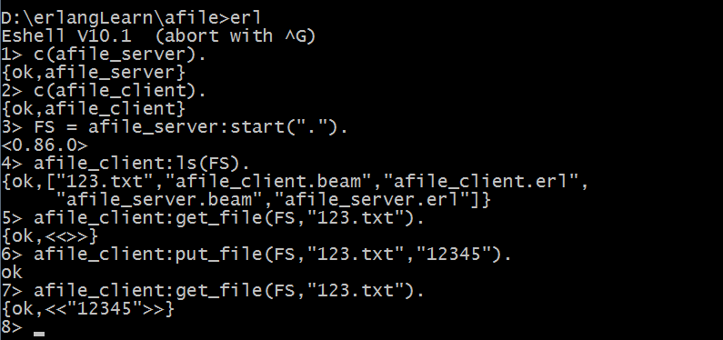

学习一个erlang，参考《Erlang程序设计》-Joe Armstrong
<!-- more -->
一个书中的示例，简单的文件服务器。
分为两个部分，客户端和服务端。
书里实现了ls和get_file功能，还有作为习题之类的put_file功能
首先看客户端的实现，首先是3个函数，参数分别是1,2,3：
```erlang
-export([ls/1,get_file/2,put_file/3]).
```
对于ls功能，就是查看当前服务器目录下的所有文件了，有：
```erlang
ls(Server) ->
	Server ! {self(), list_dir},
	receive
		{Server, FileList} ->
			FileList
	end.
```
很好理解，接受的参数就是Server了，
Server ! {self(), list_dir}表示发送一个{self(),list_dir}消息给Server
然后接收一个来自于Server的FileList消息，打印出来
对于其他两个功能同理。
get_file需要添加参数文件名用来查找
put_file需要添加参数文件名和插入的字符串
对于服务端，有两个函数，start和loop：
```erlang
start(Dir) -> spawn(afile_server, loop, [Dir]).
```
接收一个Dir参数作为文件服务器目录，然后创建服务端进程。
对于loop函数有：
```erlang
loop(Dir) ->
	receive
		{Client, list_dir} ->
			Client ! {self(), file:list_dir(Dir)};
		{Client, {get_file, File}} ->
			Full = filename:join(Dir,File),
			Client ! {self(), file:read_file(Full)};
		{Client, {put_file, File, String}} ->
			Full = filename:join(Dir,File),
			Client ! {self(), file:write_file(Full,String,[append])}
	end,
	loop(Dir).
```
不停循环监听消息。
这里按客户端的消息分为3类：
接收到客户端ls后发送的消息之后向其发送file:list_dir(Dir)作为结果。
其余的则是发送相应处理结果后的返回值，一般就是成功或者失败。
大概长这样：


[code](https://github.com/mioyuki2009/erlangLearn/tree/master/afile)