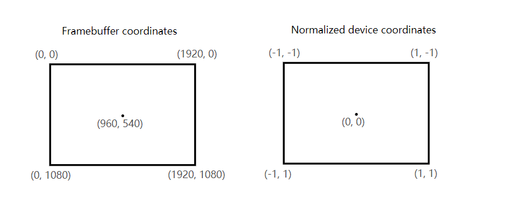
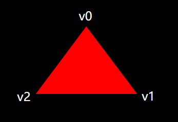
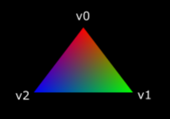

继续上一次的
<!-- more -->
与早期的API不同，Vulkan中的着色器代码必须以字节码格式，而不是像[GLSL](https://en.wikipedia.org/wiki/OpenGL_Shading_Language)和[HLSL](https://en.wikipedia.org/wiki/High-Level_Shading_Language)这样的比较有可读性的语法。这种字节码格式称为[SPIR-V](https://www.khronos.org/spir/)，旨在与Vulkan和OpenCL（两种都是Khronos API）一起使用，这是一种可用于编写图形和计算着色器的格式，但我们将重点介绍本教程中Vulkan图形管道中使用的着色器。

使用字节码格式的优点是GPU供应商编写的将着色器代码转换为本机代码的编译器要没那么复杂。过去的经验表明，使用像GLSL这样的人类可读语法，一些GPU供应商对标准的解释太灵活了。如果您碰巧使用其中一个供应商的GPU编写非平凡着色器，那么由于语法错误，您将面临其他供应商的驱动程序拒绝您的代码的风险，更糟的是由于编译器错误，着色器的运行方式可能完全不同。使用像SPIR-V这样简单的字节码格式，希望可以避免这种局面。

但是，这也不意味着我们需要手动编写这个字节码。Khronos发布了自己独立于供应商的编译器，可以将GLSL编译为SPIR-V。此编译器旨在验证着色器代码是否完全符合标准，并生成一个可与程序一起使用的SPIR-V二进制文件。

您还可以将此编译器作为库包含项目中，这样可以在运行时同时生成SPIR-V，但在本教程中我们不会这样做。编译器已包含在LunarG SDK中，即glslangValidator.exe，因此无需额外下载任何内容。

GLSL是一种带有C风格语法的着色语言。写在程序中的main函数会对为每个对象进行调用。GLSL使用全局变量来处理输入和输出，而不是使用输入参数和返回值作为输出，这个语言包括许多有助于图形编程的功能，如内置的向量和矩阵基元，还有求叉积，矩阵向量积以及反射向量等函数。矢量类型称为vec，然后使用一个数字来表示其中元素的数量，例如，一个3D坐标将存储在vec3中。可以通过.x等成员访问单个成员，也可以同时获取多个成员来创建新的向量。例如，表达式vec3（1.0,2.0,3.0）.xy将生成一个vec2向量。向量的构造函数也可以采用向量对象和标量值的组合。例如，vec3可以用vec3（vec2（1.0,2.0），3.0）来构建。

如前一章所述，我们需要编写顶点着色器和片段着色器以在屏幕上获得三角形。接下来的两节将介绍每个部分的GLSL代码，之后我将向您展示如何生成两个SPIR-V二进制文件并将它们加载到程序中。

<b>顶点着色器</b>
顶点着色器处理每个传入的顶点，它将其属性（世界位置，颜色，法线和纹理坐标等等）作为输入。输出是裁剪坐标中的最终位置以及需要传递到片段着色器的属性，如颜色和纹理坐标。然后，光栅化阶段将这些值插入片段中，来产生平滑的梯度。裁剪坐标（clip coordinate）是顶点着色器产生的四维向量，在之后通过将整个向量除以其最后一个成员变化为标准化的设备坐标。标准化的设备坐标是[齐次坐标](https://en.wikipedia.org/wiki/Homogeneous_coordinates)，它将帧缓冲区映射到[-1,1]乘[-1,1]坐标系，如下所示：

如果您之前涉足过计算机图形学，那么您应该已经熟悉了这些了。如果您之前使用过OpenGL，那么您会注意到Y坐标的符号现在被翻转了，现在用到的Z坐标的范围与Direct3D中相同，从0到1。

对于我们的第一个三角形，我们不会应用任何变换，只需将三个顶点的位置直接指定为规范化设备坐标即可创建以下形状：



我们可以直接输出归一化的设备坐标，方法是将它们作为顶点着色器的裁剪坐标输出，其中的最后一个组件设置为1。这样之后，将裁剪坐标转化为标准化的设备坐标时将不会有任何改变。

通常的做法是将这些坐标存储在顶点缓冲区中，但在Vulkan中创建顶点缓冲区以及用数据进行填充并不简单。所以我决定推迟这一步，直到我们可以看到屏幕上出现一个满意的三角形。我们将做一些非一般流程的事情：直接在顶点着色器中包含坐标。代码如下所示：
```glsl
#version 450
#extension GL_ARB_separate_shader_objects : enable

out gl_PerVertex {
    vec4 gl_Position;
};

vec2 positions[3] = vec2[](
    vec2(0.0, -0.5),
    vec2(0.5, 0.5),
    vec2(-0.5, 0.5)
);

void main() {
    gl_Position = vec4(positions[gl_VertexIndex], 0.0, 1.0);
}
```
main函数将会作用于每个顶点，内置的gl_VertexIndex变量包含当前顶点的索引。这通常是顶点缓冲区的索引，但在我们的例子中，它是硬编码顶点数据数组的索引。从着色器中的常量数组访问每个顶点的位置，并与虚拟的z坐标和w组合来生成裁剪坐标中的位置，内置变量gl_Position用作输出。Vulkan着色器需要GL_ARB_separate_shader_objects扩展才能工作。

<b>片段着色器</b>
由顶点着色器的生成的位置形成的三角形将用片段（fragments，候选像素）填充屏幕上的区域。在这些片段上调用片段着色器来为帧缓冲区（单个或多个）生成颜色和深度。为整个三角形输出红色的简单片段着色器如下所示：
```glsl
#version 450
#extension GL_ARB_separate_shader_objects : enable

layout(location = 0) out vec4 outColor;

void main() {
    outColor = vec4(1.0, 0.0, 0.0, 1.0);
}
```
就像顶点着色器中的main函数会作用于每个顶点一样，这里的main函数将会作用于每个片段。GLSL中的颜色是4个分量的矢量，其中R，G，B和α通道的值都在[0,1]范围内。与顶点着色器中的gl_Position不同，这里没有内置变量来输出当前片段的颜色。您必须为每个帧缓冲区指定自己的输出变量，其中layout（location = 0）这里的0就是指定了帧缓冲区的索引。这里将红色写入了outColor变量，这个变量链接到索引为0的第一个（也是唯一的）帧缓冲区。

<b>逐个顶点着色（Per-vertex colors）</b>
整个三角形都是红色的太无趣了，下面这个看起来好多了：



我们必须对两个着色器进行一些更改才能实现这个目标。首先，我们需要为每一个顶点都指定不同的颜色。顶点着色器现在应该包含一个颜色数组，就像它们的位置一样：
```glsl
vec3 colors[3] = vec3[](
    vec3(1.0, 0.0, 0.0),
    vec3(0.0, 1.0, 0.0),
    vec3(0.0, 0.0, 1.0)
);
```
现在我们只需要将每个顶点的颜色传递给片段着色器，这样它就可以将它们的插值输出到帧缓冲区了。将颜色输出变量添加到顶点着色器并在main函数中写入：
```glsl
layout(location = 0) out vec3 fragColor;

void main() {
    gl_Position = vec4(positions[gl_VertexIndex], 0.0, 1.0);
    fragColor = colors[gl_VertexIndex];
}
```
接下来需要在片段着色器中添加匹配的输入：
```glsl
layout(location = 0) in vec3 fragColor;

void main() {
    outColor = vec4(fragColor, 1.0);
}
```
这里的输入变量并不需要使用相同的名称（fragColor），它们将使用location指令指定的索引链接在一起。main函数的功能已被修改，现在会输出颜色和alpha值。如上图所示，fragColor的值将自动插入三个顶点之间的片段，从而产生平滑的渐变。

<b>编译着色器</b>
在项目的根目录中创建一个名为shaders的目录，并将顶点着色器存储在名为shader.vert的文件中，将片段着色器存储名为shader.frag的文件中。GLSL着色器没有官方扩展来说明，但这两个名字通常用于区分它们。

shader.vert的应该如下所示：
```glsl
#version 450
#extension GL_ARB_separate_shader_objects : enable

out gl_PerVertex {
    vec4 gl_Position;
};

layout(location = 0) out vec3 fragColor;

vec2 positions[3] = vec2[](
    vec2(0.0, -0.5),
    vec2(0.5, 0.5),
    vec2(-0.5, 0.5)
);

vec3 colors[3] = vec3[](
    vec3(1.0, 0.0, 0.0),
    vec3(0.0, 1.0, 0.0),
    vec3(0.0, 0.0, 1.0)
);

void main() {
    gl_Position = vec4(positions[gl_VertexIndex], 0.0, 1.0);
    fragColor = colors[gl_VertexIndex];
}
```
shader.frag的内容应该是：
```glsl
#version 450
#extension GL_ARB_separate_shader_objects : enable

layout(location = 0) in vec3 fragColor;

layout(location = 0) out vec4 outColor;

void main() {
    outColor = vec4(fragColor, 1.0);
}
```
我们现在要使用glslangValidator程序将它们编译成SPIR-V字节码。
<b>Windows</b>
创建一个compile.bat文件，写入以下内容：
```bat
C:/VulkanSDK/1.1.85.0/Bin32/glslangValidator.exe -V shader.vert
C:/VulkanSDK/1.1.85.0/Bin32/glslangValidator.exe -V shader.frag
pause
```
将glslangValidator.exe的路径替换为你安装Vulkan SDK的路径，双击文件并运行。
<b>Linux</b>
创建一个compile.bat文件，写入以下内容：
```sh
/home/user/VulkanSDK/x.x.x.x/x86_64/bin/glslangValidator -V shader.vert
/home/user/VulkanSDK/x.x.x.x/x86_64/bin/glslangValidator -V shader.frag
```
将glslangValidator.exe的路径替换为你安装Vulkan SDK的路径，使用chmod + x compile.sh使脚本可以执行然后运行。
<b>有关特定平台的说明</b>
这两个命令都使用了使用-V标志进行调用，这个标志用于将GLSL源文件编译为SPIR-V字节码。运行编译脚本后，可以看到创建了两个SPIR-V二进制文件：vert.spv和frag.spv。名称是根据着色器的类型自动派生，但您可以随意更改。在编译着色器时，可能会收到有关某些缺失功能的警告，但您可以放心地忽略它。

如果着色器包含语法错误，则编译器会告诉您行号和问题。例如，可以试一下省略分号并再次运行编译脚本。也可以可以尝试在没有任何参数的情况下运行编译器，以查看它支持的标志。例如，它还可以将字节码输出为人类可读的格式，这样就可以准确地看到着色器正在做什么以及在此阶段应用的优化。

在命令行上编译着色器是最直接的选则之一，这也是我们将在本教程中使用的方式。你也可以直接从代码中来编译着色器，Vulkan SDK包含libshaderc，它是一个库，用于从程序中将GLSL代码编译为SPIR-V。

<b>加载着色器</b>
现在我们有了生成SPIR-V着色器的方法，现在是时候将它们加载到我们的程序中，以便在之后将它们插入到图形管道中了。我们首先编写一个简单的辅助函数来从文件中加载二进制数据。
```cpp
#include <fstream>

...

static std::vector<char> readFile(const std::string& filename) {
    std::ifstream file(filename, std::ios::ate | std::ios::binary);

    if (!file.is_open()) {
        throw std::runtime_error("failed to open file!");
    }
}
```
readFile函数将读取指定文件中的所有字节，并将它们返回到由std::vector管理的字节数组中。我们首先用这两个标志来打开的文件：
* ate： 从文件末尾开始阅读
* binary：将文件读取为二进制文件（避免文本转换）

从文件末尾开始读取的优点是我们可以利用读取位置来确定文件的大小并分配缓冲区：
```cpp
size_t fileSize = (size_t) file.tellg();
std::vector<char> buffer(fileSize);
```
之后，我们可以回到文件的开头重新读取所有字节：
```cpp
file.seekg(0);
file.read(buffer.data(), fileSize);
```
最后关闭文件并返回字节：
```cpp
file.close();

return buffer;
```
现在将从createGraphicsPipeline调用此函数来加载两个着色器的字节码：
```cpp
void createGraphicsPipeline() {
    auto vertShaderCode = readFile("shaders/vert.spv");
    auto fragShaderCode = readFile("shaders/frag.spv");
}
```
通过打印缓冲区的大小并检查它们是否与实际文件大小（以字节为单位）匹配，可以确保正确加载着色器。

<b>创建着色器模块</b>
在我们将代码传递给管道之前，我们必须将它包装在VkShaderModule对象中。创建一个辅助函数createShaderModule来做这件事：
```cpp
VkShaderModule createShaderModule(const std::vector<char>& code) {

}
```
该函数将使用字节缓冲区作为参数的，并从中创建一个VkShaderModule。

创建着色器模块很简单，我们只需要指定一个指向缓冲区的指针，其中包含字节码及其长度。这个信息在VkShaderModuleCreateInfo结构中指定。有个问题是字节码的大小是以字节为单位指定的，但字节码指针是uint32_t类型指针而不是char指针。因此，我们需要使用reinterpret_cast指针进行转换，如下所示。当您执行此类转换时，还需要确保数据满足uint32_t的对齐要求。幸运的是，存储在std::vector中的数据，默认分配器已经确保数据满足最坏情况的对齐要求了：
```cpp
VkShaderModuleCreateInfo createInfo = {};
createInfo.sType = VK_STRUCTURE_TYPE_SHADER_MODULE_CREATE_INFO;
createInfo.codeSize = code.size();
createInfo.pCode = reinterpret_cast<const uint32_t*>(code.data());
```
然后可以通过调用vkCreateShaderModule来创建VkShaderModule：
```cpp
VkShaderModule shaderModule;
if (vkCreateShaderModule(device, &createInfo, nullptr, &shaderModule) != VK_SUCCESS) {
    throw std::runtime_error("failed to create shader module!");
}
```
参数与之前对象创建函数中的参数相同：逻辑设备，信息结构的指针，可选的自定义分配器指针和处理后的输出变量。创建着色器模块后会立即释放相应代码的缓冲区。最后不要忘记返回创建的着色器模块：
```cpp
return shaderModule;
```
只有在管道创建过程中才需要着色器模块对象，因此我们不会将它们声明为类成员，而是在createGraphicsPipeline函数中创建局部变量：
```cpp
VkShaderModule vertShaderModule;
VkShaderModule fragShaderModule;
```
调用我们创建的辅助函数来加载着色器模块：
```cpp
vertShaderModule = createShaderModule(vertShaderCode);
fragShaderModule = createShaderModule(fragShaderCode);
```
创建图形管道并返回createGraphicsPipeline后，需要清除它们，因此请确保在函数末尾删除它们：
```cpp
    ...
    vkDestroyShaderModule(device, fragShaderModule, nullptr);
    vkDestroyShaderModule(device, vertShaderModule, nullptr);
}
```

<b>创建着色器阶段</b>
VkShaderModule对象只是字节码缓冲区的一个很蠢的包装器（dumb wrapper）。着色器尚未相互链接，它们甚至还没有被赋予一个目标。将着色器模块分配给管道中的顶点或片段着色器阶段是通过VkPipelineShaderStageCreateInfo结构进行的，该结构是实际管道创建过程的一部分。

我们将首先在createGraphicsPipeline函数中填充顶点着色器的结构：
```cpp
VkPipelineShaderStageCreateInfo vertShaderStageInfo = {};
vertShaderStageInfo.sType = VK_STRUCTURE_TYPE_PIPELINE_SHADER_STAGE_CREATE_INFO;
vertShaderStageInfo.stage = VK_SHADER_STAGE_VERTEX_BIT;
```
除了必须设置的sType成员之外，第一步是告诉Vulkan将在哪个管道阶段使用着色器。在前一章中描述的每个可编程阶段都有一个对应枚举值。
```cpp
vertShaderStageInfo.module = vertShaderModule;
vertShaderStageInfo.pName = "main";
```
接下来的两个成员指定包含代码的着色器模块和要调用的函数。这意味着可以将多个片段着色器组合到一个着色器模块中，并使用不同的入口点来区分它们的行为。在这里，我们将坚持使用标准的main函数。

还有一个（可选的）成员pSpecializationInfo，我们将不会在这里使用，但会说明一下。它允许您指定着色器常量的值，您可以使用单个的着色器模块，通过为其中使用的常量指定不同的值，就能实现在创建管道的时候配置其行为。这比在渲染时使用变量配置着色器更有效，因为编译器可以执行优化，例如消除依赖于这些值的if语句。如果没有这样的常量，那么你可以将成员设置为nullptr，相应的struct自动进行初始化。

把结构修改为适合片段着色器的形式很简单：
```cpp
VkPipelineShaderStageCreateInfo fragShaderStageInfo = {};
fragShaderStageInfo.sType = VK_STRUCTURE_TYPE_PIPELINE_SHADER_STAGE_CREATE_INFO;
fragShaderStageInfo.stage = VK_SHADER_STAGE_FRAGMENT_BIT;
fragShaderStageInfo.module = fragShaderModule;
fragShaderStageInfo.pName = "main";
```
最后定义一个包含这两个结构的数组，我们稍后将在实际的管道创建步骤中引用它们。
```cpp
VkPipelineShaderStageCreateInfo shaderStages[] = {vertShaderStageInfo, fragShaderStageInfo};
```
这就是描述管道的可编程的阶段的全部内容。在下一章中，我们将讨论固定功能的阶段。