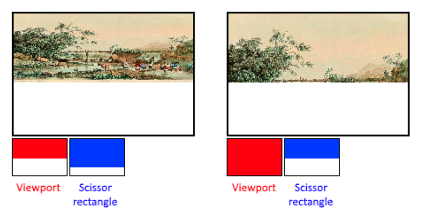

继续上一次的
<!-- more -->
较旧的图形API都会为图形管道的大多数阶段提供一个默认状态。在Vulkan中，您必须明确指定所有内容，从视口大小到颜色混合功能都需要。在本章中，我们将填写配置这些固定功能操作的所有结构。

<b>输入顶点</b>
VkPipelineVertexInputStateCreateInfo结构描述了用于传递给顶点着色器的顶点数据的格式。一般会从下面两个方面来说明：
* Bindings：数据之间的间距以及数据是顶点还是实例（请参阅[instancing](https://en.wikipedia.org/wiki/Geometry_instancing)）。
* Attribute descriptions：描述将要进行绑定及加载属性的顶点着色器中的相关属性类型。

因为我们在顶点着色器中是直接对顶点数据进行硬编码的，所以我们在填充此结构的时候需要指定现在没有要加载的顶点数据，我们之后将在顶点缓冲区章节中回来修改：
```cpp
VkPipelineVertexInputStateCreateInfo vertexInputInfo = {};
vertexInputInfo.sType = VK_STRUCTURE_TYPE_PIPELINE_VERTEX_INPUT_STATE_CREATE_INFO;
vertexInputInfo.vertexBindingDescriptionCount = 0;
vertexInputInfo.pVertexBindingDescriptions = nullptr; // Optional
vertexInputInfo.vertexAttributeDescriptionCount = 0;
vertexInputInfo.pVertexAttributeDescriptions = nullptr; // Optional
```
pVertexBindingDescriptions和pVertexAttributeDescriptions成员指向一个结构数组，用于描述上述加载顶点数据的细节。将这个结构添加到createGraphicsPipeline函数中shaderStages数组后面。

<b>输入组件</b>
VkPipelineInputAssemblyStateCreateInfo结构描述了两件事：将从顶点绘制什么样的几何体以及是否开启图元重构（primitive restart）。前者在topology成员中指定，可以具有如下值：
* VK_PRIMITIVE_TOPOLOGY_POINT_LIST：顶点到点
* VK_PRIMITIVE_TOPOLOGY_LINE_LIST：两点成线，顶点不重复使用
* VK_PRIMITIVE_TOPOLOGY_LINE_STRIP：每条线的结束顶点用作下一行的起始顶点
* VK_PRIMITIVE_TOPOLOGY_TRIANGLE_LIST：三个点成为一个三角形，顶点不重复使用
* VK_PRIMITIVE_TOPOLOGY_TRIANGLE_STRIP：每个三角形的第二个和第三个顶点用作下一个三角形的前两个顶点

通常，顶点会按顺序索引从顶点缓冲区加载，但是使用元素缓冲区（element buffer）也可以指定要自定义的索引，这允许您执行重用顶点等优化方式。如果将primitiveRestartEnable成员设置为VK_TRUE，则可以通过使用特殊索引0xFFFF或0xFFFFFFFF来分解_STRIP拓扑模式中的线和三角形。

我们打算在本教程中绘制三角形，因此将使用下面的结构数据：
```cpp
VkPipelineInputAssemblyStateCreateInfo inputAssembly = {};
inputAssembly.sType = VK_STRUCTURE_TYPE_PIPELINE_INPUT_ASSEMBLY_STATE_CREATE_INFO;
inputAssembly.topology = VK_PRIMITIVE_TOPOLOGY_TRIANGLE_LIST;
inputAssembly.primitiveRestartEnable = VK_FALSE;
```

<b>视口和裁剪</b>
视口简单描述了将用于渲染输出的的帧缓冲区域。基本上都是(0, 0)到(width, height)，在本教程中也是如此：
```cpp
VkViewport viewport = {};
viewport.x = 0.0f;
viewport.y = 0.0f;
viewport.width = (float) swapChainExtent.width;
viewport.height = (float) swapChainExtent.height;
viewport.minDepth = 0.0f;
viewport.maxDepth = 1.0f;
```
请记住，交换链及其图像的大小可能与窗口的WIDTH和HEIGHT不同。交换链图像将在以后用作帧缓冲区，因此我们应该坚持它们的大小不变。

minDepth和maxDepth值指定用于帧缓冲区的深度值的范围。这些值必须在[0.0f，1.0f]范围内，minDepth也是可能高于maxDepth的。如果没有特殊需求的话，使用标准的0.0f和1.0f就行了。

视口定义了从图像到帧缓冲的转换方式，裁剪矩形定义了实际存储像素的区域。裁剪矩形外的任何像素都将在光栅化阶段丢弃。在功能上它们更加类似于过滤而不是转换。差异如下图所示。请注意，对于图像比视口尺寸大的情况下，左侧的裁剪矩形只是众多可能方式其中一个表现。

在本教程中，我们只想绘制整个帧缓冲区，因此我们将指定一个完全覆盖它的剪刀矩形：
```cpp
VkRect2D scissor = {};
scissor.offset = {0, 0};
scissor.extent = swapChainExtent;
```
现在，需要使用VkPipelineViewportStateCreateInfo结构将此视口和裁剪矩形组合到一起。由于某些显卡上支持使用多个视口和裁剪矩形，因此这里的成员是引用它们的数组的，要使用这个特性（多个视口和裁剪矩阵同时组合）需要启用相应的GPU功能（请参阅创建逻辑设备章节）：
```cpp
VkPipelineViewportStateCreateInfo viewportState = {};
viewportState.sType = VK_STRUCTURE_TYPE_PIPELINE_VIEWPORT_STATE_CREATE_INFO;
viewportState.viewportCount = 1;
viewportState.pViewports = &viewport;
viewportState.scissorCount = 1;
viewportState.pScissors = &scissor;
```

<b>光栅化</b>
光栅化器使用由顶点着色器的顶点组成的几何体，并将其转换为片段着色器着色的片段。它还可以执行[深度测试](https://en.wikipedia.org/wiki/Z-buffering)，[面部剔除](https://en.wikipedia.org/wiki/Back-face_culling)和裁剪测试，并且为输出来选择配置是填充整个多边形还是仅仅填充边缘的片段（线框渲染）。所有的这些都是使用VkPipelineRasterizationStateCreateInfo结构来配置的。
```cpp
VkPipelineRasterizationStateCreateInfo rasterizer = {};
rasterizer.sType = VK_STRUCTURE_TYPE_PIPELINE_RASTERIZATION_STATE_CREATE_INFO;
rasterizer.depthClampEnable = VK_FALSE;
```
如果depthClampEnable设置为VK_TRUE，那么超出近平面和远平面的片段将会收敛它们来使用而不是丢弃。这在阴影贴图等特殊情况下很有用，使用此功能需要开启相应的GPU功能。
```cpp
rasterizer.rasterizerDiscardEnable = VK_FALSE;
```
如果rasterizerDiscardEnable设置为VK_TRUE，则几何体永远不会通过光栅化器阶段。这基本上禁用了帧缓冲的所有输出。
```cpp
rasterizer.polygonMode = VK_POLYGON_MODE_FILL;
```
polygonMode设置如何为几何生成片段。有以下几个选项可供选择：
* VK_POLYGON_MODE_FILL：用片段填充多边形的区域
* VK_POLYGON_MODE_LINE：多边形边缘绘制为线条
* VK_POLYGON_MODE_POINT：多边形顶点绘制为点

使用除填充之外的任何模式都需要启用相应的GPU功能。
```cpp
rasterizer.lineWidth = 1.0f;
```
lineWidth成员很简单，它根据片段数目描述线的粗细。支持的最大线宽取决于硬件，任何厚度大于1.0f的线都要求启用wideLines的GPU功能。
```cpp
rasterizer.cullMode = VK_CULL_MODE_BACK_BIT;
rasterizer.frontFace = VK_FRONT_FACE_CLOCKWISE;
```
cullMode变量确定要使用的面部剔除的类型，可以选择禁用剔除，剔除正面，剔除背面或都剔除。frontFace变量指定面向前面的面的顶点顺序，可以是顺时针或逆时针。
```cpp
rasterizer.depthBiasEnable = VK_FALSE;
rasterizer.depthBiasConstantFactor = 0.0f; // Optional
rasterizer.depthBiasClamp = 0.0f; // Optional
rasterizer.depthBiasSlopeFactor = 0.0f; // Optional
```
光栅化器可以通过添加常量值或根据片段的斜率更改偏置来更改深度值。这个方法有时用于阴影贴图，但我们在这里不会使用，只需将depthBiasEnable设置为VK_FALSE即可。

<b>多重采样</b>
VkPipelineMultisampleStateCreateInfo结构用来配置多重采样，这是[消除锯齿的方法之一](https://en.wikipedia.org/wiki/Multisample_anti-aliasing)。它会将光栅化后位于同一像素的点经过片段着色器进行处理后得到的结果来进行组合。这主要发生在边缘，这也是最明显的锯齿出现的地方。如果只有一个多边形映射到一个像素，是不需要多次运行片段着色器，它比简单地渲染到更高的分辨率然后再缩小尺寸开销要低得多。开启这个功能也需要开启相应的gpu功能：
```cpp
VkPipelineMultisampleStateCreateInfo multisampling = {};
multisampling.sType = VK_STRUCTURE_TYPE_PIPELINE_MULTISAMPLE_STATE_CREATE_INFO;
multisampling.sampleShadingEnable = VK_FALSE;
multisampling.rasterizationSamples = VK_SAMPLE_COUNT_1_BIT;
multisampling.minSampleShading = 1.0f; // Optional
multisampling.pSampleMask = nullptr; // Optional
multisampling.alphaToCoverageEnable = VK_FALSE; // Optional
multisampling.alphaToOneEnable = VK_FALSE; // Optional
```
我们将在后面的章节中重新进行多重采样，现在先禁用它。

<b>深度测试和模板测试</b>
如果使用深度或模板缓冲区，则还需要使用VkPipelineDepthStencilStateCreateInfo来配置深度和模板测试。我们现在没有用到，所以我们简单地传递一个nullptr而不是指向这样一个结构的指针。之后将在深度缓冲章节回来进行配置。

<b>颜色混合</b>
片段着色器返回颜色后，需要将其与帧缓冲区中已有的颜色组合。这种转换称为颜色混合（混色），有两种方式：
* 混合旧值和新值以生成新的颜色
* 使用位运算来组合旧值和新值

有两种类型的结构来配置颜色混合。
第一个结构，VkPipelineColorBlendAttachmentState包含了每个附加帧缓冲区的配置。
第二个结构，VkPipelineColorBlendStateCreateInfo包含全局的颜色混合设置。
在我们的例子中，我们只有一个帧缓冲区：
```cpp
VkPipelineColorBlendAttachmentState colorBlendAttachment = {};
colorBlendAttachment.colorWriteMask = VK_COLOR_COMPONENT_R_BIT | VK_COLOR_COMPONENT_G_BIT | VK_COLOR_COMPONENT_B_BIT | VK_COLOR_COMPONENT_A_BIT;
colorBlendAttachment.blendEnable = VK_FALSE;
colorBlendAttachment.srcColorBlendFactor = VK_BLEND_FACTOR_ONE; // Optional
colorBlendAttachment.dstColorBlendFactor = VK_BLEND_FACTOR_ZERO; // Optional
colorBlendAttachment.colorBlendOp = VK_BLEND_OP_ADD; // Optional
colorBlendAttachment.srcAlphaBlendFactor = VK_BLEND_FACTOR_ONE; // Optional
colorBlendAttachment.dstAlphaBlendFactor = VK_BLEND_FACTOR_ZERO; // Optional
colorBlendAttachment.alphaBlendOp = VK_BLEND_OP_ADD; // Optional
```
这个per-framebuffer结构允许你配置首选的颜色混合方式。
使用以下伪代码可以最好地演示将要执行的操作：
```cpp
if (blendEnable) {
    finalColor.rgb = (srcColorBlendFactor * newColor.rgb) <colorBlendOp> (dstColorBlendFactor * oldColor.rgb);
    finalColor.a = (srcAlphaBlendFactor * newColor.a) <alphaBlendOp> (dstAlphaBlendFactor * oldColor.a);
} else {
    finalColor = newColor;
}

finalColor = finalColor & colorWriteMask;
```
如果将blendEnable设置为VK_FALSE，则片段着色器中的新颜色直接使用原始的颜色不做任何改变，否则将会执行两个混合操作来计算新颜色。生成的颜色与colorWriteMask进行AND运算，来决定实际传递的通道。

颜色混合的最常用方法是alpha混合，新颜色会根据其不透明度与旧颜色混合。finalColor会按如下方式计算：
```cpp
finalColor.rgb = newAlpha * newColor + (1 - newAlpha) * oldColor;
finalColor.a = newAlpha.a;
```
这也可以通过以下参数来完成：
```cpp
colorBlendAttachment.blendEnable = VK_TRUE;
colorBlendAttachment.srcColorBlendFactor = VK_BLEND_FACTOR_SRC_ALPHA;
colorBlendAttachment.dstColorBlendFactor = VK_BLEND_FACTOR_ONE_MINUS_SRC_ALPHA;
colorBlendAttachment.colorBlendOp = VK_BLEND_OP_ADD;
colorBlendAttachment.srcAlphaBlendFactor = VK_BLEND_FACTOR_ONE;
colorBlendAttachment.dstAlphaBlendFactor = VK_BLEND_FACTOR_ZERO;
colorBlendAttachment.alphaBlendOp = VK_BLEND_OP_ADD;
```
可以查询文档中的VkBlendFactor和VkBlendOp枚举值中找到所有可能的操作。

第二个结构引用所有帧缓冲区的结构数组，并允许您设置混合常量，您可以看成在上述计算中所用的混合因子。
```cpp
VkPipelineColorBlendStateCreateInfo colorBlending = {};
colorBlending.sType = VK_STRUCTURE_TYPE_PIPELINE_COLOR_BLEND_STATE_CREATE_INFO;
colorBlending.logicOpEnable = VK_FALSE;
colorBlending.logicOp = VK_LOGIC_OP_COPY; // Optional
colorBlending.attachmentCount = 1;
colorBlending.pAttachments = &colorBlendAttachment;
colorBlending.blendConstants[0] = 0.0f; // Optional
colorBlending.blendConstants[1] = 0.0f; // Optional
colorBlending.blendConstants[2] = 0.0f; // Optional
colorBlending.blendConstants[3] = 0.0f; // Optional
```
如果要使用第二种混合方法（按位组合），则应将logicOpEnable设置为VK_TRUE，然后可以在logicOp字段中指定按位操作的方式。请注意，这将自动禁用第一个方法，这和把每个连接的帧缓冲区的blendEnable设置为VK_FALSE是一样的效果。colorWriteMask也将在此模式下用于确定帧缓冲区中的哪些通道实际受影响。也可以禁用这两种模式，就像我们在这里做的这样样，在这种情况下，片段颜色将被无修改地写入帧缓冲区。

<b>动态</b>
我们在之前的结构中指定的有限数量的状态实际上可以在不重新创建管道的情况下进行更改，比如是视口的大小，线宽以及混合常量。如果你想这样做，那么你必须填充VkPipelineDynamicStateCreateInfo结构，如下所示：
```cpp
VkDynamicState dynamicStates[] = {
    VK_DYNAMIC_STATE_VIEWPORT,
    VK_DYNAMIC_STATE_LINE_WIDTH
};

VkPipelineDynamicStateCreateInfo dynamicState = {};
dynamicState.sType = VK_STRUCTURE_TYPE_PIPELINE_DYNAMIC_STATE_CREATE_INFO;
dynamicState.dynamicStateCount = 2;
dynamicState.pDynamicStates = dynamicStates;
```
这将导致现在忽略这些值的配置，之后需要在绘图的时候来指定。我们将在之后的章节中回来修改。如果没有任何动态状态，则可以使用nullptr替换此结构。

<b>管道布局</b>
您可以在着色器中使用uniform，这种类型值是类似于动态状态变量的全局变量，可以在绘制时更改这些变量以更改着色器的行为，而无需重新创建它们。它们通常用于将变换矩阵传递到顶点着色器，或者在片段着色器中创建纹理采样器。

需要在管道创建期间通过创建VkPipelineLayout对象来指定这些uniform值。即使我们在之后的章节中不会用到它们，仍然需要创建一个空的管道布局。

创建一个类成员来保存这个对象，因为我们之后会从其他函数中引用它：
```cpp
VkPipelineLayout pipelineLayout;
```
然后在createGraphicsPipeline函数中创建对象：
```cpp
VkPipelineLayoutCreateInfo pipelineLayoutInfo = {};
pipelineLayoutInfo.sType = VK_STRUCTURE_TYPE_PIPELINE_LAYOUT_CREATE_INFO;
pipelineLayoutInfo.setLayoutCount = 0; // Optional
pipelineLayoutInfo.pSetLayouts = nullptr; // Optional
pipelineLayoutInfo.pushConstantRangeCount = 0; // Optional
pipelineLayoutInfo.pPushConstantRanges = nullptr; // Optional

if (vkCreatePipelineLayout(device, &pipelineLayoutInfo, nullptr, &pipelineLayout) != VK_SUCCESS) {
    throw std::runtime_error("failed to create pipeline layout!");
}
```
该结构还指定了推送常量（push constants），这是将动态值传递给着色器的另一种方式，我们可能会在将来的章节中介绍这些方法。管道布局将在整个程序的生命周期中被引用，因此它应该在最后被销毁：
```cpp
void cleanup() {
    vkDestroyPipelineLayout(device, pipelineLayout, nullptr);
    ...
}
```

<b>总结</b>
这就是所有固定功能了。从头开始设置所有这些看起来非常麻烦，但优点是我们现在几乎完全了解了图形管道中正在发生的一切。这减少了遇到意外行为的可能性，因为某些组件的默认状态不是我们所期望的。

然而，在我们最终创建图形管道之前还有一个要创建的对象，那就是渲染过程。


