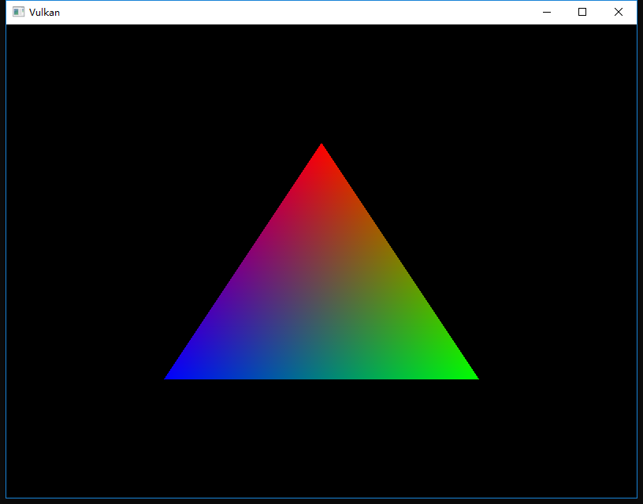
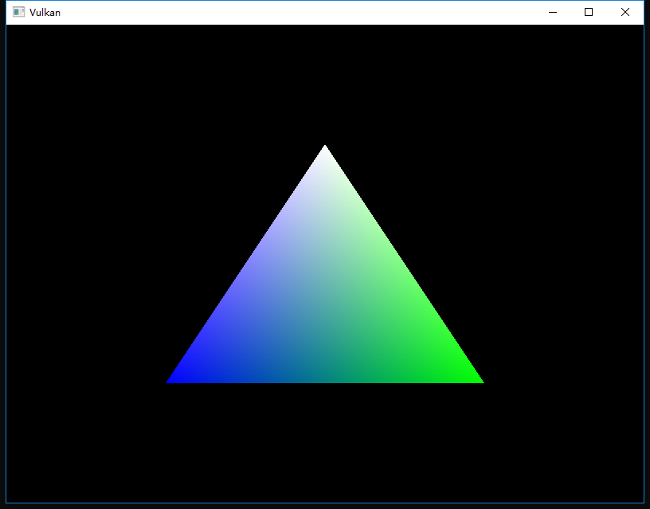

继续上一次的
<!-- more -->
<b>介绍</b>
Vulkan中的缓冲区是用于存储由显卡读取的任意数据的存储区域。它们可用于存储顶点数据，也可用于将在以后的章节中探讨的许多其他目的。与我们到目前为止处理的Vulkan对象不同，缓冲区不会自动为自己分配内存。前几章的工作表明，Vulkan API使程序员几乎可以控制其中的所有内容，内存管理就是其中之一。

<b>创建缓冲区</b>
在initVulkan中创建一个新函数createVertexBuffer，并在createCommandBuffers之前调用：
```cpp
void initVulkan() {
    createInstance();
    setupDebugCallback();
    createSurface();
    pickPhysicalDevice();
    createLogicalDevice();
    createSwapChain();
    createImageViews();
    createRenderPass();
    createGraphicsPipeline();
    createFramebuffers();
    createCommandPool();
    createVertexBuffer();
    createCommandBuffers();
    createSyncObjects();
}

...

void createVertexBuffer() {

}
```
创建缓冲区需要我们填充VkBufferCreateInfo结构：
```cpp
VkBufferCreateInfo bufferInfo = {};
bufferInfo.sType = VK_STRUCTURE_TYPE_BUFFER_CREATE_INFO;
bufferInfo.size = sizeof(vertices[0]) * vertices.size();
```
这个结构的第一参数是size，它以字节为单位指定缓冲区的大小，使用sizeof就能很简单的计算出顶点数据的字节大小了。
```cpp
bufferInfo.usage = VK_BUFFER_USAGE_VERTEX_BUFFER_BIT;
```
第二个参数是usage，它指示将使用缓冲区中的数据的目的，可以使用按位或来指定多个目的。我们的示例就是一个简单的顶点缓冲区，我们将在后面的章节中介绍其他类型的用法。
```cpp
bufferInfo.sharingMode = VK_SHARING_MODE_EXCLUSIVE;
```
就像交换链中的图像一样，缓冲区也可以由特定队列簇拥有，或者同时在多个队列簇之间共享。缓冲区仅用于图形队列，因此我们使用独占的方式来访问。

flags参数用于配置稀疏缓冲区内存，这与目前的功能无关。我们将其保留为默认值0。

我们现在可以使用vkCreateBuffer来创建缓冲区了。定义一个类成员来保存缓冲区句柄并将其命名为vertexBuffer：
```cpp
VkBuffer vertexBuffer;

...

void createVertexBuffer() {
    VkBufferCreateInfo bufferInfo = {};
    bufferInfo.sType = VK_STRUCTURE_TYPE_BUFFER_CREATE_INFO;
    bufferInfo.size = sizeof(vertices[0]) * vertices.size();
    bufferInfo.usage = VK_BUFFER_USAGE_VERTEX_BUFFER_BIT;
    bufferInfo.sharingMode = VK_SHARING_MODE_EXCLUSIVE;

    if (vkCreateBuffer(device, &bufferInfo, nullptr, &vertexBuffer) != VK_SUCCESS) {
        throw std::runtime_error("failed to create vertex buffer!");
    }
}
```
缓冲区应该在从渲染命令到程序结束都是可用的，并且它不依赖于交换链，所以我们将在原始的cleanup函数中清理它：
```cpp
void cleanup() {
    cleanupSwapChain();

    vkDestroyBuffer(device, vertexBuffer, nullptr);

    ...
}
```

<b>内存要求</b>
虽然缓冲区已经创建了，但实际上还没有分配任何内存。为缓冲区分配内存的第一步是使用vkGetBufferMemoryRequirements函数查询其内存需求。
```cpp
VkMemoryRequirements memRequirements;
vkGetBufferMemoryRequirements(device, vertexBuffer, &memRequirements);
```
VkMemoryRequirements结构有三个参数：
* size：所需内存的大小（以字节为单位）可能与bufferInfo.size不同。
* alignment：缓冲区在分配的内存区域中开始时的字节偏移量，取决于bufferInfo.usage和bufferInfo.flags。
* memoryTypeBits：适合缓冲区的内存类型的位字段。

显卡可以提供不同类型的内存来分配，每种类型的存储器在允许的操作和性能特征方面都有所不同。我们需要结合缓冲区的要求和我们自己的应用程序要求来找到要使用的正确类型的内存，为此创建一个新函数findMemoryType：
```cpp
uint32_t findMemoryType(uint32_t typeFilter, VkMemoryPropertyFlags properties) {

}
```
首先，我们需要使用vkGetPhysicalDeviceMemoryProperties查询有关可用内存类型的信息。
```cpp
VkPhysicalDeviceMemoryProperties memProperties;
vkGetPhysicalDeviceMemoryProperties(physicalDevice, &memProperties);
```
VkPhysicalDeviceMemoryProperties结构有两个数组memoryTypes和memoryHeaps。内存堆是很多不同的内存资源，就像专用VRAM和当VRAM用完时RAM中的交换空间（swap space）。这些堆中存在不同类型的存储器，目前我们只关心内存的类型而不是它来自的堆，虽然这样显然会影响性能。

让我们首先找到一个适合缓冲区本身的内存类型：
```cpp
for (uint32_t i = 0; i < memProperties.memoryTypeCount; i++) {
    if (typeFilter & (1 << i)) {
        return i;
    }
}

throw std::runtime_error("failed to find suitable memory type!");
```
typeFilter参数将用于指定适合的内存类型的位字段。这意味着我们可以通过简单地迭代它们并检查相应的位是否设置为1来找到合适的存储器类型的索引。

但是，我们不仅仅是对适合顶点缓冲区的内存类型感兴趣，我们还需要能够将顶点数据写入该内存。memoryTypes数组由VkMemoryType结构组成，这些结构指定每种类型内存的堆和属性。这些属性定义了内存的特殊功能，比如能够映射它，这样我们就可以从CPU写入它了。这个属性用VK_MEMORY_PROPERTY_HOST_VISIBLE_BIT表示，但我们还需要使用VK_MEMORY_PROPERTY_HOST_COHERENT_BIT属性，当我们映射内存时，我们就能看到原因了。

我们现在可以修改循环以检查此属性的支持：
```cpp
for (uint32_t i = 0; i < memProperties.memoryTypeCount; i++) {
    if ((typeFilter & (1 << i)) && (memProperties.memoryTypes[i].propertyFlags & properties) == properties) {
        return i;
    }
}
```
我们可能有多个理想的属性，因此我们应该检查按位与的结果是否不仅仅是非零，而是等于所需的属性位字段。如果有一个适合缓冲区的内存类型同时还具有我们需要的所有属性，那么我们返回它的索引，否则我们抛出异常。

<b>内存分配</b>
我们现在有办法确定正确的内存类型了，因此我们可以通过填充VkMemoryAllocateInfo结构来实际分配内存。
```cpp
VkMemoryAllocateInfo allocInfo = {};
allocInfo.sType = VK_STRUCTURE_TYPE_MEMORY_ALLOCATE_INFO;
allocInfo.allocationSize = memRequirements.size;
allocInfo.memoryTypeIndex = findMemoryType(memRequirements.memoryTypeBits, VK_MEMORY_PROPERTY_HOST_VISIBLE_BIT | VK_MEMORY_PROPERTY_HOST_COHERENT_BIT);
```
内存分配现在就像指定大小和类型一样简单，这两者都是从顶点缓冲区的内存需求和所需属性中派生的。创建一个类成员来存储句柄并使用vkAllocateMemory进行分配。
```cpp
VkBuffer vertexBuffer;
VkDeviceMemory vertexBufferMemory;

...

if (vkAllocateMemory(device, &allocInfo, nullptr, &vertexBufferMemory) != VK_SUCCESS) {
    throw std::runtime_error("failed to allocate vertex buffer memory!");
}
```
如果内存分配成功，那么我们现在可以使用vkBindBufferMemory将此内存与缓冲区关联：
```cpp
vkBindBufferMemory(device, vertexBuffer, vertexBufferMemory, 0);
```
前三个参数是很简单，第四个参数是内存区域内的偏移量。由于此内存是专门为该顶点缓冲区分配的，因此偏移量为0。如果偏移量不为零，则需要通过memRequirements.alignment对其进行整除。

当然，就像C++中的动态内存分配一样，内存应该在某个时候被释放。一旦缓冲区不再使用，绑定到缓冲区对象的内存会被释放，所以在缓冲区被销毁后释放它：
```cpp
void cleanup() {
    cleanupSwapChain();

    vkDestroyBuffer(device, vertexBuffer, nullptr);
    vkFreeMemory(device, vertexBufferMemory, nullptr);
```

<b>填充顶点缓冲区</b>
现在是时候将顶点数据复制到缓冲区了。这是通过使用vkMapMemory将[缓冲区内存映射](https://en.wikipedia.org/wiki/Memory-mapped_I/O)到CPU可访问内存来完成的。
```cpp
void* data;
vkMapMemory(device, vertexBufferMemory, 0, bufferInfo.size, 0, &data);
```
此函数允许我们访问由偏移量和大小定义的指定内存资源的区域，这里的偏移量和大小分别为0和bufferInfo.size，也可以指定特殊值VK_WHOLE_SIZE来映射所有内存。倒数第二个参数可用于指定标志，但当前API中尚无任何可用标志，现在必须设置为0。最后一个参数指定指向映射内存的指针的输出。
```cpp
void* data;
vkMapMemory(device, vertexBufferMemory, 0, bufferInfo.size, 0, &data);
    memcpy(data, vertices.data(), (size_t) bufferInfo.size);
vkUnmapMemory(device, vertexBufferMemory);
```
您现在可以简单地使用memcpy将顶点数据映射到内存，并使用vkUnmapMemory取消映射。不幸的是，驱动程序可能不会立即将数据复制到缓冲存储器中，例如由于缓存的原因。在映射的内存中，对缓冲区的写入也可能不可见。有两种方法可以解决这个问题：
* 使用主机一致的内存堆，用VK_MEMORY_PROPERTY_HOST_COHERENT_BIT表示
* 在写入映射内存之后调用vkFlushMappedMemoryRanges，并在从映射内存中读取之前调用vkInvalidateMappedMemoryRanges

我们采用了第一种方法，它确保映射的内存始终与分配的内存的内容相匹配。请记住，这可能会导致性能略差于显式刷新，但这并没有什么太大的关系，我们将在下一章解释这一点。

<b>绑定顶点缓冲区</b>
现在剩下的就是在渲染操作期间绑定顶点缓冲区了。我们将扩展createCommandBuffers函数来做到这一点：
```cpp
vkCmdBindPipeline(commandBuffers[i], VK_PIPELINE_BIND_POINT_GRAPHICS, graphicsPipeline);

VkBuffer vertexBuffers[] = {vertexBuffer};
VkDeviceSize offsets[] = {0};
vkCmdBindVertexBuffers(commandBuffers[i], 0, 1, vertexBuffers, offsets);

vkCmdDraw(commandBuffers[i], static_cast<uint32_t>(vertices.size()), 1, 0, 0);
```
vkCmdBindVertexBuffers函数用于绑定顶点缓冲区，就像我们在前一章中设置的那样。除了命令缓冲区之外，前两个参数指定了我们要为其指定顶点缓冲区的偏移量和绑定数。最后两个参数指定要绑定的顶点缓冲区数组和开始从中读取顶点数据的字节偏移量。您还应该将调用更改为vkCmdDraw以传递缓冲区中的顶点数，而不是硬编码的数字3。

现在运行该程序，您应该又可以看到这个熟悉的三角形了：


尝试通过修改顶点数组将顶部顶点的颜色更改为白色：
```cpp
const std::vector<Vertex> vertices = {
    {{0.0f, -0.5f}, {1.0f, 1.0f, 1.0f}},
    {{0.5f, 0.5f}, {0.0f, 1.0f, 0.0f}},
    {{-0.5f, 0.5f}, {0.0f, 0.0f, 1.0f}}
};
```
再次运行该程序，您应该看到下面的结果：


在下一章中，我们将介绍将顶点数据复制到顶点缓冲区以获得更好性能的不同方法，当然也需要做更多工作。


