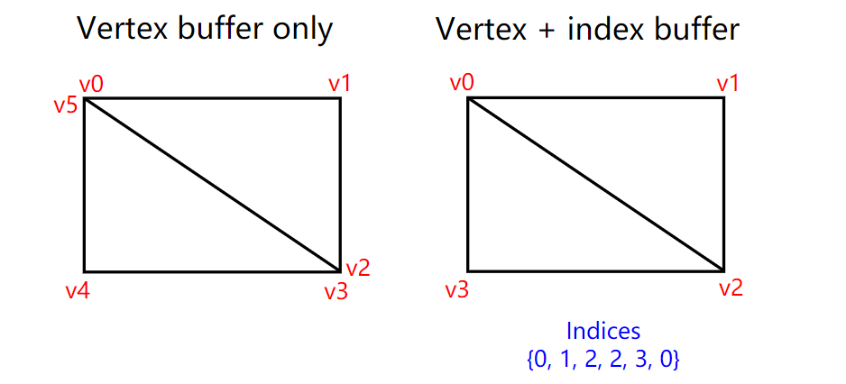
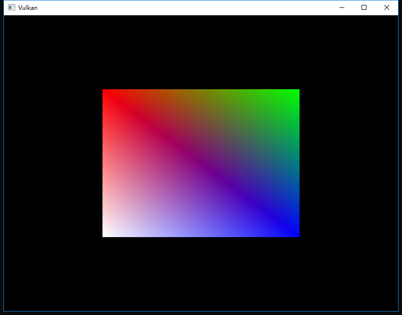

继续上一次的
<!-- more -->
<b>介绍</b>
在实际应用程序中渲染的3D网格通常会在多个三角形之间共享顶点。即使是像绘制矩形这样简单的事情，这种情况也会发生：


绘制一个矩形需要两个三角形，这意味着我们需要一个带有6个顶点的顶点缓冲区。问题是两个顶点的数据会重复，这导致了50％的冗余。这在更复杂的网格时会变得更糟，平均每三个三角形就会发生重复顶点使用的情况。该问题的解决方案是使用索引缓冲区（index buffer）。

索引缓冲区本质上是指向顶点缓冲区的指针数组。它允许您重新排序顶点数据，并重用多个顶点的现有数据。上图显示了如果我们有一个只包含四个顶点的顶点缓冲区，那么矩形的索引缓冲区会是什么样子，前三个索引定义右上三角形，后三个索引定义左下三角形的顶点。

<b>创建索引缓冲区</b>
在本章中，我们将修改顶点数据并添加索引数据以绘制如图中的矩形。修改顶点数据以表示四个角：
```cpp
const std::vector<Vertex> vertices = {
    {{-0.5f, -0.5f}, {1.0f, 0.0f, 0.0f}},
    {{0.5f, -0.5f}, {0.0f, 1.0f, 0.0f}},
    {{0.5f, 0.5f}, {0.0f, 0.0f, 1.0f}},
    {{-0.5f, 0.5f}, {1.0f, 1.0f, 1.0f}}
};
```
左上角为红色，右上角为绿色，右下角为蓝色，左下角为白色。我们将添加一个新的数组索引来表示索引缓冲区的内容。它和图中的索引相匹配用来绘制右上角三角形和左下角三角形。
```cpp
const std::vector<uint16_t> indices = {
    0, 1, 2, 2, 3, 0
};
```
根据顶点中的条目数，可以使用uint16_t或uint32_t作为索引缓冲区。我们现在可以使用uint16_t，因为我们使用的顶点不到65535个。

就像顶点数据一样，索引需要上传到VkBuffer中，以便GPU能够访问它们。定义两个新的类成员来保存索引缓冲区的资源：
```cpp
VkBuffer vertexBuffer;
VkDeviceMemory vertexBufferMemory;
VkBuffer indexBuffer;
VkDeviceMemory indexBufferMemory;
```
现在要添加的createIndexBuffer函数，内容几乎与createVertexBuffer一模一样：
```cpp
void initVulkan() {
    ...
    createVertexBuffer();
    createIndexBuffer();
    ...
}

void createIndexBuffer() {
    VkDeviceSize bufferSize = sizeof(indices[0]) * indices.size();

    VkBuffer stagingBuffer;
    VkDeviceMemory stagingBufferMemory;
    createBuffer(bufferSize, VK_BUFFER_USAGE_TRANSFER_SRC_BIT, VK_MEMORY_PROPERTY_HOST_VISIBLE_BIT | VK_MEMORY_PROPERTY_HOST_COHERENT_BIT, stagingBuffer, stagingBufferMemory);

    void* data;
    vkMapMemory(device, stagingBufferMemory, 0, bufferSize, 0, &data);
    memcpy(data, indices.data(), (size_t) bufferSize);
    vkUnmapMemory(device, stagingBufferMemory);

    createBuffer(bufferSize, VK_BUFFER_USAGE_TRANSFER_DST_BIT | VK_BUFFER_USAGE_INDEX_BUFFER_BIT, VK_MEMORY_PROPERTY_DEVICE_LOCAL_BIT, indexBuffer, indexBufferMemory);

    copyBuffer(stagingBuffer, indexBuffer, bufferSize);

    vkDestroyBuffer(device, stagingBuffer, nullptr);
    vkFreeMemory(device, stagingBufferMemory, nullptr);
}
```
有两个地方有差别。bufferSize等于索引的大小乘以类型（uint16_t或uint32_t）的大小。indexBuffer的用法应该是VK_BUFFER_USAGE_INDEX_BUFFER_BIT而不是VK_BUFFER_USAGE_VERTEX_BUFFER_BIT。除此之外，其他部分完全相同。我们创建一个临时缓冲区来复制索引的内容，然后将其复制到最终的设备本地索引缓冲区。

和顶点缓冲区一样，应该在程序结束时清理索引缓冲区：
```cpp
void cleanup() {
    cleanupSwapChain();

    vkDestroyBuffer(device, indexBuffer, nullptr);
    vkFreeMemory(device, indexBufferMemory, nullptr);

    vkDestroyBuffer(device, vertexBuffer, nullptr);
    vkFreeMemory(device, vertexBufferMemory, nullptr);

    ...
}
```

<b>使用索引缓冲区</b>
使用索引缓冲区进行绘制涉及对createCommandBuffers的两个更改。我们首先需要绑定索引缓冲区，就像我们对顶点缓冲区所做的那样，不同之处在于索引缓冲区只能有一个。遗憾的是，不可能为每个顶点属性使用不同的索引，因此即使只有一个属性变化，我们仍然必须完全复制顶点数据。
```cpp
vkCmdBindVertexBuffers(commandBuffers[i], 0, 1, vertexBuffers, offsets);

vkCmdBindIndexBuffer(commandBuffers[i], indexBuffer, 0, VK_INDEX_TYPE_UINT16);
```
使用vkCmdBindIndexBuffer绑定索引缓冲区，参数分别是索引缓冲区，字节偏移量和索引数据类型作为参数。和前面说的一样，可能的类型是VK_INDEX_TYPE_UINT16和VK_INDEX_TYPE_UINT32。

只是绑定索引缓冲区还没有改变任何东西，我们还需要更改绘图命令以告诉Vulkan使用索引缓冲区。删除vkCmdDraw行并将其替换为vkCmdDrawIndexed：
```cpp
vkCmdDrawIndexed(commandBuffers[i], static_cast<uint32_t>(indices.size()), 1, 0, 0, 0);
```
对此函数的调用与vkCmdDraw非常相似。前两个参数指定了索引数和实例数，我们没有使用实例化，所以只需指定1个实例。索引数表示将传递给顶点缓冲区的顶点数。下一个参数指定索引缓冲区的偏移量，如果使用值1将会导致显卡在第二个索引处开始读取。倒数第二个参数指定要添加到索引缓冲区中索引的偏移量，最后一个参数指定了实例化的偏移量，我们没有用到。

现在运行您的程序，您应该看到以下内容：


您现在知道如何通过使用索引缓冲区重用顶点来节省内存了。这将在我们将要加载复杂3D模型的未来章节中变得尤为重要。

前一章已经提到过你应该使用单个分配内存来分配多个资源，比如缓冲区，但事实上你应该更进一步。[驱动程序开发人员还建议](https://developer.nvidia.com/vulkan-memory-management)您将多个缓冲区（如顶点和索引缓冲区）存储到单个VkBuffer中，并在vkCmdBindVertexBuffers等命令中使用偏移量。优点在于，在这种情况下，数据会更加充分的利用缓存，因为它们排列在一块区域。如果在相同的渲染操作期间不使用相同的内存块，甚至可以重复使用相同的内存块，只要刷新数据即可。该技巧称为称为aliasing，一些Vulkan函数有明确的标志指定这样做。


