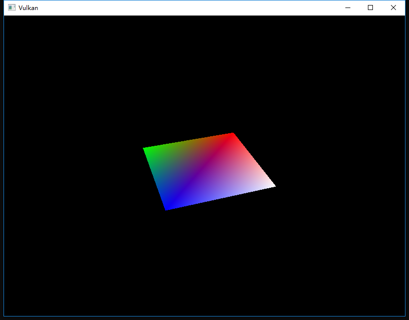

继续上一次的
<!-- more -->
<b>介绍</b>
前一章中的描述符布局描述了被绑定的描述符的类型。在本章中，我们将为每个VkBuffer资源创建一个描述符集，以将其绑定到统一缓冲区描述符上。

<b>描述符池</b>
描述符集不能直接创建，它们必须从命令缓冲区等池中分配。对于描述符集合使用需要调用描述符对象池（descriptor pool）。我们将编写一个新函数createDescriptorPool来创建：
```cpp
void initVulkan() {
    ...
    createUniformBuffer();
    createDescriptorPool();
    ...
}

...

void createDescriptorPool() {

}
```
我们首先需要使用VkDescriptorPoolSize结构来描述我们的描述符集将包含哪些描述符类型以及数目。
```cpp
VkDescriptorPoolSize poolSize = {};
poolSize.type = VK_DESCRIPTOR_TYPE_UNIFORM_BUFFER;
poolSize.descriptorCount = static_cast<uint32_t>(swapChainImages.size());
```
我们将为每个帧分配其中一个描述符。这个池的大小由VkDescriptorPoolCreateInfo结构引用：
```cpp
VkDescriptorPoolCreateInfo poolInfo = {};
poolInfo.sType = VK_STRUCTURE_TYPE_DESCRIPTOR_POOL_CREATE_INFO;
poolInfo.poolSizeCount = 1;
poolInfo.pPoolSizes = &poolSize;
```
除了可用的单个描述符的最大数量之外，我们还需要指定可以分配的最大描述符集数量：
```cpp
poolInfo.maxSets = static_cast<uint32_t>(swapChainImages.size());
```
该结构具有一个类似于命令池的可选标志，用于确定是否可以释放各个单个的描述符集：VK_DESCRIPTOR_POOL_CREATE_FREE_DESCRIPTOR_SET_BIT。创建后我们不会再使用他，所以我们不需要这个标志。这里设置成默认的0就行。
```cpp
VkDescriptorPool descriptorPool;

...

if (vkCreateDescriptorPool(device, &poolInfo, nullptr, &descriptorPool) != VK_SUCCESS) {
    throw std::runtime_error("failed to create descriptor pool!");
}
```
添加一个新的类成员来存储描述符池的句柄，并调用vkCreateDescriptorPool来创建它。与其他绘制资源一样，描述符也是在程序退出的时候销毁：
```cpp
void cleanup() {
    cleanupSwapChain();

    vkDestroyDescriptorPool(device, descriptorPool, nullptr);

    ...
}
```

<b>描述符集</b>
我们现在可以分配描述符集了。添加一个createDescriptorSets函数：
```cpp
void initVulkan() {
    ...
    createDescriptorPool();
    createDescriptorSets();
    ...
}

...

void createDescriptorSets() {

}
```
使用VkDescriptorSetAllocateInfo结构来描述描述符集的分配。您需要指定要分配的描述符池，要分配的描述符集的数量，以及基于它们的描述符布局：
```cpp
std::vector<VkDescriptorSetLayout> layouts(swapChainImages.size(), descriptorSetLayout);
VkDescriptorSetAllocateInfo allocInfo = {};
allocInfo.sType = VK_STRUCTURE_TYPE_DESCRIPTOR_SET_ALLOCATE_INFO;
allocInfo.descriptorPool = descriptorPool;
allocInfo.descriptorSetCount = static_cast<uint32_t>(swapChainImages.size());
allocInfo.pSetLayouts = layouts.data();
```
在我们的例子中，我们将为每个交换链图像都创建一个描述符集，所有描述符都具有相同的布局。不幸的是，我们确实需要布局的所有副本，因为下一个函数需要一个与集合数匹配的数组。添加一个类成员来保存描述符集句柄并使用vkAllocateDescriptorSets分配它们：
```cpp
VkDescriptorPool descriptorPool;
std::vector<VkDescriptorSet> descriptorSets;

...

descriptorSets.resize(swapChainImages.size());
if (vkAllocateDescriptorSets(device, &allocInfo, descriptorSets.data()) != VK_SUCCESS) {
    throw std::runtime_error("failed to allocate descriptor sets!");
}
```
您不需要显式清理描述符集，因为它们将在销毁描述符池时自动释放。对vkAllocateDescriptorSets的调用将分配描述符集，每个描述符集都具有一个统一的缓冲区描述符。

现在已经分配了描述符集，但仍然需要配置其中的描述符。我们现在将添加一个循环来填充每个描述符：
```cpp
for (size_t i = 0; i < swapChainImages.size(); i++) {

}
```
引用缓冲区的描述符（如我们的统一缓冲区描述符）使用VkDescriptorBufferInfo结构进行配置。此结构指定缓冲区及其中包含描述符数据的区域。
```cpp
for (size_t i = 0; i < swapChainImages.size(); i++) {
    VkDescriptorBufferInfo bufferInfo = {};
    bufferInfo.buffer = uniformBuffers[i];
    bufferInfo.offset = 0;
    bufferInfo.range = sizeof(UniformBufferObject);
}
```
如果你正在覆盖整个缓冲区，就像现在这种情况下一样，那么也可以使用VK_WHOLE_SIZE值作为范围。使用vkUpdateDescriptorSets函数更新描述符的配置，该函数将VkWriteDescriptorSet结构数组作为参数。
```cpp
VkWriteDescriptorSet descriptorWrite = {};
descriptorWrite.sType = VK_STRUCTURE_TYPE_WRITE_DESCRIPTOR_SET;
descriptorWrite.dstSet = descriptorSets[i];
descriptorWrite.dstBinding = 0;
descriptorWrite.dstArrayElement = 0;
```
前两个字段指定要更新的描述符集和绑定，我们设定了统一缓冲区绑定的索引为0。请记住，描述符可以是数组，因此我们还需要指定要更新后的数组的索引。由于我们没有使用数组，所以索引设为0就行了。
```cpp
descriptorWrite.descriptorType = VK_DESCRIPTOR_TYPE_UNIFORM_BUFFER;
descriptorWrite.descriptorCount = 1;
```
我们需要再次指定描述符的类型。从索引dstArrayElement开始，可以在数组中一次更新多个描述符，descriptorCount字段指定要更新的数组元素数目。
```cpp
descriptorWrite.pBufferInfo = &bufferInfo;
descriptorWrite.pImageInfo = nullptr; // Optional
descriptorWrite.pTexelBufferView = nullptr; // Optional
```
最后一个字段引用一个数组，其中包含了实际配置描述符的descriptorCount结构。它取决于描述符的类型，您实际需要使用三个中的一个。pBufferInfo字段用于引用缓冲区数据的描述符，pImageInfo用于引用图像数据的描述符，pTexelBufferView用于引用缓冲区视图的描述符。
```cpp
vkUpdateDescriptorSets(device, 1, &descriptorWrite, 0, nullptr);
```
使用vkUpdateDescriptorSets应用更新。它接受两种数组作为参数：VkWriteDescriptorSet数组和VkCopyDescriptorSet数组。正如其名称所暗示的，后者可用于将描述符彼此复制。

<b>使用描述符集</b>
我们现在需要更新createCommandBuffers函数，使用cmdBindDescriptorSets将描述符集合绑定到实际的着色器的描述符中，这个函数需vkCmdDrawIndexed之前完成调用：
```cpp
vkCmdBindDescriptorSets(commandBuffers[i], VK_PIPELINE_BIND_POINT_GRAPHICS, pipelineLayout, 0, 1, &descriptorSets[i], 0, nullptr);
vkCmdDrawIndexed(commandBuffers[i], static_cast<uint32_t>(indices.size()), 1, 0, 0, 0);
```
与顶点和索引缓冲区不同，描述符集不是图形管道所特有的，因此，我们需要指定是否要将描述符集绑定到图形或计算管道。下一个参数是描述符所基于的布局。接下来的三个参数分别指定了第一个描述符集的索引，要绑定的集合数以及要绑定的集数组。最后两个参数指定用于动态描述符的偏移数组。我们在后续的章节中讨论这些。

如果你现在运行你的程序，那么你会注意到遗憾的是没有任何东西可见。问题在于，由于我们在投影矩阵中进行了Y-flip，所以现在以顺时针顺序而不是逆时针顺序绘制顶点。这会导致背面剔除，并阻止绘制任何几何体。在createGraphicsPipeline函数中修改VkPipelineRasterizationStateCreateInfo中的frontFace以更正此问题：
```cpp
rasterizer.cullMode = VK_CULL_MODE_BACK_BIT;
rasterizer.frontFace = VK_FRONT_FACE_COUNTER_CLOCKWISE;
```
再次运行您的程序，您现在应该看到以下内容：


矩形已变为正方形，因为投影矩阵现在可以校正纵横比。updateUniformBuffer负责屏幕大小调整，因此我们不需要在recreateSwapChain中重新创建描述符集。

<b>多描述符集</b>
正如一些结构和函数调用暗示的那样，实际上可以同时绑定多个描述符集。在创建管道布局时，需要为每个描述符集指定描述符布局，然后着色器可以引用特定的描述符集，如下所示：
```cpp
layout(set = 0, binding = 0) uniform UniformBufferObject { ... }
```
我们可以使用此功能将每个对象和发生变化的描述符分配到单独的描述符集合中，在这种情况下，可以避免重新绑定大部分描述符，这样可能会更加高效。


