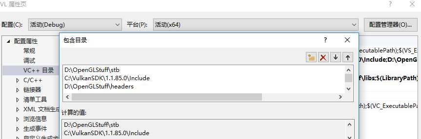

继续上一次的
<!-- more -->
<b>介绍</b>
到目前为止，几何体已经逐顶点的方法进行着色，这是一种相当局限的方法。在本教程的这个部分中，我们将实现纹理映射以使几何看起来更生动有趣，这也将允许我们在将来的章节中加载和绘制基本的3D模型。

在应用程序中添加纹理将涉及以下步骤：
* 创建设备内存支持的图像对象
* 用图像文件中的像素填充它
* 创建图像采样器
* 添加组合图像采样器描述符以从纹理中采样颜色

我们之前已经使用过图像对象，但这些是由交换链扩展自动创建的，这次我们必须自己创造一个。创建图像并用数据填充它与顶点缓冲区创建类似，我们首先创建一个临时资源并用像素数据填充它，然后我们将其复制到我们将用于渲染的最终图像对象中。虽然可以为此目的创建一个临时图像，但Vulkan还允许您直接将像素从VkBuffer复制到图像，并且在[某些硬件上这样还更快](https://developer.nvidia.com/vulkan-memory-management)。我们首先创建这个缓冲区并用像素值填充它，然后我们将创建一个图像来复制像素。它需要查询内存，分配设备内存并绑定它，就像之前那样。

但是，在处理图像时我们还需要注意一些额外的事情，图像可以具有不同的布局，这些布局会影响像素在内存中的组织方式。由于图形硬件的工作方式，例如简单地逐行存储像素可能不会产生最佳性能。对图像执行任何操作时，都必须确保它们具有最适合在该操作中使用的布局。实际上，当我们指定渲染过程时，我们已经看到了一些布局：
* VK_IMAGE_LAYOUT_PRESENT_SRC_KHR：最适合演示
* VK_IMAGE_LAYOUT_COLOR_ATTACHMENT_OPTIMAL：最适合作为从片段着色器中写入颜色的附件
* VK_IMAGE_LAYOUT_TRANSFER_SRC_OPTIMAL：最适合作为传输操作中的源，如vkCmdCopyImageToBuffer
* VK_IMAGE_LAYOUT_TRANSFER_DST_OPTIMAL：最适合作为传输操作中的目标，如vkCmdCopyBufferToImage
* VK_IMAGE_LAYOUT_SHADER_READ_ONLY_OPTIMAL：最适合着色器采样

转换图像布局的最常用方法之一是管线屏障（pipeline barrier）。管线屏障主要用于同步对资源的访问，例如确保在读取图像之前写入图像，但它们也可用于转换布局。在本章中，我们将看到管线屏障如何用于此目的。使用VK_SHARING_MODE_EXCLUSIVE时，还可以使用屏障来传输队列簇的所有权。

<b>图像库</b>
有许多库可用于加载图像，您甚至可以编写自己的代码来加载简单格式，如BMP和PPM。在本教程中，我们将使用[stb collection](https://github.com/nothings/stb)中的stb_image库。它的优点是所有代码都在一个文件中，因此它不需要任何棘手的构建配置。下载stb_image.h并将其存储在一个方便的位置，例如保存GLFW和GLM的目录中。将位置添加到包含路径。
<b>Visual Studio</b>
将包含stb_image.h的目录添加到Additional Include Directories路径。


<b>Makefile</b>
将包含stb_image.h的目录添加到GCC的include目录中：
```Makefile
VULKAN_SDK_PATH = /home/user/VulkanSDK/x.x.x.x/x86_64
STB_INCLUDE_PATH = /home/user/libraries/stb

...

CFLAGS = -std=c++17 -I$(VULKAN_SDK_PATH)/include -I$(STB_INCLUDE_PATH)
```

<b>加载图片</b>
像这样包含图像库：
```cpp
#define STB_IMAGE_IMPLEMENTATION
#include <stb_image.h>
```
头文件默认只定义了函数的原型。一个代码文件需要使用STB_IMAGE_IMPLEMENTATION来包含定义在头文件中的函数体，否则我们将收到链接错误。
```cpp
void initVulkan() {
    ...
    createCommandPool();
    createTextureImage();
    createVertexBuffer();
    ...
}

...

void createTextureImage() {

}
```
创建一个新函数createTextureImage，我们将加载一个图像并将其上传到Vulkan图像对象中。我们将使用命令缓冲区，因此在createCommandPool之后来调用它。

在shaders目录旁边创建一个新目录textures，以存储纹理图像。我们将从该目录加载一个名为texture.jpg的图像。我选择使用以下[CC0许可](https://pixabay.com/en/statue-sculpture-fig-historically-1275469/)的可图片并将大小调整为512x512，但您可以选择想要的任何图像。


使用这个库加载图像非常简单：
```cpp
void createTextureImage() {
    int texWidth, texHeight, texChannels;
    stbi_uc* pixels = stbi_load("textures/texture.jpg", &texWidth, &texHeight, &texChannels, STBI_rgb_alpha);
    VkDeviceSize imageSize = texWidth * texHeight * 4;

    if (!pixels) {
        throw std::runtime_error("failed to load texture image!");
    }
}
```
stbi_load函数将文件路径和要加载的通道数作为参数。STBI_rgb_alpha值会强制图像加载alpha通道，即使它没有，这样以便将来与其他纹理保持一致。返回的指针是像素值数组中的第一个元素。在STBI_rgba_alpha的情况下，像素逐行排列，每像素4个字节，总共有texWidth*texHeight*4个值。

<b>临时缓冲区</b>
我们现在要在主机可见内存中创建一个缓冲区，以便我们可以使用vkMapMemory并将像素复制给它。在createTextureImage函数中添加此临时缓冲区的变量：
```cpp
VkBuffer stagingBuffer;
VkDeviceMemory stagingBufferMemory;
```
缓冲区应该在主机可见内存中，以便我们可以映射它，而且它还应该可以用作传输源，以便我们稍后可以将其复制到图像中：
```cpp
createBuffer(imageSize, VK_BUFFER_USAGE_TRANSFER_SRC_BIT, VK_MEMORY_PROPERTY_HOST_VISIBLE_BIT | VK_MEMORY_PROPERTY_HOST_COHERENT_BIT, stagingBuffer, stagingBufferMemory);
```
然后我们可以直接将我们从图像加载库获得的像素值复制到缓冲区：
```cpp
void* data;
vkMapMemory(device, stagingBufferMemory, 0, imageSize, 0, &data);
    memcpy(data, pixels, static_cast<size_t>(imageSize));
vkUnmapMemory(device, stagingBufferMemory);
```
不要忘记清理原始像素数组：
```cpp
stbi_image_free(pixels);
```

<b>纹理图像</b>
虽然我们可以设置着色器来访问缓冲区中的像素值，但在Vulkan中最好使用图像对象来实现此目的。通过使用2D坐标，图像对象可以更容易和更快地来检索颜色。图像对象中的像素称为纹素（texels），即纹理元素，我们将从现在开始使用该名称。添加以下新类成员：
```cpp
VkImage textureImage;
VkDeviceMemory textureImageMemory;
```
图像的参数在VkImageCreateInfo结构中指定：
```cpp
VkImageCreateInfo imageInfo = {};
imageInfo.sType = VK_STRUCTURE_TYPE_IMAGE_CREATE_INFO;
imageInfo.imageType = VK_IMAGE_TYPE_2D;
imageInfo.extent.width = static_cast<uint32_t>(texWidth);
imageInfo.extent.height = static_cast<uint32_t>(texHeight);
imageInfo.extent.depth = 1;
imageInfo.mipLevels = 1;
imageInfo.arrayLayers = 1;
```
在imageType字段中指定的图像类型来告诉Vulkan将使用哪种坐标系来处理图像中的纹素，可以是1D，2D和3D图像。例如，一维图像可用于存储数据或梯度阵列，二维图像主要用于纹理，三维图像可用于存储立体纹素。extent字段指定图像的尺寸，基本上就是每个轴上有多少个纹​​素。这就是为什么深度必须是1而不是0.我们的纹理不会是一个数组，而现在我们不会使用mipmapping功能。
```cpp
imageInfo.format = VK_FORMAT_R8G8B8A8_UNORM;
```
Vulkan支持许多可能的图像格式，但我们应该使用与缓冲区中像素相同的纹理元素格式，否则复制操作将失败。
```cpp
imageInfo.tiling = VK_IMAGE_TILING_OPTIMAL;
```
tiling字段可以是以下两个值之一：
* VK_IMAGE_TILING_LINEAR：像我们的像素数组一样，纹素按行序排列
* VK_IMAGE_TILING_OPTIMAL：纹素基于具体的实现来定义布局，以实现最佳的访问效率

与图像的布局不同，平铺模式不能在之后更改。如果您希望能够直接访问图像内存中的纹素，则必须使用VK_IMAGE_TILING_LINEAR，我们将使用一个临时缓冲区而不是一个临时图像，并没有这个需求。我们将使用VK_IMAGE_TILING_OPTIMAL从着色器进行高效访问。
```cpp
imageInfo.initialLayout = VK_IMAGE_LAYOUT_UNDEFINED;
```
图像的initialLayout只有两个可能的值：
* VK_IMAGE_LAYOUT_UNDEFINED：GPU无法使用，第一次转换将丢弃纹素。
* VK_IMAGE_LAYOUT_PREINITIALIZED：GPU无法使用，但第一次转换将保留纹素。

在第一次转换期间，很少有情况需要保留纹素。但是，如果您想将图像使用VK_IMAGE_TILING_LINEAR的布局作为临时图像，在这种情况下，您需要将纹素数据上传，然后将图像转换为传输源而不能丢失数据。然而，在我们的例子中，我们首先将图像转换为传输目标，然后从缓冲区对象复制纹素数据，因此我们不需要这个特性，所以可以放心地使用VK_IMAGE_LAYOUT_UNDEFINED。
```cpp
imageInfo.usage = VK_IMAGE_USAGE_TRANSFER_DST_BIT | VK_IMAGE_USAGE_SAMPLED_BIT;
```
usage字段与缓冲区创建期间的语义相同。该图像将用作缓冲区复制的目标，因此应将其设置为传输目标。我们还希望能够从着色器访问图像用来为我们的网格着色，因此还要应包括VK_IMAGE_USAGE_SAMPLED_BIT。
```cpp
imageInfo.sharingMode = VK_SHARING_MODE_EXCLUSIVE;
```
该图像仅由一个队列簇使用：支持图形（因此也支持）传输操作的队列。
```cpp
imageInfo.samples = VK_SAMPLE_COUNT_1_BIT;
imageInfo.flags = 0; // Optional
```
samples标志位与多重采样相关。这仅仅适用于作为附件的图像，所以我们坚持一个采样数值。对于与稀疏图像相关的图像，存在一些可选标记。稀疏图像是只有某些区域实际存储到内存的图像。例如，如果您使用3D纹理用于立体地形的生成，那么您可以使用它来避免分配的内存存储大量的“空”值。我们将不会在本教程中使用它，因此将其保留为默认值0。
```cpp
if (vkCreateImage(device, &imageInfo, nullptr, &textureImage) != VK_SUCCESS) {
    throw std::runtime_error("failed to create image!");
}
```
图像是使用vkCreateImage创建的，它没有任何特别值得注意的参数。图形硬件可能不支持VK_FORMAT_R8G8B8A8_UNORM格式，所以您应该有一个可接受的替代方案列表，并选择最好的替代方案，但是，对这种特定格式的支持非常普遍，我们将跳过此步骤。使用不同的格式也需要烦人的转换。我们将在深度缓冲区讨论他，并实现一个类似的系统。
```cpp
VkMemoryRequirements memRequirements;
vkGetImageMemoryRequirements(device, textureImage, &memRequirements);

VkMemoryAllocateInfo allocInfo = {};
allocInfo.sType = VK_STRUCTURE_TYPE_MEMORY_ALLOCATE_INFO;
allocInfo.allocationSize = memRequirements.size;
allocInfo.memoryTypeIndex = findMemoryType(memRequirements.memoryTypeBits, VK_MEMORY_PROPERTY_DEVICE_LOCAL_BIT);

if (vkAllocateMemory(device, &allocInfo, nullptr, &textureImageMemory) != VK_SUCCESS) {
    throw std::runtime_error("failed to allocate image memory!");
}

vkBindImageMemory(device, textureImage, textureImageMemory, 0);
```
为图像分配内存的工作方式与为缓冲区分配内存的方式完全相同。这里需要使用vkGetImageMemoryRequirements而不是vkGetBufferMemoryRequirements，使用vkBindImageMemory而不是vkBindBufferMemory。

这个函数已经变得非常巨大了，并且在后面的章节中还会创建更多的图像，因此我们应该将图像创建的过程抽象为createImage函数，就像我们为缓冲区所做的那样。创建函数并将图像对象创建和内存分配过程移动到这里面：
```cpp
void createImage(uint32_t width, uint32_t height, VkFormat format, VkImageTiling tiling, VkImageUsageFlags usage, VkMemoryPropertyFlags properties, VkImage& image, VkDeviceMemory& imageMemory) {
    VkImageCreateInfo imageInfo = {};
    imageInfo.sType = VK_STRUCTURE_TYPE_IMAGE_CREATE_INFO;
    imageInfo.imageType = VK_IMAGE_TYPE_2D;
    imageInfo.extent.width = width;
    imageInfo.extent.height = height;
    imageInfo.extent.depth = 1;
    imageInfo.mipLevels = 1;
    imageInfo.arrayLayers = 1;
    imageInfo.format = format;
    imageInfo.tiling = tiling;
    imageInfo.initialLayout = VK_IMAGE_LAYOUT_UNDEFINED;
    imageInfo.usage = usage;
    imageInfo.samples = VK_SAMPLE_COUNT_1_BIT;
    imageInfo.sharingMode = VK_SHARING_MODE_EXCLUSIVE;

    if (vkCreateImage(device, &imageInfo, nullptr, &image) != VK_SUCCESS) {
        throw std::runtime_error("failed to create image!");
    }

    VkMemoryRequirements memRequirements;
    vkGetImageMemoryRequirements(device, image, &memRequirements);

    VkMemoryAllocateInfo allocInfo = {};
    allocInfo.sType = VK_STRUCTURE_TYPE_MEMORY_ALLOCATE_INFO;
    allocInfo.allocationSize = memRequirements.size;
    allocInfo.memoryTypeIndex = findMemoryType(memRequirements.memoryTypeBits, properties);

    if (vkAllocateMemory(device, &allocInfo, nullptr, &imageMemory) != VK_SUCCESS) {
        throw std::runtime_error("failed to allocate image memory!");
    }

    vkBindImageMemory(device, image, imageMemory, 0);
}
```
这里使用了width,height,format,tiling mode,usage和memory properties参数，因为之后创建的图像都会有所不同。

createTextureImage函数现在可以简化为：
```cpp
void createTextureImage() {
    int texWidth, texHeight, texChannels;
    stbi_uc* pixels = stbi_load("textures/texture.jpg", &texWidth, &texHeight, &texChannels, STBI_rgb_alpha);
    VkDeviceSize imageSize = texWidth * texHeight * 4;

    if (!pixels) {
        throw std::runtime_error("failed to load texture image!");
    }

    VkBuffer stagingBuffer;
    VkDeviceMemory stagingBufferMemory;
    createBuffer(imageSize, VK_BUFFER_USAGE_TRANSFER_SRC_BIT, VK_MEMORY_PROPERTY_HOST_VISIBLE_BIT | VK_MEMORY_PROPERTY_HOST_COHERENT_BIT, stagingBuffer, stagingBufferMemory);

    void* data;
    vkMapMemory(device, stagingBufferMemory, 0, imageSize, 0, &data);
        memcpy(data, pixels, static_cast<size_t>(imageSize));
    vkUnmapMemory(device, stagingBufferMemory);

    stbi_image_free(pixels);

    createImage(texWidth, texHeight, VK_FORMAT_R8G8B8A8_UNORM, VK_IMAGE_TILING_OPTIMAL, VK_IMAGE_USAGE_TRANSFER_DST_BIT | VK_IMAGE_USAGE_SAMPLED_BIT, VK_MEMORY_PROPERTY_DEVICE_LOCAL_BIT, textureImage, textureImageMemory);
}
```

<b>布局转换</b>
我们现在要编写的函数包括再次记录和执行命令缓冲区，所以现在是将该逻辑转换为辅助函数的好时机：
```cpp
VkCommandBuffer beginSingleTimeCommands() {
    VkCommandBufferAllocateInfo allocInfo = {};
    allocInfo.sType = VK_STRUCTURE_TYPE_COMMAND_BUFFER_ALLOCATE_INFO;
    allocInfo.level = VK_COMMAND_BUFFER_LEVEL_PRIMARY;
    allocInfo.commandPool = commandPool;
    allocInfo.commandBufferCount = 1;

    VkCommandBuffer commandBuffer;
    vkAllocateCommandBuffers(device, &allocInfo, &commandBuffer);

    VkCommandBufferBeginInfo beginInfo = {};
    beginInfo.sType = VK_STRUCTURE_TYPE_COMMAND_BUFFER_BEGIN_INFO;
    beginInfo.flags = VK_COMMAND_BUFFER_USAGE_ONE_TIME_SUBMIT_BIT;

    vkBeginCommandBuffer(commandBuffer, &beginInfo);

    return commandBuffer;
}

void endSingleTimeCommands(VkCommandBuffer commandBuffer) {
    vkEndCommandBuffer(commandBuffer);

    VkSubmitInfo submitInfo = {};
    submitInfo.sType = VK_STRUCTURE_TYPE_SUBMIT_INFO;
    submitInfo.commandBufferCount = 1;
    submitInfo.pCommandBuffers = &commandBuffer;

    vkQueueSubmit(graphicsQueue, 1, &submitInfo, VK_NULL_HANDLE);
    vkQueueWaitIdle(graphicsQueue);

    vkFreeCommandBuffers(device, commandPool, 1, &commandBuffer);
}
```
这些函数的代码是基于copyBuffer中的已有代码。您现在可以将该功能简化为：
```cpp
void copyBuffer(VkBuffer srcBuffer, VkBuffer dstBuffer, VkDeviceSize size) {
    VkCommandBuffer commandBuffer = beginSingleTimeCommands();

    VkBufferCopy copyRegion = {};
    copyRegion.size = size;
    vkCmdCopyBuffer(commandBuffer, srcBuffer, dstBuffer, 1, &copyRegion);

    endSingleTimeCommands(commandBuffer);
}
```
如果我们仍在使用缓冲区，那么我们现在可以编写一个函数来记录和执行vkCmdCopyBufferToImage来完成作业，但是这个命令要求图像首先处于正确的布局中。创建一个新函数来处理布局转换：
```cpp
void transitionImageLayout(VkImage image, VkFormat format, VkImageLayout oldLayout, VkImageLayout newLayout) {
    VkCommandBuffer commandBuffer = beginSingleTimeCommands();

    endSingleTimeCommands(commandBuffer);
}
```
执行布局转换的最常用方法之一是使用图像内存屏障（image memory barrier）。像这样的管线屏障通常用于同步对资源的访问，例如确保在读取缓冲区之前完成对缓冲区的写入，但是当使用VK_SHARING_MODE_EXCLUSIVE时，它也可以用于转换图像布局和传输队列簇的所有权。缓冲区有一个等效的缓冲区内存屏障（uffer memory barrier）。
```cpp
VkImageMemoryBarrier barrier = {};
barrier.sType = VK_STRUCTURE_TYPE_IMAGE_MEMORY_BARRIER;
barrier.oldLayout = oldLayout;
barrier.newLayout = newLayout;
```
前两个字段指定布局转换。如果您不关心图像的现有内容，可以将oldLayout的值改为VK_IMAGE_LAYOUT_UNDEFINED。
```cpp
barrier.srcQueueFamilyIndex = VK_QUEUE_FAMILY_IGNORED;
barrier.dstQueueFamilyIndex = VK_QUEUE_FAMILY_IGNORED;
```
如果您使用屏障来传输队列簇的所有权，那么这两个字段应该是队列族的索引。如果您不想这样做（这个不是默认值！必须设置），则必须将它们设置为VK_QUEUE_FAMILY_IGNORED。
```cpp
barrier.image = image;
barrier.subresourceRange.aspectMask = VK_IMAGE_ASPECT_COLOR_BIT;
barrier.subresourceRange.baseMipLevel = 0;
barrier.subresourceRange.levelCount = 1;
barrier.subresourceRange.baseArrayLayer = 0;
barrier.subresourceRange.layerCount = 1;
```
image和subresourceRange指定了受影响的图像和图像的特定部分。我们的图像不是数组形式，也没有使用mipmapping级别，因此只指定了一个级别和图层。
```cpp
barrier.srcAccessMask = 0; // TODO
barrier.dstAccessMask = 0; // TODO
```
屏障主要用于同步，因此您必须指定涉及资源的哪些类型的操作必须在屏障之前发生，以及涉及资源的哪些操作必须在屏障上等待。尽管已经使用vkQueueWaitIdle手动同步，但我们还是需要这样做。正确的值取决于旧的和新的布局，所以一旦我们弄清楚我们将要使用哪些转换，就会回到这里来设置。
```cpp
vkCmdPipelineBarrier(
    commandBuffer,
    0 /* TODO */, 0 /* TODO */,
    0,
    0, nullptr,
    0, nullptr,
    1, &barrier
);
```
使用相同的函数提交所有类型的管道障碍。命令缓冲区之后的第一个参数指定了应在屏障之前发生的操作位于哪个管道阶段。第二个参数指定操作将在屏障上等待的管道阶段。在屏障之前和之后指定的管道阶段取决于您在屏障之前和之后使用资源的方式。允许的值列在此[规范表](https://www.khronos.org/registry/vulkan/specs/1.0/html/vkspec.html#synchronization-access-types-supported)中。例如，如果您要在p屏障后从统一缓冲区中读取，就需要指定为VK_ACCESS_UNIFORM_READ_BIT用法并将从统一缓冲区中读取到的初始着色器作为管线阶段，例如VK_PIPELINE_STAGE_FRAGMENT_SHADER_BIT。为此类用法指定非着色器管道阶段是没有意义的，并且当您指定与使用类型不匹配的管道阶段时，验证层将发出警告。

第三个参数是0或VK_DEPENDENCY_BY_REGION_BIT。后者将屏障转变为每个区域的状态。这意味着，可以实现从目前已经编写的资源部分开始读取。

最后三个参数引用了三种可用类型的管道屏障数组：内存屏障，缓冲内存屏障和图像内存屏障，就像我们在这里使用的那样。请注意，我们还没有使用VkFormat参数，这个我们将在深度缓冲区章节中来使用进行特殊转换。

<b>从缓冲区复制到图像</b>
在回到createTextureImage之前，我们这里再写一个辅助函数：copyBufferToImage：
```cpp
void copyBufferToImage(VkBuffer buffer, VkImage image, uint32_t width, uint32_t height) {
    VkCommandBuffer commandBuffer = beginSingleTimeCommands();

    endSingleTimeCommands(commandBuffer);
}
```
就像缓冲区复制一样，您需要指定将缓冲区的哪个部分复制到映像的哪个部分。这通过VkBufferImageCopy结构实现：
```cpp
VkBufferImageCopy region = {};
region.bufferOffset = 0;
region.bufferRowLength = 0;
region.bufferImageHeight = 0;

region.imageSubresource.aspectMask = VK_IMAGE_ASPECT_COLOR_BIT;
region.imageSubresource.mipLevel = 0;
region.imageSubresource.baseArrayLayer = 0;
region.imageSubresource.layerCount = 1;

region.imageOffset = {0, 0, 0};
region.imageExtent = {
    width,
    height,
    1
};
```
大多数这些参数都是一看就知道了。bufferOffset指定了缓冲区中的字节偏移量，代表像素值起始的位置。bufferRowLength和bufferImageHeight字段指定像素在内存中的布局方式。例如，您可以在图像的行与行之间有一些填充字节，为两者指定0表示像素紧密排列，就像我们的情况一样imageSubresource，imageOffset和imageExtent字段指示了我们要复制像素的图像部分。

使用vkCmdCopyBufferToImage函数将缓冲区到图像的复制操作排入队列：
```cpp
vkCmdCopyBufferToImage(
    commandBuffer,
    buffer,
    image,
    VK_IMAGE_LAYOUT_TRANSFER_DST_OPTIMAL,
    1,
    &region
);
```
第四个参数指示图像当前使用的布局。现在假设图像已经转换到最适合复制像素的布局。现在我们只将像素块复制到整个图像，但是可以指定一个VkBufferImageCopy数组，在一次操作中从该缓冲区到图像执行许多不同的复制操作。

<b>准备纹理图像</b>
现在我们拥有了完成纹理图像设置所需的所有工具，因此我们将回到createTextureImage函数，我们在那里做的最后一件事是创建纹理图像。下一步是将临时缓冲区复制到纹理图像。这涉及两个步骤：
* 将纹理图像转换为VK_IMAGE_LAYOUT_TRANSFER_DST_OPTIMAL
* 执行缓冲区到图像的复制操作

这对我们刚刚创建的函数很容易实现：
```cpp
transitionImageLayout(textureImage, VK_FORMAT_R8G8B8A8_UNORM, VK_IMAGE_LAYOUT_UNDEFINED, VK_IMAGE_LAYOUT_TRANSFER_DST_OPTIMAL);
copyBufferToImage(stagingBuffer, textureImage, static_cast<uint32_t>(texWidth), static_cast<uint32_t>(texHeight));
```
图像是使用VK_IMAGE_LAYOUT_UNDEFINED布局创建的，因此在转换textureImage时应将其指定为旧布局。请记住，我们可以这样做是因为在执行复制操作之前我们不关心其内容。

为了能够从着色器中的纹理图像进行采样，我们需要最后一次转换操作来为着色器访问做好准备：
```cpp
transitionImageLayout(textureImage, VK_FORMAT_R8G8B8A8_UNORM, VK_IMAGE_LAYOUT_TRANSFER_DST_OPTIMAL, VK_IMAGE_LAYOUT_SHADER_READ_ONLY_OPTIMAL);
```

<b>转换屏障掩码</b>
如果您现在运行启用了验证图层的应用程序，那么您将看到它抱怨transitionImageLayout中的访问掩码和管道阶段无效。我们仍然需要根据转换中的布局来设置它们。

我们需要处理两个转换：
* Undefined → transfer destination：传输的写入操作不需要等待任何事情
* Transfer destination → shader reading: 着色器的读取应该等待传输写入，特别是着色器在读取片段着色器的时候，因为那是我们要使用纹理的地方。

使用以下访问掩码和管道阶段来指定这些规则：
```cpp
VkPipelineStageFlags sourceStage;
VkPipelineStageFlags destinationStage;

if (oldLayout == VK_IMAGE_LAYOUT_UNDEFINED && newLayout == VK_IMAGE_LAYOUT_TRANSFER_DST_OPTIMAL) {
    barrier.srcAccessMask = 0;
    barrier.dstAccessMask = VK_ACCESS_TRANSFER_WRITE_BIT;

    sourceStage = VK_PIPELINE_STAGE_TOP_OF_PIPE_BIT;
    destinationStage = VK_PIPELINE_STAGE_TRANSFER_BIT;
} else if (oldLayout == VK_IMAGE_LAYOUT_TRANSFER_DST_OPTIMAL && newLayout == VK_IMAGE_LAYOUT_SHADER_READ_ONLY_OPTIMAL) {
    barrier.srcAccessMask = VK_ACCESS_TRANSFER_WRITE_BIT;
    barrier.dstAccessMask = VK_ACCESS_SHADER_READ_BIT;

    sourceStage = VK_PIPELINE_STAGE_TRANSFER_BIT;
    destinationStage = VK_PIPELINE_STAGE_FRAGMENT_SHADER_BIT;
} else {
    throw std::invalid_argument("unsupported layout transition!");
}

vkCmdPipelineBarrier(
    commandBuffer,
    sourceStage, destinationStage,
    0,
    0, nullptr,
    0, nullptr,
    1, &barrier
);
```
正如您在上述表中所看到的，传输写入必须在管道传输阶段进行。由于写入不必等待任何事情，因此您可以为预屏障操作指定空的访问掩码和最早可能的流水线阶段VK_PIPELINE_STAGE_TOP_OF_PIPE_BIT。应该注意的是，VK_PIPELINE_STAGE_TRANSFER_BIT不是图形和计算流水线中的真实阶段。它更像是一个转换发生时的一个伪阶段。有关伪阶段的更多信息和其他示例，请参阅[文档](https://www.khronos.org/registry/vulkan/specs/1.1-extensions/man/html/VkPipelineStageFlagBits.html)。

图像将写入相同的管道阶段，然后由片段着色器读取，这就是为什么我们要在片段着色器管道阶段指定着色器读取访问。

如果我们将来需要进行更多转换，那么我们将扩展该功能。应用程序现在应该成功运行，尽管还没有可视化的变化。

需要注意的一点是，命令缓冲区提交会在开始时导致隐式VK_ACCESS_HOST_WRITE_BIT同步。由于transitionImageLayout函数仅使用单个命令执行命令缓冲区，如果在布局转换中需要VK_ACCESS_HOST_WRITE_BIT依赖项，则可以使用此隐式同步并将srcAccessMask设置为0。你想明确操作或隐式操作是完全取决于你的想法，但我个人并不喜欢依赖于这些类似OpenGL的“隐藏”操作。

实际上有一种特殊类型的图像布局支持所有操作，VK_IMAGE_LAYOUT_GENERAL。当然，它的问题在于它不一定能为所有操作都提供最佳性能。在某些特殊情况需要它，例如将图像用作输入和输出，或者在图像离开预初始化布局后读取图像。

到目前为止，所有提交命令的辅助函数都已设置为通过等待队列变为空闲来同步执行。对于实际的应用，建议将这些操作组合在一个命令缓冲区中，并异步执行它们以获得更高的吞吐量，尤其是createTextureImage函数中的转换和复制操作。尝试通过创建一个setupCommandBuffer辅助函数记录命令，并添加一个flushSetupCommands函数来执行所以已经目录的命令。纹理贴图映射工作后这样做，来检查纹理资源是否仍然正确设置。

<b>清理</b>
通过在末尾清理临时缓冲区及其内存来完成createTextureImage函数：
```cpp
    transitionImageLayout(textureImage, VK_FORMAT_R8G8B8A8_UNORM, VK_IMAGE_LAYOUT_TRANSFER_DST_OPTIMAL, VK_IMAGE_LAYOUT_SHADER_READ_ONLY_OPTIMAL);

    vkDestroyBuffer(device, stagingBuffer, nullptr);
    vkFreeMemory(device, stagingBufferMemory, nullptr);
}
```
程序中使用的贴图图像直到退出的时候才清理：
```cpp
void cleanup() {
    cleanupSwapChain();

    vkDestroyImage(device, textureImage, nullptr);
    vkFreeMemory(device, textureImageMemory, nullptr);

    ...
}
```
图像现在包含了纹理，但我们仍然需要一种从图形管道访问它的方法。我们将在下一章中讨论这个问题。


