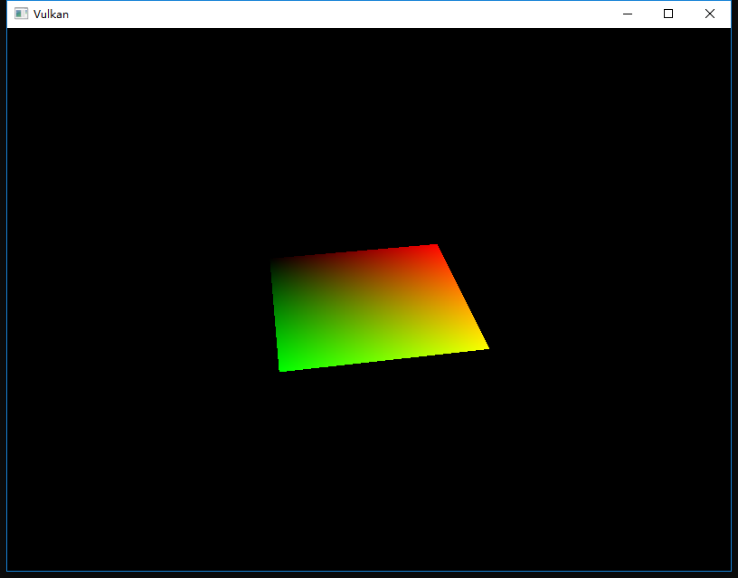
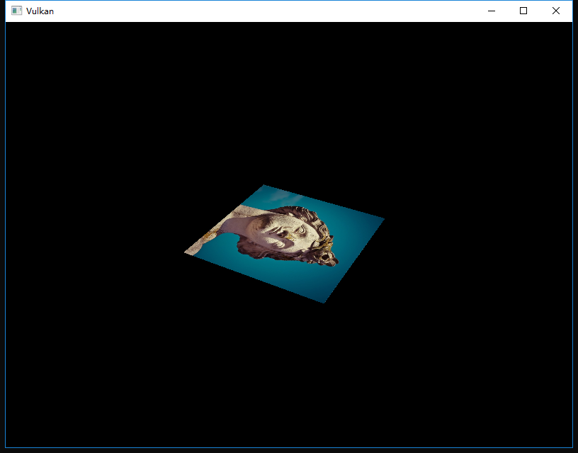
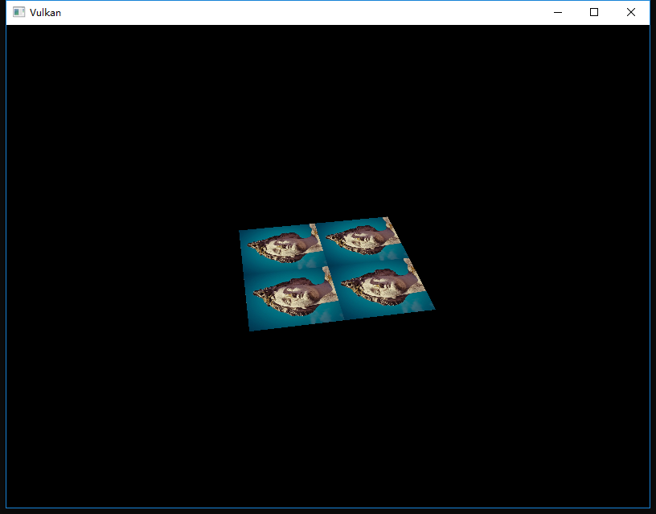
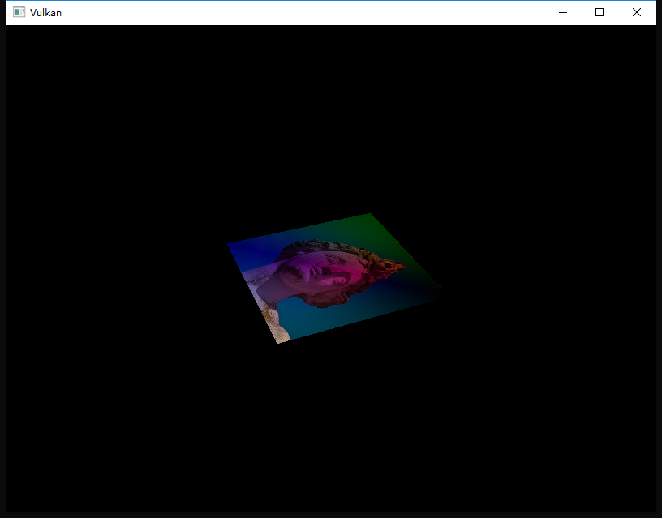

继续上一次的
<!-- more -->
<b>介绍</b>
我们在本教程的统一缓冲区章节中第一次了解到了描述符。在本章中，我们将介绍一种新类型的描述符：组合图像采样器（combined image sampler）。此描述符使着色器可以通过采样器对象访问图像资源，就是我们在上一章中创建的那种采样器。

我们将首先修改描述符布局，描述符池和描述符集用来包含新的组合图像采样器描述符。之后，我们将向Vertex中添加纹理坐标，并修改片段着色器以从纹理中读取颜色，而不是仅仅是插入顶点颜色。

<b>更新描述符</b>
在createDescriptorSetLayout函数中为组合图像采样器添加VkDescriptorSetLayoutBinding对象，我们只需将它放在统一缓冲区后进行绑定：
```cpp
VkDescriptorSetLayoutBinding samplerLayoutBinding = {};
samplerLayoutBinding.binding = 1;
samplerLayoutBinding.descriptorCount = 1;
samplerLayoutBinding.descriptorType = VK_DESCRIPTOR_TYPE_COMBINED_IMAGE_SAMPLER;
samplerLayoutBinding.pImmutableSamplers = nullptr;
samplerLayoutBinding.stageFlags = VK_SHADER_STAGE_FRAGMENT_BIT;

std::array<VkDescriptorSetLayoutBinding, 2> bindings = {uboLayoutBinding, samplerLayoutBinding};
VkDescriptorSetLayoutCreateInfo layoutInfo = {};
layoutInfo.sType = VK_STRUCTURE_TYPE_DESCRIPTOR_SET_LAYOUT_CREATE_INFO;
layoutInfo.bindingCount = static_cast<uint32_t>(bindings.size());
layoutInfo.pBindings = bindings.data();
```
确保设置stageFlags以指示我们打算在片段着色器中使用组合图像采样器描述符，这就是要确定片段颜色的地方了。也可以在顶点着色器中使用纹理采样，例如通过[高度图](https://en.wikipedia.org/wiki/Heightmap)动态地变形顶点的网格。

如果您现在将运行带有验证层的应用程序，那么您将看到它抱怨描述符池无法使用此布局来分配描述符集，因为它还没有任何组合图像采样器描述符。转到createDescriptorPool函数并修改它来包含此描述符的VkDescriptorPoolSize：
```cpp
std::array<VkDescriptorPoolSize, 2> poolSizes = {};
poolSizes[0].type = VK_DESCRIPTOR_TYPE_UNIFORM_BUFFER;
poolSizes[0].descriptorCount = static_cast<uint32_t>(swapChainImages.size());
poolSizes[1].type = VK_DESCRIPTOR_TYPE_COMBINED_IMAGE_SAMPLER;
poolSizes[1].descriptorCount = static_cast<uint32_t>(swapChainImages.size());

VkDescriptorPoolCreateInfo poolInfo = {};
poolInfo.sType = VK_STRUCTURE_TYPE_DESCRIPTOR_POOL_CREATE_INFO;
poolInfo.poolSizeCount = static_cast<uint32_t>(poolSizes.size());
poolInfo.pPoolSizes = poolSizes.data();
poolInfo.maxSets = static_cast<uint32_t>(swapChainImages.size());
```
最后一步是将实际图像和采样器资源绑定到描述符集中的描述符，转到createDescriptorSets函数。
```cpp
for (size_t i = 0; i < swapChainImages.size(); i++) {
    VkDescriptorBufferInfo bufferInfo = {};
    bufferInfo.buffer = uniformBuffers[i];
    bufferInfo.offset = 0;
    bufferInfo.range = sizeof(UniformBufferObject);

    VkDescriptorImageInfo imageInfo = {};
    imageInfo.imageLayout = VK_IMAGE_LAYOUT_SHADER_READ_ONLY_OPTIMAL;
    imageInfo.imageView = textureImageView;
    imageInfo.sampler = textureSampler;

    ...
}
```
VkDescriptorImageInfo结构指定了组合图像采样器结构的资源，就像在VkDescriptorBufferInfo结构中指定统一缓冲区描述符的缓冲区资源一样。这是前一章中的对象汇集在一起​​的地方。
```cpp
std::array<VkWriteDescriptorSet, 2> descriptorWrites = {};

descriptorWrites[0].sType = VK_STRUCTURE_TYPE_WRITE_DESCRIPTOR_SET;
descriptorWrites[0].dstSet = descriptorSets[i];
descriptorWrites[0].dstBinding = 0;
descriptorWrites[0].dstArrayElement = 0;
descriptorWrites[0].descriptorType = VK_DESCRIPTOR_TYPE_UNIFORM_BUFFER;
descriptorWrites[0].descriptorCount = 1;
descriptorWrites[0].pBufferInfo = &bufferInfo;

descriptorWrites[1].sType = VK_STRUCTURE_TYPE_WRITE_DESCRIPTOR_SET;
descriptorWrites[1].dstSet = descriptorSets[i];
descriptorWrites[1].dstBinding = 1;
descriptorWrites[1].dstArrayElement = 0;
descriptorWrites[1].descriptorType = VK_DESCRIPTOR_TYPE_COMBINED_IMAGE_SAMPLER;
descriptorWrites[1].descriptorCount = 1;
descriptorWrites[1].pImageInfo = &imageInfo;

vkUpdateDescriptorSets(device, static_cast<uint32_t>(descriptorWrites.size()), descriptorWrites.data(), 0, nullptr);
```
描述符必须与此图像信息一起更新，就像缓冲区一样，这次我们使用的是pImageInfo数组而不是pBufferInfo。描述符现在可以被着色器使用了。

<b>纹理坐标</b>
纹理映射有一个重要的因素仍然缺失，那就是每个顶点的实际坐标。坐标确定了图像实际映射到几何体的方式。
```cpp
struct Vertex {
    glm::vec2 pos;
    glm::vec3 color;
    glm::vec2 texCoord;

    static VkVertexInputBindingDescription getBindingDescription() {
        VkVertexInputBindingDescription bindingDescription = {};
        bindingDescription.binding = 0;
        bindingDescription.stride = sizeof(Vertex);
        bindingDescription.inputRate = VK_VERTEX_INPUT_RATE_VERTEX;

        return bindingDescription;
    }

    static std::array<VkVertexInputAttributeDescription, 3> getAttributeDescriptions() {
        std::array<VkVertexInputAttributeDescription, 3> attributeDescriptions = {};

        attributeDescriptions[0].binding = 0;
        attributeDescriptions[0].location = 0;
        attributeDescriptions[0].format = VK_FORMAT_R32G32_SFLOAT;
        attributeDescriptions[0].offset = offsetof(Vertex, pos);

        attributeDescriptions[1].binding = 0;
        attributeDescriptions[1].location = 1;
        attributeDescriptions[1].format = VK_FORMAT_R32G32B32_SFLOAT;
        attributeDescriptions[1].offset = offsetof(Vertex, color);

        attributeDescriptions[2].binding = 0;
        attributeDescriptions[2].location = 2;
        attributeDescriptions[2].format = VK_FORMAT_R32G32_SFLOAT;
        attributeDescriptions[2].offset = offsetof(Vertex, texCoord);

        return attributeDescriptions;
    }
};
```
修改Vertex结构以包含纹理坐标的vec2，确保还添加了VkVertexInputAttributeDescription，以便我们可以在顶点着色器中使用访问纹理坐标作为输入。这是必要的，是为了能够将它们传递给片段着色器，以便在正方形的表面上进行插值。
```cpp
const std::vector<Vertex> vertices = {
    {{-0.5f, -0.5f}, {1.0f, 0.0f, 0.0f}, {1.0f, 0.0f}},
    {{0.5f, -0.5f}, {0.0f, 1.0f, 0.0f}, {0.0f, 0.0f}},
    {{0.5f, 0.5f}, {0.0f, 0.0f, 1.0f}, {0.0f, 1.0f}},
    {{-0.5f, 0.5f}, {1.0f, 1.0f, 1.0f}, {1.0f, 1.0f}}
};
```
在本教程中，我将简单地使用从左上角的0,0到右下角的1,1的坐标来填充纹理。在这里可以尝试各种坐标。尝试使用低于0或者高于1的坐标来观察寻址模式的不同表现。

<b>着色器</b>
最后一步是修改着色器以从纹理中采样颜色。我们首先需要修改顶点着色器以将纹理坐标传递给片段着色器：
```glsl
layout(location = 0) in vec2 inPosition;
layout(location = 1) in vec3 inColor;
layout(location = 2) in vec2 inTexCoord;

layout(location = 0) out vec3 fragColor;
layout(location = 1) out vec2 fragTexCoord;

void main() {
    gl_Position = ubo.proj * ubo.view * ubo.model * vec4(inPosition, 0.0, 1.0);
    fragColor = inColor;
    fragTexCoord = inTexCoord;
}
```
就像每个顶点的颜色，fragTexCoord值通过光栅化平滑的插值到矩形区域内。我们可以通过让片段着色器将纹理坐标输出为颜色来可视化：
```glsl
#version 450
#extension GL_ARB_separate_shader_objects : enable

layout(location = 0) in vec3 fragColor;
layout(location = 1) in vec2 fragTexCoord;

layout(location = 0) out vec4 outColor;

void main() {
    outColor = vec4(fragTexCoord, 0.0, 1.0);
}
```
您应该可以看到如下图所示的内容。别忘了重新编译着色器！


绿色通道表示水平坐标，红色通道表示垂直坐标。黑色和黄色角确认纹理坐标是从0,0到1,1正确的在正方形上进行插值。在着色器编程中使用颜色可视化数据相当于printf调试，因为也没有更好的选择了。

组合图像采样器描述符在GLSL中由均匀采样器表示。在片段着色器中添加对它的引用：
```glsl
layout(binding = 1) uniform sampler2D texSampler;
```
对于其他类型的图像，可以使用相似的sampler1D和sampler3D类型，确保在此处使用正确的绑定。
```glsl
void main() {
    outColor = texture(texSampler, fragTexCoord);
}
```
使用内置的纹理函数对纹理进行采样，它需要一个采样器和坐标作为参数。采样器会自动处理后台中的过滤和转换。现在，您应该可以在运行应用程序时看到正方形上的纹理了：


尝试通过将纹理坐标缩放到大于1的值来尝试寻址模式。例如，使用VK_SAMPLER_ADDRESS_MODE_REPEAT时，可以使用下面的片段着色器生成下图中的结果：
```glsl
void main() {
    outColor = texture(texSampler, fragTexCoord * 2.0);
}
```


您还可以使用顶点颜色来处理纹理颜色：
```glsl
void main() {
    outColor = vec4(fragColor * texture(texSampler, fragTexCoord).rgb, 1.0);
}
```
我在这里将RGB和alpha通道分开以不缩放alpha通道。


您现在知道如何在着色器中访问图像了。当与帧缓冲区中的图像进行结合时，这是一个非常有效的技术。您可以使用这些图像作为输入来实现非常酷炫的效果，如3D世界中的后期处理和相机显示。


