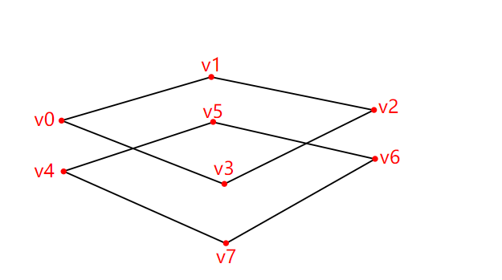
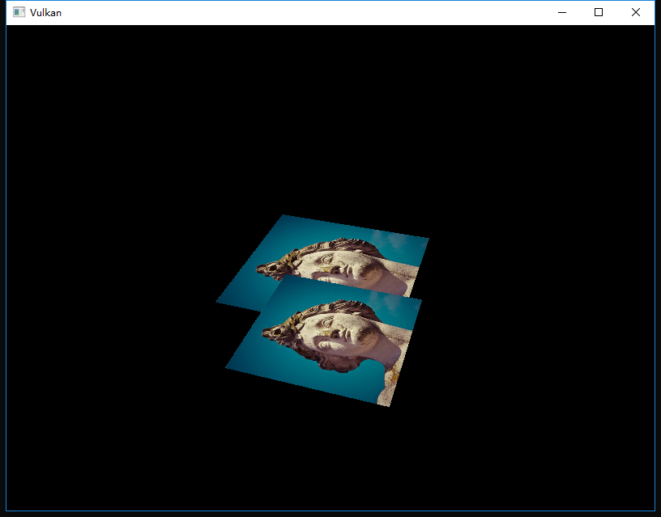
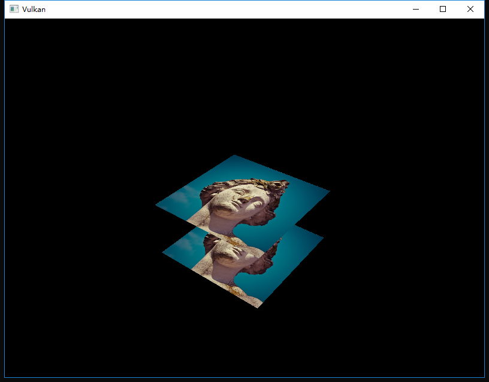

继续上一次的
<!-- more -->
<b>介绍</b>
到目前为止我们使用的几何体被虽然投射到3D空间中，但它仍然是完全平坦的。在本章中，我们将向位置添加Z坐标以为3D网格做准备。我们将使用这个第三个坐标在当前正方形上方放置一个正方形，来查看几何未按深度排序时出现的问题。

<b>三维几何</b>
更改Vertex结构以使用3D矢量表示位置，并更新相应的VkVertexInputAttributeDescription中的格式：
```cpp
struct Vertex {
    glm::vec3 pos;
    glm::vec3 color;
    glm::vec2 texCoord;

    ...

    static std::array<VkVertexInputAttributeDescription, 3> getAttributeDescriptions() {
        std::array<VkVertexInputAttributeDescription, 3> attributeDescriptions = {};

        attributeDescriptions[0].binding = 0;
        attributeDescriptions[0].location = 0;
        attributeDescriptions[0].format = VK_FORMAT_R32G32B32_SFLOAT;
        attributeDescriptions[0].offset = offsetof(Vertex, pos);

        ...
    }
};
```
接下来，更新顶点着色器以接受并转换3D坐标作为输入，不要忘记之后重新编译它。
```glsl
layout(location = 0) in vec3 inPosition;

...

void main() {
    gl_Position = ubo.proj * ubo.view * ubo.model * vec4(inPosition, 1.0);
    fragColor = inColor;
    fragTexCoord = inTexCoord;
}
```
最后，更新vertices容器以包含Z坐标：
```cpp
const std::vector<Vertex> vertices = {
    {{-0.5f, -0.5f, 0.0f}, {1.0f, 0.0f, 0.0f}, {0.0f, 0.0f}},
    {{0.5f, -0.5f, 0.0f}, {0.0f, 1.0f, 0.0f}, {1.0f, 0.0f}},
    {{0.5f, 0.5f, 0.0f}, {0.0f, 0.0f, 1.0f}, {1.0f, 1.0f}},
    {{-0.5f, 0.5f, 0.0f}, {1.0f, 1.0f, 1.0f}, {0.0f, 1.0f}}
};
```
如果您现在运行您的应用程序，那么您会看到与以前完全相同的结果。是时候添加一些额外的几何体来使场景更有趣，并展示我们将在本章中需要解决的问题了。复制顶点以定义当前正方形下方的位置，如下所示：


使用-0.5f的Z坐标并为额外的正方形添加适当的索引：
```cpp
const std::vector<Vertex> vertices = {
    {{-0.5f, -0.5f, 0.0f}, {1.0f, 0.0f, 0.0f}, {0.0f, 0.0f}},
    {{0.5f, -0.5f, 0.0f}, {0.0f, 1.0f, 0.0f}, {1.0f, 0.0f}},
    {{0.5f, 0.5f, 0.0f}, {0.0f, 0.0f, 1.0f}, {1.0f, 1.0f}},
    {{-0.5f, 0.5f, 0.0f}, {1.0f, 1.0f, 1.0f}, {0.0f, 1.0f}},

    {{-0.5f, -0.5f, -0.5f}, {1.0f, 0.0f, 0.0f}, {0.0f, 0.0f}},
    {{0.5f, -0.5f, -0.5f}, {0.0f, 1.0f, 0.0f}, {1.0f, 0.0f}},
    {{0.5f, 0.5f, -0.5f}, {0.0f, 0.0f, 1.0f}, {1.0f, 1.0f}},
    {{-0.5f, 0.5f, -0.5f}, {1.0f, 1.0f, 1.0f}, {0.0f, 1.0f}}
};

const std::vector<uint16_t> indices = {
    0, 1, 2, 2, 3, 0,
    4, 5, 6, 6, 7, 4
};
```
现在运行你的程序，你会看到类似Escher插图的东西：


问题是下方的片段被绘制在上方的片段上，这仅仅是因为它是后出现在索引数组中的。有两种方法可以解决这个问题：
* 按从后到前的深度排序依次绘制
* 使用深度缓冲区进行深度测试

第一种方法通常用于绘制透明对象，因为与顺序无关的透明度是一个难以解决问题。然而，更常见地是使用深度缓冲（depth buffer）解决按深度排序片段的问题。深度缓冲区是一个附加附件，用于存储每个位置的深度，就像颜​​色附件存储每个位置的颜色一样。每次光栅化器生成片段时，深度测试将检查新片段是否比前一片段更接近，如果没有的话，则会被丢弃。通过深度测试的片段会将自己的深度写入深度缓冲区。可以从片段着色器中操纵此值，就像可以操纵颜色输出一样。
```cpp
#define GLM_FORCE_RADIANS
#define GLM_FORCE_DEPTH_ZERO_TO_ONE
#include <glm/glm.hpp>
#include <glm/gtc/matrix_transform.hpp>
```
GLM生成的透视投影矩阵默认使用-1.0到1.0的OpenGL深度范围。我们需要使用GLM_FORCE_DEPTH_ZERO_TO_ONE定义将其配置为使用0.0到1.0的Vulkan范围。

<b>深度图像和视图</b>
就像颜色附件一样，深度附件也是基于图像的，不同之处在于交换链不会自动为我们创建深度图像。我们只需要一个深度图像，因为一次只能运行一个绘图操作。深度图像也需要三个资源：图像，内存和图像视图。
```cpp
VkImage depthImage;
VkDeviceMemory depthImageMemory;
VkImageView depthImageView;
```
创建一个新函数createDepthResources来设置这些资源：
```cpp
void initVulkan() {
    ...
    createCommandPool();
    createDepthResources();
    createTextureImage();
    ...
}

...

void createDepthResources() {

}
```
创建深度图像非常简单。它应和交换链定义的颜色附件有相同的分辨率，适合深度附件的图像用法，最佳平铺方式和设备本地内存。唯一的问题是：深度图像的正确格式是什么？格式必须包含深度组件，由VK_FORMAT_中的_D ?? _表示。

与纹理图像不同，我们不一定需要特定的格式，因为我们不会直接从程序中访问纹素。它需要具有一个合适的精确度，在实际应用中至少要24位。有几种格式符合此要求：
* VK_FORMAT_D32_SFLOAT：32位浮点数深度
* VK_FORMAT_D32_SFLOAT_S8_UINT：32位有符号浮点数深度和8位模板组件
* VK_FORMAT_D24_UNORM_S8_UINT：24位浮点数深度和8位模板组件

模板组件用于[模板测试](https://en.wikipedia.org/wiki/Stencil_buffer)，这是一项可与深度测试相结合的附加测试。我们将在以后的章节中讨论这个问题。

我们可以简单地选择VK_FORMAT_D32_SFLOAT格式，因为对它的支持非常普遍（参见硬件数据库），但是可能的话为我们的应用程序添加一些灵活性是很好的。我们将编写一个函数findSupportedFormat，它按照从最理想到最不理想的顺序获取候选格式列表，并检查哪个是第一个支持的：
```cpp
VkFormat findSupportedFormat(const std::vector<VkFormat>& candidates, VkImageTiling tiling, VkFormatFeatureFlags features) {

}
```
格式的支持取决于平铺模式和用法，因此我们还必须将这些作为参数包含在内。可以使用vkGetPhysicalDeviceFormatProperties函数查询格式的支持情况：
```cpp
for (VkFormat format : candidates) {
    VkFormatProperties props;
    vkGetPhysicalDeviceFormatProperties(physicalDevice, format, &props);
}
```
VkFormatProperties结构包含三个字段：
* linearTilingFeatures：线性平铺支持
* optimalTilingFeatures：最佳平铺支持
* bufferFeatures：缓冲区支持

这里只有前两个是相关的，我们需要检查函数的tiling参数：
```cpp
if (tiling == VK_IMAGE_TILING_LINEAR && (props.linearTilingFeatures & features) == features) {
    return format;
} else if (tiling == VK_IMAGE_TILING_OPTIMAL && (props.optimalTilingFeatures & features) == features) {
    return format;
}
```
如果没有候选格式支持所需的用法，那么我们可以返回一个特殊值或只是抛出一个异常：
```cpp
VkFormat findSupportedFormat(const std::vector<VkFormat>& candidates, VkImageTiling tiling, VkFormatFeatureFlags features) {
    for (VkFormat format : candidates) {
        VkFormatProperties props;
        vkGetPhysicalDeviceFormatProperties(physicalDevice, format, &props);

        if (tiling == VK_IMAGE_TILING_LINEAR && (props.linearTilingFeatures & features) == features) {
            return format;
        } else if (tiling == VK_IMAGE_TILING_OPTIMAL && (props.optimalTilingFeatures & features) == features) {
            return format;
        }
    }

    throw std::runtime_error("failed to find supported format!");
}
```
我们现在创建一个findDepthFormat辅助函数，以选择具有深度组件的格式，该深度组件支持用作深度附件：
```cpp
VkFormat findDepthFormat() {
    return findSupportedFormat(
        {VK_FORMAT_D32_SFLOAT, VK_FORMAT_D32_SFLOAT_S8_UINT, VK_FORMAT_D24_UNORM_S8_UINT},
        VK_IMAGE_TILING_OPTIMAL,
        VK_FORMAT_FEATURE_DEPTH_STENCIL_ATTACHMENT_BIT
    );
}
```
在这种情况下，请确保使用VK_FORMAT_FEATURE_标志而不是VK_IMAGE_USAGE_，所有这些候选格式都包含深度组件，但后两者也包含模板组件。虽然现在我们还没有使用它，但我们确实需要在使用这些格式的图像上执行布局转换时考虑到这一点。添加一个简单的辅助函数，告诉我们所选的深度格式是否包含模板组件：
```cpp
bool hasStencilComponent(VkFormat format) {
    return format == VK_FORMAT_D32_SFLOAT_S8_UINT || format == VK_FORMAT_D24_UNORM_S8_UINT;
}
```
调用函数以从createDepthResources中查找深度格式：
```cpp
VkFormat depthFormat = findDepthFormat();
```
我们现在拥有调用createImage和createImageView辅助函数所需的所有信息：
```cpp
createImage(swapChainExtent.width, swapChainExtent.height, depthFormat, VK_IMAGE_TILING_OPTIMAL, VK_IMAGE_USAGE_DEPTH_STENCIL_ATTACHMENT_BIT, VK_MEMORY_PROPERTY_DEVICE_LOCAL_BIT, depthImage, depthImageMemory);
depthImageView = createImageView(depthImage, depthFormat);
```
但是，createImageView函数当前是假定子资源始终为VK_IMAGE_ASPECT_COLOR_BIT，因此我们需要将该字段转换为参数：
```cpp
VkImageView createImageView(VkImage image, VkFormat format, VkImageAspectFlags aspectFlags) {
    ...
    viewInfo.subresourceRange.aspectMask = aspectFlags;
    ...
}
```
更新对此函数的所有调用，确保正确无误：
```cpp
swapChainImageViews[i] = createImageView(swapChainImages[i], swapChainImageFormat, VK_IMAGE_ASPECT_COLOR_BIT);
...
depthImageView = createImageView(depthImage, depthFormat, VK_IMAGE_ASPECT_DEPTH_BIT);
...
textureImageView = createImageView(textureImage, VK_FORMAT_R8G8B8A8_UNORM, VK_IMAGE_ASPECT_COLOR_BIT);
```
这就是深度图像的创建了。我们并不需要映射它或将另一个图像复制到它，因为我们会在渲染过程的开头就清除它，就像颜色附件一样。但是，它仍然还是需要转换为适合深度附件使用的布局。我们可以在渲染过程中像颜色附件那样做，但在这里我选择使用管道屏障，因为转换只需要发生一次：
```cpp
transitionImageLayout(depthImage, depthFormat, VK_IMAGE_LAYOUT_UNDEFINED, VK_IMAGE_LAYOUT_DEPTH_STENCIL_ATTACHMENT_OPTIMAL);
```
未定义的布局可以用作初始布局，因为现有的深度图像内容并不重要。我们需要更新transitionImageLayout中的一些逻辑以使用正确的子资源：
```cpp
if (newLayout == VK_IMAGE_LAYOUT_DEPTH_STENCIL_ATTACHMENT_OPTIMAL) {
    barrier.subresourceRange.aspectMask = VK_IMAGE_ASPECT_DEPTH_BIT;

    if (hasStencilComponent(format)) {
        barrier.subresourceRange.aspectMask |= VK_IMAGE_ASPECT_STENCIL_BIT;
    }
} else {
    barrier.subresourceRange.aspectMask = VK_IMAGE_ASPECT_COLOR_BIT;
}
```
虽然我们没有使用到模板组件，但我们还是需要将其包含在深度图像的布局转换中。

最后，添加正确的访问掩码和管道阶段：
```cpp
if (oldLayout == VK_IMAGE_LAYOUT_UNDEFINED && newLayout == VK_IMAGE_LAYOUT_TRANSFER_DST_OPTIMAL) {
    barrier.srcAccessMask = 0;
    barrier.dstAccessMask = VK_ACCESS_TRANSFER_WRITE_BIT;

    sourceStage = VK_PIPELINE_STAGE_TOP_OF_PIPE_BIT;
    destinationStage = VK_PIPELINE_STAGE_TRANSFER_BIT;
} else if (oldLayout == VK_IMAGE_LAYOUT_TRANSFER_DST_OPTIMAL && newLayout == VK_IMAGE_LAYOUT_SHADER_READ_ONLY_OPTIMAL) {
    barrier.srcAccessMask = VK_ACCESS_TRANSFER_WRITE_BIT;
    barrier.dstAccessMask = VK_ACCESS_SHADER_READ_BIT;

    sourceStage = VK_PIPELINE_STAGE_TRANSFER_BIT;
    destinationStage = VK_PIPELINE_STAGE_FRAGMENT_SHADER_BIT;
} else if (oldLayout == VK_IMAGE_LAYOUT_UNDEFINED && newLayout == VK_IMAGE_LAYOUT_DEPTH_STENCIL_ATTACHMENT_OPTIMAL) {
    barrier.srcAccessMask = 0;
    barrier.dstAccessMask = VK_ACCESS_DEPTH_STENCIL_ATTACHMENT_READ_BIT | VK_ACCESS_DEPTH_STENCIL_ATTACHMENT_WRITE_BIT;

    sourceStage = VK_PIPELINE_STAGE_TOP_OF_PIPE_BIT;
    destinationStage = VK_PIPELINE_STAGE_EARLY_FRAGMENT_TESTS_BIT;
} else {
    throw std::invalid_argument("unsupported layout transition!");
}
```
深度缓冲区会被读取用来执行深度测试以查看片段是否可见，并且将在绘制新片段时写入。读取发生在VK_PIPELINE_STAGE_EARLY_FRAGMENT_TESTS_BIT阶段，写入发生在VK_PIPELINE_STAGE_LATE_FRAGMENT_TESTS_BIT阶段。您应该选择与指定操作匹配的最早的管道阶段，以便在需要时可以作为深度附件使用。

<b>渲染过程</b>
我们现在要修改createRenderPass以包含深度附件。首先创建VkAttachementDescription：
```cpp
VkAttachmentDescription depthAttachment = {};
depthAttachment.format = findDepthFormat();
depthAttachment.samples = VK_SAMPLE_COUNT_1_BIT;
depthAttachment.loadOp = VK_ATTACHMENT_LOAD_OP_CLEAR;
depthAttachment.storeOp = VK_ATTACHMENT_STORE_OP_DONT_CARE;
depthAttachment.stencilLoadOp = VK_ATTACHMENT_LOAD_OP_DONT_CARE;
depthAttachment.stencilStoreOp = VK_ATTACHMENT_STORE_OP_DONT_CARE;
depthAttachment.initialLayout = VK_IMAGE_LAYOUT_UNDEFINED;
depthAttachment.finalLayout = VK_IMAGE_LAYOUT_DEPTH_STENCIL_ATTACHMENT_OPTIMAL;
```
format应与深度图像本身相同。这次我们不关心深度数据的存储（storeOp），因为它在绘制完成后就不会被使用了，这样硬件可以执行额外的优化。就像颜色缓冲区一样，我们不关心之前的深度的内容，因此我们可以使用VK_IMAGE_LAYOUT_UNDEFINED作为initialLayout。
```cpp
VkAttachmentReference depthAttachmentRef = {};
depthAttachmentRef.attachment = 1;
depthAttachmentRef.layout = VK_IMAGE_LAYOUT_DEPTH_STENCIL_ATTACHMENT_OPTIMAL;
```
为第一个（也是唯一的）子通道添加对附件的引用：
```cpp
VkSubpassDescription subpass = {};
subpass.pipelineBindPoint = VK_PIPELINE_BIND_POINT_GRAPHICS;
subpass.colorAttachmentCount = 1;
subpass.pColorAttachments = &colorAttachmentRef;
subpass.pDepthStencilAttachment = &depthAttachmentRef;
```
与颜色附件不同，子通道只能使用单个深度（+模板）附件，在多个缓冲区上进行深度测试实际上没有任何意义。
```cpp
std::array<VkAttachmentDescription, 2> attachments = {colorAttachment, depthAttachment};
VkRenderPassCreateInfo renderPassInfo = {};
renderPassInfo.sType = VK_STRUCTURE_TYPE_RENDER_PASS_CREATE_INFO;
renderPassInfo.attachmentCount = static_cast<uint32_t>(attachments.size());
renderPassInfo.pAttachments = attachments.data();
renderPassInfo.subpassCount = 1;
renderPassInfo.pSubpasses = &subpass;
renderPassInfo.dependencyCount = 1;
renderPassInfo.pDependencies = &dependency;
```
最后，更新VkRenderPassCreateInfo结构以引用这两个附件。

<b>帧缓冲区</b>
下一步是修改帧缓冲区的创建以将深度图像绑定到深度附件。转到createFramebuffers并将深度图像视图指定为第二个附件：
```cpp
std::array<VkImageView, 2> attachments = {
    swapChainImageViews[i],
    depthImageView
};

VkFramebufferCreateInfo framebufferInfo = {};
framebufferInfo.sType = VK_STRUCTURE_TYPE_FRAMEBUFFER_CREATE_INFO;
framebufferInfo.renderPass = renderPass;
framebufferInfo.attachmentCount = static_cast<uint32_t>(attachments.size());
framebufferInfo.pAttachments = attachments.data();
framebufferInfo.width = swapChainExtent.width;
framebufferInfo.height = swapChainExtent.height;
framebufferInfo.layers = 1;
```
每个交换链图像的颜色附件都不同，但所有这些图像都可以使用相同的深度图像，由于我们的信号量的关系，同一时间只有一个子通道运行。

您还需要将函数调用移动到createFramebuffers以确保在实际创建深度图像视图后调用它：
```cpp
void initVulkan() {
    ...
    createDepthResources();
    createFramebuffers();
    ...
}
```

<b>清除值</b>
因为我们现在有多个有VK_ATTACHMENT_LOAD_OP_CLEAR的附件，转到createCommandBuffers并创建一个VkClearValue结构数组：
```cpp
std::array<VkClearValue, 2> clearValues = {};
clearValues[0].color = {0.0f, 0.0f, 0.0f, 1.0f};
clearValues[1].depthStencil = {1.0f, 0};

renderPassInfo.clearValueCount = static_cast<uint32_t>(clearValues.size());
renderPassInfo.pClearValues = clearValues.data();
```
在Vulkan中，深度缓冲区中的深度范围为0.0到1.0，其中1.0位于远视平面，0.0位于近视平面。深度缓冲区中每个点的初始值应该是最远的深度，即1.0。

<b>深度和模板状态</b>
深度附件现在可以使用了，但还需要在图形管道中启用深度测试。它是通过VkPipelineDepthStencilStateCreateInfo结构配置的：
```cpp
VkPipelineDepthStencilStateCreateInfo depthStencil = {};
depthStencil.sType = VK_STRUCTURE_TYPE_PIPELINE_DEPTH_STENCIL_STATE_CREATE_INFO;
depthStencil.depthTestEnable = VK_TRUE;
depthStencil.depthWriteEnable = VK_TRUE;
```
depthTestEnable字段指定是否应将新片段的深度与深度缓冲区进行比较，以查看是否应丢弃它们。depthWriteEnable字段指定是否应该将通过深度测试的新片段深度实际写入深度缓冲区，这对于绘制透明对象很有用。它们应该与之前渲染的不透明对象进行比较，但不会导致更远的透明对象不被绘制。
```cpp
depthStencil.depthCompareOp = VK_COMPARE_OP_LESS;
```
depthCompareOp字段指定执行保留或者丢弃片段的比较细节。我们坚持更低深度=更接近的惯例，所以新的片段的深度应该更小。
```cpp
depthStencil.depthBoundsTestEnable = VK_FALSE;
depthStencil.minDepthBounds = 0.0f; // Optional
depthStencil.maxDepthBounds = 1.0f; // Optional
```
depthBoundsTestEnable，minDepthBounds和maxDepthBounds字段是可选的，用于深度范围测试，这允许您仅保留落在指定深度范围内的片元。我们不会使用该功能。
```cpp
depthStencil.stencilTestEnable = VK_FALSE;
depthStencil.front = {}; // Optional
depthStencil.back = {}; // Optional
```
最后三个字段配置模板缓冲区操作，我们在本教程中也不会使用它们。如果要使用这些操作，则必须确保深度/模板图像的格式包含模板组件。
```cpp
pipelineInfo.pDepthStencilState = &depthStencil;
```
更新VkGraphicsPipelineCreateInfo结构以引用我们刚填充的深度模板状态。如果渲染过程包含深度模板附件，则必须始终指定深度模板状态。

如果您现在运行程序，那么您应该看到几何体的片段现在已正确排序：


<b>处理窗口尺寸变化</b>
调整窗口大小以匹配新的颜色附件分辨率时，深度缓冲区的分辨率也需要更改。在这种情况下，扩展recreateSwapChain函数以重新创建深度资源：
```cpp
void recreateSwapChain() {
    vkDeviceWaitIdle(device);

    cleanupSwapChain();

    createSwapChain();
    createImageViews();
    createRenderPass();
    createGraphicsPipeline();
    createDepthResources();
    createFramebuffers();
    createCommandBuffers();
}
```
清理操作应该在交换链清理功能中进行：
```cpp
void cleanupSwapChain() {
    vkDestroyImageView(device, depthImageView, nullptr);
    vkDestroyImage(device, depthImage, nullptr);
    vkFreeMemory(device, depthImageMemory, nullptr);

    ...
}
```
恭喜，您的应用程序现在终于可以正确的渲染任意3D几何体了，我们将在下一章中通过绘制纹理模型来尝试。


