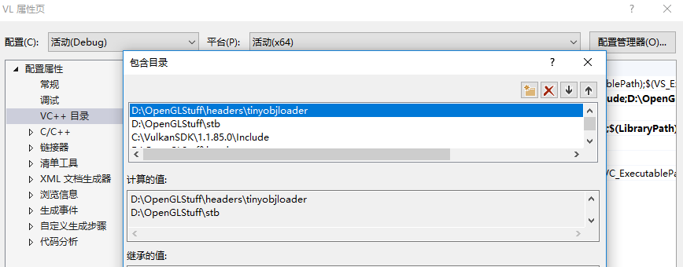
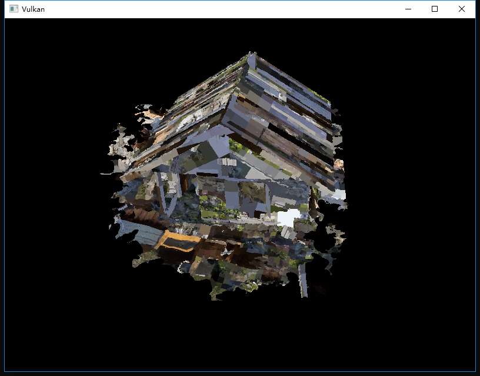
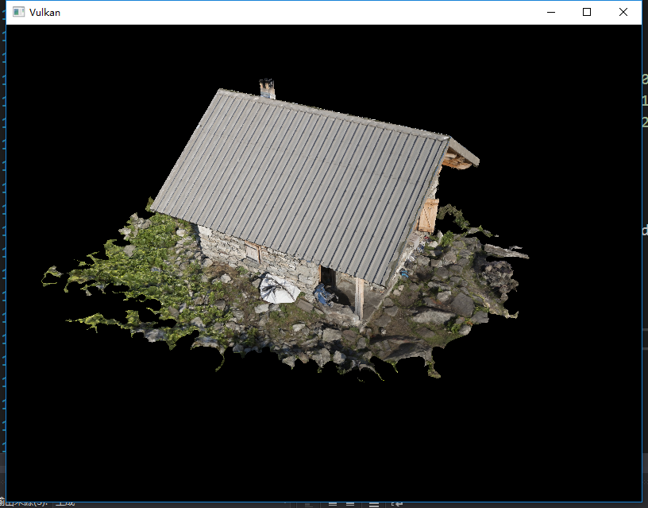

继续上一次的
<!-- more -->
<b>介绍</b>
您的程序现在可以渲染纹理3D网格了，但是顶点和索引数组中的几何形状现在不是很有趣。在本章中，我们将扩展程序以从实际模型文件中加载顶点和索引，来使图形卡实际上做一些工作。

许多图形API教程在这样的章节中让读者编写自己的OBJ加载器。这样做的问题是任何有趣的3D应用程序可能需要某种功能，但是该文件格式不支持，比如骨骼动画skeletal animation。我们将在本章中从OBJ模型加载网格数据，但我们将更多地关注网格数据与程序本身的集成，而不是从文件中加载网格数据的细节。

<b>库</b>
我们将使用[tinyobjloader库](https://github.com/syoyo/tinyobjloader)从OBJ文件加载顶点和面。它很有效并且很容易集成，因为它是像stb_image这样的单个文件库。转到上面链接的存储库并将tiny_obj_loader.h文件下载到库目录中的文件夹。确保使用master分支中的文件版本，因为最新的官方发行版已过时。
<b>Visual Studio</b>
将其中包含tiny_obj_loader.h的目录添加到Additional Include Directories路径。


<b>Makefile</b>
将tiny_obj_loader.h的目录添加到GCC的include目录中：
```Makefile
VULKAN_SDK_PATH = /home/user/VulkanSDK/x.x.x.x/x86_64
STB_INCLUDE_PATH = /home/user/libraries/stb
TINYOBJ_INCLUDE_PATH = /home/user/libraries/tinyobjloader

...

CFLAGS = -std=c++17 -I$(VULKAN_SDK_PATH)/include -I$(STB_INCLUDE_PATH) -I$(TINYOBJ_INCLUDE_PATH)
```

<b>样本网格</b>
在本章中，我们还不会启用照明功能，这有助于使用具有照明烘焙到纹理中的样本模型。查找此类模型的简便方法是在Sketchfab上查询，该站点上的许多模型都以OBJ格式提供，并具有许可许可。

在本教程中，我决定使用Escadrone的[Chalet Hippolyte Chassande Baroz模型](https://sketchfab.com/models/e925320e1d5744d9ae661aeff61e7aef)。我调整了模型的大小和方向，以便将其用作当前几何体的替代品。
* [chalet.obj](https://vulkan-tutorial.com/resources/chalet.obj.zip)
* [chalet.jpg](https://vulkan-tutorial.com/resources/chalet.jpg)

它有五十万个三角形，所以可以成为我们应用程序的一个很好的基准。在这里随意使用自己的模型文件，但是要确保它们是由一种材质构成的，尺寸约为1.5 x1.5x1.5。如果它比这个大，那么你将不得不改变视图矩阵。将模型文件放在shaders和textures旁边的新models目录中，并将纹理图像放在textures目录中。

在程序中新建两个新的配置变量来定义模型和纹理路径：
```cpp
const int WIDTH = 800;
const int HEIGHT = 600;

const std::string MODEL_PATH = "models/chalet.obj";
const std::string TEXTURE_PATH = "textures/chalet.jpg";
```
并更新createTextureImage以使用这个路径变量：
```cpp
stbi_uc* pixels = stbi_load(TEXTURE_PATH.c_str(), &texWidth, &texHeight, &texChannels, STBI_rgb_alpha);
```

<b>加载顶点和索引</b>
我们现在要从模型文件加载顶点和索引，所以你现在应该删除全局vertices和indices数组。将它们替换为非const的容器作为类成员：
```cpp
std::vector<Vertex> vertices;
std::vector<uint32_t> indices;
VkBuffer vertexBuffer;
VkDeviceMemory vertexBufferMemory;
```
您应该将索引的类型从uint16_t更改为uint32_t，因为将会有比65535更多的顶点。记得还要更改vkCmdBindIndexBuffer参数：
```cpp
vkCmdBindIndexBuffer(commandBuffers[i], indexBuffer, 0, VK_INDEX_TYPE_UINT32);
```
tinyobjloader库的包含方式与STB库相同。包含tiny_obj_loader.h文件并确保在源文件中定义TINYOBJLOADER_IMPLEMENTATION以包含函数体避免链接器错误：
```cpp
#define TINYOBJLOADER_IMPLEMENTATION
#include <tiny_obj_loader.h>
```
我们现在要编写一个loadModel函数，该函数利用这个库来使用网格中的顶点数据填充顶点和索引容器。应该在创建顶点和索引缓冲区之前调用它：
```cpp
void initVulkan() {
    ...
    loadModel();
    createVertexBuffer();
    createIndexBuffer();
    ...
}

...

void loadModel() {

}
```
通过调用tinyobj::LoadObj函数将模型加载到库的数据结构中：
```cpp
void loadModel() {
    tinyobj::attrib_t attrib;
    std::vector<tinyobj::shape_t> shapes;
    std::vector<tinyobj::material_t> materials;
    std::string warn, err;

    if (!tinyobj::LoadObj(&attrib, &shapes, &materials, &warn, &err, MODEL_PATH.c_str())) {
        throw std::runtime_error(warn + err);
    }
}
```
OBJ文件由位置，法线，纹理坐标和面组成。面由任意数量的顶点组成，其中每个顶点通过索引来引用位置，法线，纹理坐标或他们的组合。这使得不仅可以重用整个顶点，还可以重用单个属性。

attrib容器在其attrib.vertices，attrib.normals和attrib.texcoords向量中保存了所有的位置，法线和纹理坐标。shapes容器包含了所有单独的对象及其面，每个面由顶点数组组成，每个顶点包含位置，法线和纹理坐标属性的索引。OBJ模型还可以定义每个面的材质和纹理，但我们将忽略它们。

err字符串包含错误，warn字符串包含加载文件时发生的警告，如缺少材料定义。如果LoadObj函数返回false，则仅加载失败。如上所述，OBJ文件中的面实际上可以包含任意数量的顶点，而我们的应用程序只能渲染三角形，幸运的是，LoadObj有一个可选参数来自动对这些面进行三角测量，默认情况下启用它。

我们将把文件中的所有面组合到一个单一模型中，所以只需遍历所有形状：
```cpp
for (const auto& shape : shapes) {

}
```
三角测量功能已经确保了每个面有三个顶点，所以我们现在可以直接迭代顶点并将它们直接转储到我们的顶点向量中：
```cpp
for (const auto& shape : shapes) {
    for (const auto& index : shape.mesh.indices) {
        Vertex vertex = {};

        vertices.push_back(vertex);
        indices.push_back(indices.size());
    }
}
```
为简单起见，我们假设每个顶点现在都是唯一的，因此只做简单的自动增量索引。index变量的类型为tinyobj::index_t，它包含了vertex_index，normal_index和texcoord_index成员。我们需要使用这些索引来查找attrib数组中的实际顶点属性：
```cpp
vertex.pos = {
    attrib.vertices[3 * index.vertex_index + 0],
    attrib.vertices[3 * index.vertex_index + 1],
    attrib.vertices[3 * index.vertex_index + 2]
};

vertex.texCoord = {
    attrib.texcoords[2 * index.texcoord_index + 0],
    attrib.texcoords[2 * index.texcoord_index + 1]
};

vertex.color = {1.0f, 1.0f, 1.0f};
```
不幸的是，attrib.vertices数组是一个float值数组，而不是glm::vec3类型，所以你需要将索引乘以3。类似地，每个条目有两个纹理坐标分量。0，1，2的偏移分别用于访问X，Y和Z分量，或者在纹理坐标系访问U和V分量。

现在运行程序并启用优化（例如，Visual Studio中的Release模式和GCC的-O3编译器标志），这是必要的，否则加载模型将非常缓慢。您应该可以看到如下内容：


太棒了，几何体看起来是正确的，但纹理是怎么了？这是由于Vulkan中纹理坐标的原点是左上角，而OBJ格式则是左下角。通过翻转纹理坐标的垂直分量可以解决这个问题：
```cpp
vertex.texCoord = {
    attrib.texcoords[2 * index.texcoord_index + 0],
    1.0f - attrib.texcoords[2 * index.texcoord_index + 1]
};
```
当您再次运行程序时，您现在应该可以看到正确的结果：


所有这些努力终于开始得到回报了。

<b>顶点重复数据删除</b>
不幸的是，我们还没有真正利用到索引缓冲区的优势。vertices向量包含大量重复的顶点数据，因为许多顶点包含在了多个三角形中。我们应该只保留唯一的顶点并使用索引缓冲区在它们出现时重用它们。实现此目的的一种简单方法是使用map或unordered_map来跟踪唯一顶点和相应的索引：
```cpp
#include <unordered_map>

...

std::unordered_map<Vertex, uint32_t> uniqueVertices = {};

for (const auto& shape : shapes) {
    for (const auto& index : shape.mesh.indices) {
        Vertex vertex = {};

        ...

        if (uniqueVertices.count(vertex) == 0) {
            uniqueVertices[vertex] = static_cast<uint32_t>(vertices.size());
            vertices.push_back(vertex);
        }

        indices.push_back(uniqueVertices[vertex]);
    }
}
```
每次我们从OBJ文件中读取一个顶点时，我们都会检查是否已经看到过具有完全相同位置和纹理坐标的顶点。如果没有，我们将它添加到vertices并将其索引存储在uniqueVertices容器中。之后，我们将新顶点的索引添加到indices。如果我们之前已经看到完全相同的顶点，那么我们在uniqueVertices中查找其索引并将该索引存储在索引中。

该程序现在无法编译，因为使用像我们的Vertex结构这样的用户定义类型作为哈希表中的键还需要我们实现两个函数：等号测试和哈希计算。前者很容易通过重载Vertex结构中的==运算符来实现：
```cpp
bool operator==(const Vertex& other) const {
    return pos == other.pos && color == other.color && texCoord == other.texCoord;
}
```
Vertex的哈希函数是通过为std::hash<T>指定模板特化来实现的。散列函数是一个复杂的主题，但[cppreference.com建议](https://en.cppreference.com/w/cpp/utility/hash)使用以下方法组合结构的字段以创建质量比较高的散列函数：
```cpp
namespace std {
    template<> struct hash<Vertex> {
        size_t operator()(Vertex const& vertex) const {
            return ((hash<glm::vec3>()(vertex.pos) ^
                   (hash<glm::vec3>()(vertex.color) << 1)) >> 1) ^
                   (hash<glm::vec2>()(vertex.texCoord) << 1);
        }
    };
}
```
这段代码应放在Vertex结构之外。需要使用以下标头包含GLM类型的哈希函数：
```cpp
#define GLM_ENABLE_EXPERIMENTAL
#include <glm/gtx/hash.hpp>
```
散列函数在gtx文件夹中定义，这意味着它在技术上仍然是GLM的实验扩展。因此，您需要定义GLM_ENABLE_EXPERIMENTAL才能使用它。这意味着API可能会在未来新版本的GLM中进行更改，但实际上却非常稳定。

您现在应该能够成功编译并运行您的程序。如果你检查顶点的大小，那么你会发现它已经从1,500,000缩小到265,645！这意味着每个顶点在平均会在约6个三角形中重复使用。这这样做无疑为我们节省了大量的GPU内存。


