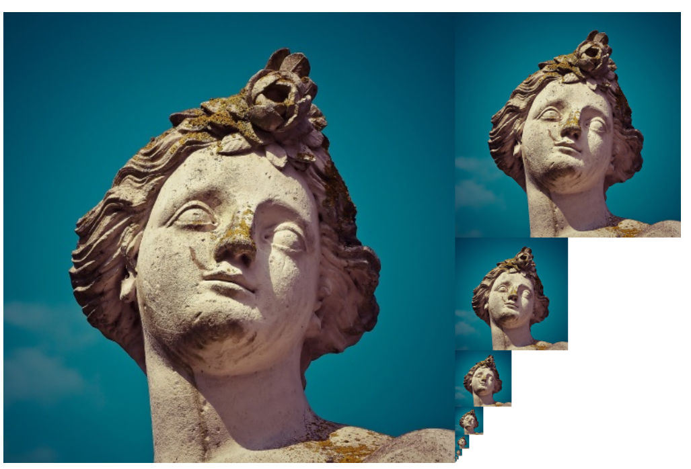
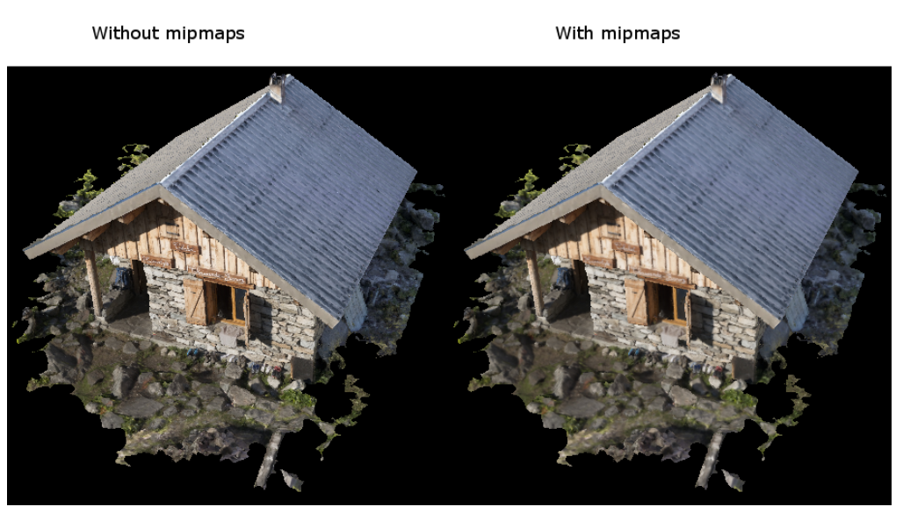
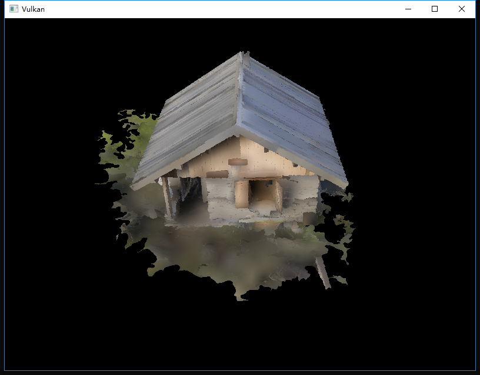

继续上一次的
<!-- more -->
<b>介绍</b>
我们的程序现在可以加载和渲染3D模型了。在本章中，我们将添加另一个功能，即生成mipmap。Mipmap广泛用于游戏和渲染软件，Vulkan让我们可以完全操作它们的创建过程。

Mipmap是预先计算的缩小版图像，每个新图像的宽度和高度都是前一个图像的一半。Mipmap用作细节级别（Level of Detail，LOD）的形式。远离相机的物体将从较小的mip图像中采样纹理。使用较小的图像可提高渲染速度并能够避免产生莫尔图案之类的伪影（artifacts）。下面是一个mipmaps的示例：


<b>图像创建</b>
在Vulkan中，每个mip图像都存储在VkImage的不同mip级别（mip levels）中。Mip级别0是原始图像，级别0之后的mip级别通常称为mip链（mip chain）。

创建VkImage时指定mip级别的数量，到目前为止，我们始终将此值设置为1。我们需要根据图像的尺寸计算mip级别的数量。
首先，添加一个类成员来存储这个数字：
```cpp
...
uint32_t mipLevels;
VkImage textureImage;
...
```
一旦我们在createTextureImage中加载纹理，就可以找到mipLevels的值：
```cpp
int texWidth, texHeight, texChannels;
stbi_uc* pixels = stbi_load(TEXTURE_PATH.c_str(), &texWidth, &texHeight, &texChannels, STBI_rgb_alpha);
...
mipLevels = static_cast<uint32_t>(std::floor(std::log2(std::max(texWidth, texHeight)))) + 1;
```
这里计算了mip链中的级别数。max函数选择最大尺寸，log2函数计算该维度除以2的次数。floor函数处理最大维度不是2的幂的情况，添加1以使原始图像具有mip级别。

要使用此值，需要更改createImage，createImageView和transitionImageLayout函数，以允许我们指定mip级别的数量。在函数中添加mipLevels参数：
```cpp
void createImage(uint32_t width, uint32_t height, uint32_t mipLevels, VkFormat format, VkImageTiling tiling, VkImageUsageFlags usage, VkMemoryPropertyFlags properties, VkImage& image, VkDeviceMemory& imageMemory) {
    ...
    imageInfo.mipLevels = mipLevels;
    ...
}
```
```cpp
VkImageView createImageView(VkImage image, VkFormat format, VkImageAspectFlags aspectFlags, uint32_t mipLevels) {
    ...
    viewInfo.subresourceRange.levelCount = mipLevels;
    ...
```
```cpp
void transitionImageLayout(VkImage image, VkFormat format, VkImageLayout oldLayout, VkImageLayout newLayout, uint32_t mipLevels) {
    ...
    barrier.subresourceRange.levelCount = mipLevels;
    ...
```
更新对这些函数的所有调用以使用正确的值：
```cpp
createImage(swapChainExtent.width, swapChainExtent.height, 1, depthFormat, VK_IMAGE_TILING_OPTIMAL, VK_IMAGE_USAGE_DEPTH_STENCIL_ATTACHMENT_BIT, VK_MEMORY_PROPERTY_DEVICE_LOCAL_BIT, depthImage, depthImageMemory);
...
createImage(texWidth, texHeight, mipLevels, VK_FORMAT_R8G8B8A8_UNORM, VK_IMAGE_TILING_OPTIMAL, VK_IMAGE_USAGE_TRANSFER_DST_BIT | VK_IMAGE_USAGE_SAMPLED_BIT, VK_MEMORY_PROPERTY_DEVICE_LOCAL_BIT, textureImage, textureImageMemory);
```
```cpp
swapChainImageViews[i] = createImageView(swapChainImages[i], swapChainImageFormat, VK_IMAGE_ASPECT_COLOR_BIT, 1);
...
depthImageView = createImageView(depthImage, depthFormat, VK_IMAGE_ASPECT_DEPTH_BIT, 1);
...
textureImageView = createImageView(textureImage, VK_FORMAT_R8G8B8A8_UNORM, VK_IMAGE_ASPECT_COLOR_BIT, mipLevels);
```
```cpp
transitionImageLayout(depthImage, depthFormat, VK_IMAGE_LAYOUT_UNDEFINED, VK_IMAGE_LAYOUT_DEPTH_STENCIL_ATTACHMENT_OPTIMAL, 1);
...
transitionImageLayout(textureImage, VK_FORMAT_R8G8B8A8_UNORM, VK_IMAGE_LAYOUT_UNDEFINED, VK_IMAGE_LAYOUT_TRANSFER_DST_OPTIMAL, mipLevels);
```

<b>生成Mipmap</b>
我们的纹理图像现在具有多个mip级别，但是临时缓冲区只能用于填充mip级别0，其他级别仍未定义。为了填补这些级别，我们需要从我们拥有的单个级别来生成数据。我们将使用vkCmdBlitImage命令。此命令执行复制，缩放和筛选操作，我们将多次调用它来将数据位块传输（blit）到纹理图像的每个级别。

VkCmdBlit被认为是传输操作，因此我们必须告知Vulkan我们用作传输的源和目标的纹理图像。将VK_IMAGE_USAGE_TRANSFER_SRC_BIT添加到createTextureImage中纹理图像的用法标志中：
```cpp
...
createImage(texWidth, texHeight, mipLevels, VK_FORMAT_R8G8B8A8_UNORM, VK_IMAGE_TILING_OPTIMAL, VK_IMAGE_USAGE_TRANSFER_SRC_BIT | VK_IMAGE_USAGE_TRANSFER_DST_BIT | VK_IMAGE_USAGE_SAMPLED_BIT, VK_MEMORY_PROPERTY_DEVICE_LOCAL_BIT, textureImage, textureImageMemory);
...
```
与其他图像操作一样，vkCmdBlitImage依赖于其操作的图像的布局，我们可以将整个图像转换为VK_IMAGE_LAYOUT_GENERAL，但这很可能很慢。为获得最佳性能，源映像应位于VK_IMAGE_LAYOUT_TRANSFER_SRC_OPTIMAL中，目标映像应位于VK_IMAGE_LAYOUT_TRANSFER_DST_OPTIMAL中。Vulkan允许我们独立转换图像的每个mip级别。每个    一次只处理两个mip级别，因此我们可以在blit命令间歇的时候将级别转换为的最佳布局。

transitionImageLayout只对整个图像执行布局转换，因此我们还需要编写一些管道屏障命令。删除createTextureImage中现有的转换为VK_IMAGE_LAYOUT_SHADER_READ_ONLY_OPTIMAL的代码：
```cpp
...
transitionImageLayout(textureImage, VK_FORMAT_R8G8B8A8_UNORM, VK_IMAGE_LAYOUT_UNDEFINED, VK_IMAGE_LAYOUT_TRANSFER_DST_OPTIMAL, mipLevels);
    copyBufferToImage(stagingBuffer, textureImage, static_cast<uint32_t>(texWidth), static_cast<uint32_t>(texHeight));
//transitioned to VK_IMAGE_LAYOUT_SHADER_READ_ONLY_OPTIMAL while generating mipmaps
...
```
这将使纹理图像的每个级别都保留在VK_IMAGE_LAYOUT_TRANSFER_DST_OPTIMAL。在读取blit命令完成后，每个级别将转换为VK_IMAGE_LAYOUT_SHADER_READ_ONLY_OPTIMAL。

我们现在要编写生成mipmap的函数：
```cpp
void generateMipmaps(VkImage image, int32_t texWidth, int32_t texHeight, uint32_t mipLevels) {
    VkCommandBuffer commandBuffer = beginSingleTimeCommands();
    
    VkImageMemoryBarrier barrier = {};
    barrier.sType = VK_STRUCTURE_TYPE_IMAGE_MEMORY_BARRIER;
    barrier.image = image;
    barrier.srcQueueFamilyIndex = VK_QUEUE_FAMILY_IGNORED;
    barrier.dstQueueFamilyIndex = VK_QUEUE_FAMILY_IGNORED;
    barrier.subresourceRange.aspectMask = VK_IMAGE_ASPECT_COLOR_BIT;
    barrier.subresourceRange.baseArrayLayer = 0;
    barrier.subresourceRange.layerCount = 1;
    barrier.subresourceRange.levelCount = 1;
    
    endSingleTimeCommands(commandBuffer);
}
```
我们将进行多次转换，因此我们将重用此VkImageMemoryBarrier。对于所有屏障，上面设置的字段都将保持不变。每次转换需要更改的是subresourceRange.miplevel，oldLayout，newLayout，srcAccessMask和dstAccessMask。
```cpp
int32_t mipWidth = texWidth;
int32_t mipHeight = texHeight;

for (uint32_t i = 1; i < mipLevels; i++) {

}
```
该循环将记录每个VkCmdBlitImage命令。请注意，循环变量从1开始，而不是0。
```cpp
barrier.subresourceRange.baseMipLevel = i - 1;
barrier.oldLayout = VK_IMAGE_LAYOUT_TRANSFER_DST_OPTIMAL;
barrier.newLayout = VK_IMAGE_LAYOUT_TRANSFER_SRC_OPTIMAL;
barrier.srcAccessMask = VK_ACCESS_TRANSFER_WRITE_BIT;
barrier.dstAccessMask = VK_ACCESS_TRANSFER_READ_BIT;

vkCmdPipelineBarrier(commandBuffer,
    VK_PIPELINE_STAGE_TRANSFER_BIT, VK_PIPELINE_STAGE_TRANSFER_BIT, 0,
    0, nullptr,
    0, nullptr,
    1, &barrier);
```
首先，我们将i-1级别转换为VK_IMAGE_LAYOUT_TRANSFER_SRC_OPTIMAL，此转换将等待前一个blit命令或vkCmdCopyBufferToImage填充级别i-1完成。当前的blit命令也将等待此转换完成。
```cpp
VkImageBlit blit = {};
blit.srcOffsets[0] = { 0, 0, 0 };
blit.srcOffsets[1] = { mipWidth, mipHeight, 1 };
blit.srcSubresource.aspectMask = VK_IMAGE_ASPECT_COLOR_BIT;
blit.srcSubresource.mipLevel = i - 1;
blit.srcSubresource.baseArrayLayer = 0;
blit.srcSubresource.layerCount = 1;
blit.dstOffsets[0] = { 0, 0, 0 };
blit.dstOffsets[1] = { mipWidth > 1 ? mipWidth / 2 : 1, mipHeight > 1 ? mipHeight / 2 : 1, 1 };
blit.dstSubresource.aspectMask = VK_IMAGE_ASPECT_COLOR_BIT;
blit.dstSubresource.mipLevel = i;
blit.dstSubresource.baseArrayLayer = 0;
blit.dstSubresource.layerCount = 1;
```
接下来，我们指定将在blit操作中使用的区域。源mip级别为i-1，目标mip级别为i。srcOffsets数组的两个元素确定数据中进行blit的3D区域，dstOffsets确定数据将被blit到的区域。dstOffsets[1]的X和Y维度需要除以2，因为每个mip级别是前一级别的一半。srcOffsets[1]和dstOffsets[1]的Z维度必须为1，因为2D图像的深度为1。
```cpp
vkCmdBlitImage(commandBuffer,
    image, VK_IMAGE_LAYOUT_TRANSFER_SRC_OPTIMAL,
    image, VK_IMAGE_LAYOUT_TRANSFER_DST_OPTIMAL,
    1, &blit,
    VK_FILTER_LINEAR);
```
现在，我们记录blit命令。请注意，textureImage会用作srcImage和dstImage参数。这是因为我们是在同一图像的不同级别之间进行blitting的。源mip级别刚刚转换为VK_IMAGE_LAYOUT_TRANSFER_SRC_OPTIMAL，目标级别仍然是来自createTextureImage中的VK_IMAGE_LAYOUT_TRANSFER_DST_OPTIMAL。

最后一个参数允许我们指定要在blit中使用的VkFilter，我们在制作VkSampler时具有相同的过滤选项，我们使用VK_FILTER_LINEAR来启用插值。
```cpp
barrier.oldLayout = VK_IMAGE_LAYOUT_TRANSFER_SRC_OPTIMAL;
barrier.newLayout = VK_IMAGE_LAYOUT_SHADER_READ_ONLY_OPTIMAL;
barrier.srcAccessMask = VK_ACCESS_TRANSFER_READ_BIT;
barrier.dstAccessMask = VK_ACCESS_SHADER_READ_BIT;

vkCmdPipelineBarrier(commandBuffer,
    VK_PIPELINE_STAGE_TRANSFER_BIT, VK_PIPELINE_STAGE_FRAGMENT_SHADER_BIT, 0,
    0, nullptr,
    0, nullptr,
    1, &barrier);
```
此屏障将mip级别i-1转换为VK_IMAGE_LAYOUT_SHADER_READ_ONLY_OPTIMAL。此转换等待当前blit命令完成，而所有采样操作都将等待此转换完成。
```cpp
    ...
    if (mipWidth > 1) mipWidth /= 2;
    if (mipHeight > 1) mipHeight /= 2;
}
```
在循环结束时，我们将当前的mip尺寸除以2。我们在每次除法之前都要检查各个维度，以确保维度的值永远不会变为0。这处理了图像不是方形的情况，在这种情况下其中一个mip尺寸将在另一个尺寸之前达到1，发生这种情况时，对于所有剩余的级别，该维度都应保持为1。
```cpp
    barrier.subresourceRange.baseMipLevel = mipLevels - 1;
    barrier.oldLayout = VK_IMAGE_LAYOUT_TRANSFER_DST_OPTIMAL;
    barrier.newLayout = VK_IMAGE_LAYOUT_SHADER_READ_ONLY_OPTIMAL;
    barrier.srcAccessMask = VK_ACCESS_TRANSFER_WRITE_BIT;
    barrier.dstAccessMask = VK_ACCESS_SHADER_READ_BIT;

    vkCmdPipelineBarrier(commandBuffer,
        VK_PIPELINE_STAGE_TRANSFER_BIT, VK_PIPELINE_STAGE_FRAGMENT_SHADER_BIT, 0,
        0, nullptr,
        0, nullptr,
        1, &barrier);

    endSingleTimeCommands(commandBuffer);
}
```
在我们结束命令缓冲区之前，我们再插入一个管道屏障。此屏障将最后一个mip级别从VK_IMAGE_LAYOUT_TRANSFER_DST_OPTIMAL转换为VK_IMAGE_LAYOUT_SHADER_READ_ONLY_OPTIMAL。这不是由循环处理的，因为最后一个mip级别从不进行blit操作。

最后，在createTextureImage中添加对generateMipmaps的调用：
```cpp
transitionImageLayout(textureImage, VK_FORMAT_R8G8B8A8_UNORM, VK_IMAGE_LAYOUT_UNDEFINED, VK_IMAGE_LAYOUT_TRANSFER_DST_OPTIMAL, mipLevels);
    copyBufferToImage(stagingBuffer, textureImage, static_cast<uint32_t>(texWidth), static_cast<uint32_t>(texHeight));
//transitioned to VK_IMAGE_LAYOUT_SHADER_READ_ONLY_OPTIMAL while generating mipmaps
...
generateMipmaps(textureImage, texWidth, texHeight, mipLevels);
```
现在我们的纹理图像的mipmap现在已经填充完毕了。

<b>线性过滤支持</b>
使用像vkCmdBlitImage这样的内置函数生成所有mip级别非常方便，但遗憾的是并不能保证所有平台都支持。它需要我们的纹理图像格式支持线性过滤，这一点可以使用vkGetPhysicalDeviceFormatProperties函数进行检查。我们将为generateMipmaps函数添加一个检查。

首先添加一个指定图像格式的附加参数：
```cpp
void createTextureImage() {
    ...

    generateMipmaps(textureImage, VK_FORMAT_R8G8B8A8_UNORM, texWidth, texHeight, mipLevels);
}

void generateMipmaps(VkImage image, VkFormat imageFormat, int32_t texWidth, int32_t texHeight, uint32_t mipLevels) {

    ...
}
```
在generateMipmaps函数中，使用vkGetPhysicalDeviceFormatProperties来获取纹理图像格式的属性：
```cpp
void generateMipmaps(VkImage image, VkFormat imageFormat, int32_t texWidth, int32_t texHeight, uint32_t mipLevels) {

    // Check if image format supports linear blitting
    VkFormatProperties formatProperties;
    vkGetPhysicalDeviceFormatProperties(physicalDevice, imageFormat, &formatProperties);

    ...
```
VkFormatProperties结构有三个名为linearTilingFeatures，optimalTilingFeatures和bufferFeatures的字段，每个字段都描述了相应格式的使用方式，具体取决于它的使用方式。我们使用的是最佳平铺格式来创建纹理图像，因此我们需要检查optimalTilingFeatures。可以使用VK_FORMAT_FEATURE_SAMPLED_IMAGE_FILTER_LINEAR_BIT检查对线性过滤功能的支持：
```cpp
if (!(formatProperties.optimalTilingFeatures & VK_FORMAT_FEATURE_SAMPLED_IMAGE_FILTER_LINEAR_BIT)) {
    throw std::runtime_error("texture image format does not support linear blitting!");
}
```
在这种情况下有两种选择。您可以实现一个函数，搜索某个常见的支持线性blitting的纹理图像格式，或者您可以使用像[stb_image_resize](https://github.com/nothings/stb/blob/master/stb_image_resize.h)这样的库在软件中自己实现mipmap的生成，然后可以按照加载原始图像的方式将每个mip级别加载到图像中。

应该注意的是，实际上在运行时生成mipmap级别是不常见的。通常它们被预生成并存储在基本级别旁边的纹理文件中以提高加载速度。实现在软件中调整大小并从文件加载多个级别是留给读者的练习。

<b>采样</b>
当VkImage保存mipmap数据时，VkSampler控制渲染时读取数据的方式。Vulkan允许我们指定minLod，maxLod，mipLodBias和mipmapMode（“Lod”表示“细节级别”）。采样纹理时，采样器根据以下伪代码进行mip级别的选择：
```cpp
lod = getLodLevelFromScreenSize(); //smaller when the object is close, may be negative
lod = clamp(lod + mipLodBias, minLod, maxLod);

level = clamp(floor(lod), 0, texture.mipLevels - 1);  //clamped to the number of mip levels in the texture

if (mipmapMode == VK_SAMPLER_MIPMAP_MODE_NEAREST) {
    color = sample(level);
} else {
    color = blend(sample(level), sample(level + 1));
}
```
如果samplerInfo.mipmapMode是VK_SAMPLER_MIPMAP_MODE_NEAREST，则lod选择要从中采样的mip级别。如果mipmap模式是VK_SAMPLER_MIPMAP_MODE_LINEAR，则lod用于选择要采样的两个mip级别，然后对这些级别进行采样，并将结果线性混合。

采样操作也受到lod的影响：
```cpp
if (lod <= 0) {
    color = readTexture(uv, magFilter);
} else {
    color = readTexture(uv, minFilter);
}
```
如果物体靠近相机，则使用magFilter作为滤镜，如果物体离相机较远，则使用minFilter。通常lod是非负的，关闭相机时值为0。mipLodBias让我们强迫Vulkan可以使用比通常使用的值更低的lod和level。

要查看运行的结果，我们需要为textureSampler选择相应的值。我们已经将minFilter和magFilter设置为使用VK_FILTER_LINEAR了。现在只需要为minLod，maxLod，mipLodBias和mipmapMode选择值。
```cpp
void createTextureSampler() {
    ...
    samplerInfo.mipmapMode = VK_SAMPLER_MIPMAP_MODE_LINEAR;
    samplerInfo.minLod = 0; // Optional
    samplerInfo.maxLod = static_cast<float>(mipLevels);
    samplerInfo.mipLodBias = 0; // Optional
    ...
}
```
为了允许使用所有范围的mip级别，我们将minLod设置为0，并将maxLod设置为mip级别的数量。我们不需要更改lod值，因此将mipLodBias设置为0。

现在运行程序，可以看到以下内容：


差异并不明显，因为我们的场景非常简单。如果仔细观察，还是会有细微差别。


最明显的区别是木牌上的文字。使用mipmap时，文字会平滑处理。如果没有mipmaps，那么文字就会有莫尔条纹的粗糙边缘和间隙。

您可以使用采样器设置来查看它们如何影响mipmapping。例如，通过更改minLod，您可以强制采样器不使用最低的mip级别：
```cpp
samplerInfo.minLod = static_cast<float>(mipLevels / 2);
```
这些设置将生成此图像：


这是当物体远离相机时将使用的更高mip级别的方式。


