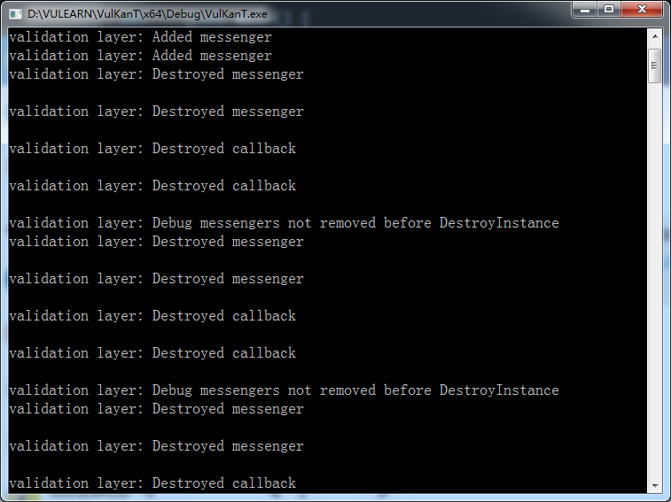

继续上一次的
<!-- more -->
<b>有关验证层</b>
Vulkan API设计的初衷是让相关的驱动程序开销最小，为了达到这个目标，对API的错误检查的部分就十分有限了
即使是将枚举设置为不正确的值或将空指针传递给所需参数这样简单的错误通常也不会被显式处理，只会导致崩溃或未定义的行为
由于Vulkan要求对所做的一切都非常了解，所以很容易犯很多小错误，比如使用新的GPU功能而忘记在逻辑设备创建时请求
但是，这并不意味着无法将这些错误检查添加到API中

Vulkan使用了叫做验证层的方式来实现，验证层是可选的组件，它钩（hook）到Vulkan其他的函数上来实现额外的操作
常见操作如下：
* 根据规范检查参数值以检测是否误用
* 跟踪对象的创建和销毁以检测资源泄漏
* 通过跟踪调用父线程来检查线程安全性
* 将每个调用及其参数记录到标准输出
* 跟踪Vulkan的函数调用进行性能分析和重现
下面是一个验证层中函数实现的示例：
```cpp
VkResult vkCreateInstance(
    const VkInstanceCreateInfo* pCreateInfo,
    const VkAllocationCallbacks* pAllocator,
    VkInstance* instance) {

    if (pCreateInfo == nullptr || instance == nullptr) {
        log("Null pointer passed to required parameter!");
        return VK_ERROR_INITIALIZATION_FAILED;
    }

    return real_vkCreateInstance(pCreateInfo, pAllocator, instance);
}
```
这些验证层可以自由堆叠所有你想用到的各种功能，也可以只为调试版本启用验证层，并在发布版本完全禁用它们
Vulkan没有内置任何验证层，但是LunarG Vulkan SDK提供了一组很好的层来检查常见错误。它们也是完全[开源](https://github.com/KhronosGroup/Vulkan-ValidationLayers)的，因此可以自由查看相关代码的功能以及贡献代码
使用验证层是避免应用程序由于未定义的行为在不同驱动程序上崩溃的最佳方法了

验证层只有在已安装到系统上时才能使用，例如，LunarG的验证层仅适用于安装了Vulkan SDK的PC
以前在Vulkan里有两种不同类型的验证层，实例（instance）和特定设备（device specific）的
这个想法是实例层只会检查与实例等全局Vulkan对象相关的调用，特定设备的层只会检查与特定GPU相关的调用
现在已弃用特定设备的层，这意味着实例验证层适用于所有Vulkan调用。

规范文档仍然建议在设备级别启用验证层以及实现某些功能所需的兼容性设置，这只需要在逻辑设备级别指定与实例相同的层，之后就会看到如何实现这一点

<b>使用验证层</b>
在本节中，将了解如何启用Vulkan SDK提供的标准诊断层。就像扩展一样，需要通过指定其名称来启用验证层。
SDK不需要显式指定所有有用的层，直接使用VK_LAYER_LUNARG_standard_validation层就可以隐式的启用一系列有用的诊断层了

首先向程序添加两个用来配置的变量，以指定要启用的层以及是否启用它们。
这里选择将该值仅仅在程序在调试模式下编译使用为true，NDEBUG宏是C ++标准的一部分，意味着“不调试”
```cpp
const int WIDTH = 800;
const int HEIGHT = 600;

const std::vector<const char*> validationLayers = {
    "VK_LAYER_LUNARG_standard_validation"
};

#ifdef NDEBUG
    const bool enableValidationLayers = false;
#else
    const bool enableValidationLayers = true;
#endif
```
之后添加一个新函数checkValidationLayerSupport，用于检查所有请求的层是否都可用
首先使用vkEnumerateInstanceLayerProperties函数列出所有可用图层，它的用法与之前说到的vkEnumerateInstanceExtensionProperties的用法相同。
```cpp
bool checkValidationLayerSupport() {
    uint32_t layerCount;
    vkEnumerateInstanceLayerProperties(&layerCount, nullptr);

    std::vector<VkLayerProperties> availableLayers(layerCount);
    vkEnumerateInstanceLayerProperties(&layerCount, availableLayers.data());

    return false;
}
```
接下来，检查验证层中的所有图层是否都存在于可用的pLayers列表中，这里的strcmp函数需要#include <cstring>。
```cpp
for (const char* layerName : validationLayers) {
    bool layerFound = false;

    for (const auto& layerProperties : availableLayers) {
        if (strcmp(layerName, layerProperties.layerName) == 0) {
            layerFound = true;
            break;
        }
    }

    if (!layerFound) {
        return false;
    }
}

return true;
```
现在将这个函数添加到createInstance里：
```cpp
void createInstance() {
    if (enableValidationLayers && !checkValidationLayerSupport()) {
        throw std::runtime_error("validation layers requested, but not available!");
    }

    ...
}
```
现在以调试模式运行程序并确保不会发生错误，如果有错误，检查是否正确安装了Vulkan SDK。
如果没有显示任何图层，或者显示的极少，或许是碰到了[这个问题](https://vulkan.lunarg.com/issue/home?limit=10;q=;mine=false;org=false;khronos=false;lunarg=false;indie=false;status=new,open)，可以按照他的方法来修正

最后，修改VkInstanceCreateInfo结构的实例化来包含验证层：
```cpp
if (enableValidationLayers) {
    createInfo.enabledLayerCount = static_cast<uint32_t>(validationLayers.size());
    createInfo.ppEnabledLayerNames = validationLayers.data();
} else {
    createInfo.enabledLayerCount = 0;
}
```
如果检查成功，那么vkCreateInstance就不会返回VK_ERROR_LAYER_NOT_PRESENT，但是最好还是运行一下来确保正确

<b>消息回调</b>
不幸的是，只是启用图层并没有多大是的帮助，因为他们目前无法将调试消息返回我们的程序。
要接收这些消息，需要设置一个回调，这里需要VK_EXT_debug_utils扩展。
首先创建一个getRequiredExtensions函数，该函数将根据是否启用验证层返回所需的扩展列表：
```cpp
std::vector<const char*> getRequiredExtensions() {
    uint32_t glfwExtensionCount = 0;
    const char** glfwExtensions;
    glfwExtensions = glfwGetRequiredInstanceExtensions(&glfwExtensionCount);

    std::vector<const char*> extensions(glfwExtensions, glfwExtensions + glfwExtensionCount);

    if (enableValidationLayers) {
        extensions.push_back(VK_EXT_DEBUG_UTILS_EXTENSION_NAME);
    }

    return extensions;
}
```
GLFW指定的扩展始终是必需的，但调试报告扩展可以根据条件来添加。
注意在这里使用了VK_EXT_DEBUG_UTILS_EXTENSION_NAME宏，这个和文字字符串“VK_EXT_debug_utils”是一样的，但是使用这个宏可以避免拼写错误。

现在可以在createInstance中使用此函数了：
```cpp
auto extensions = getRequiredExtensions();
createInfo.enabledExtensionCount = static_cast<uint32_t>(extensions.size());
createInfo.ppEnabledExtensionNames = extensions.data();
```
运行该程序来确保没有VK_ERROR_EXTENSION_NOT_PRESENT错误。实际上不需要检查此扩展的存在，因为这个在验证层的可用性检查时已经包含了。

现在来实现一下回调函数，使用PFN_vkDebugUtilsMessengerCallbackEXT原型来添加一个名为debugCallback的新静态成员函数，VKAPI_ATTR和VKAPI_CALL确保这个函数具有正确的签名可以让Vulkan来调用它。
```cpp
static VKAPI_ATTR VkBool32 VKAPI_CALL debugCallback(
    VkDebugUtilsMessageSeverityFlagBitsEXT messageSeverity,
    VkDebugUtilsMessageTypeFlagsEXT messageType,
    const VkDebugUtilsMessengerCallbackDataEXT* pCallbackData,
    void* pUserData) {

    std::cerr << "validation layer: " << pCallbackData->pMessage << std::endl;

    return VK_FALSE;
}
```
第一个参数表示消息的严重性，它可以是以下几个标志之一：
* VK_DEBUG_UTILS_MESSAGE_SEVERITY_VERBOSE_BIT_EXT：诊断消息
* VK_DEBUG_UTILS_MESSAGE_SEVERITY_INFO_BIT_EXT：信息性消息，如创建资源
* VK_DEBUG_UTILS_MESSAGE_SEVERITY_WARNING_BIT_EXT：有关行为的消息，不一定是错误（error），但很可能是某个的错误（bug，这个实在不知道怎么表达区别了）
* VK_DEBUG_UTILS_MESSAGE_SEVERITY_ERROR_BIT_EXT：有关无效行为的消息，可能导致崩溃
这个枚举的值的设置方式让我们可以使用比较操作来检查消息是否与某个严重级别相等或更差，例如：
```cpp
if (messageSeverity >= VK_DEBUG_UTILS_MESSAGE_SEVERITY_WARNING_BIT_EXT) {
    // Message is important enough to show
}
```
messageType参数可以是以下几个标志之一：
* VK_DEBUG_UTILS_MESSAGE_TYPE_GENERAL_BIT_EXT：发生了一些与规范或性能无关的事件
* VK_DEBUG_UTILS_MESSAGE_TYPE_VALIDATION_BIT_EXT：发生了违反规范或表明可能存在错误的事情
* VK_DEBUG_UTILS_MESSAGE_TYPE_PERFORMANCE_BIT_EXT：Vulkan的潜在非最佳使用
pCallbackData参数是一个VkDebugUtilsMessengerCallbackDataEXT结构，其中包含消息本身的详细信息，比较重要的成员有以下几个：
* pMessage：以null结尾的调试消息字符串
* pObjects：与消息相关的Vulkan对象句柄的数组
* objectCount：数组中的对象个数
最后，pUserData参数是一个在回调设置期间指定的指针，并允许将自身的数据传递给它。

回调函数返回一个布尔值，指示是否应该中止触发验证层消息的Vulkan调用。
如果回调返回true，则调用将因VK_ERROR_VALIDATION_FAILED_EXT错误而中止，这个通常仅用于测试验证层本身，所以应始终返回VK_FALSE。

现在剩下的就是把回调函数告知Vulkan了。有些令人惊讶的是，Vulkan中的调试回调也是通过需要显式创建和销毁的句柄来管理的。
这样的回调称为信使（messenger），可以根据需要随意添加。在instance下面添加这个句柄的类成员：
```cpp
VkDebugUtilsMessengerEXT callback;
```
添加函数setupDebugCallback，在initVulkan中的createInstance之后调用：
```cpp
void initVulkan() {
    createInstance();
    setupDebugCallback();
}

void setupDebugCallback() {
    if (!enableValidationLayers) return;

}
```
接下来使用回调的相关信息来填充一个结构：
```cpp
VkDebugUtilsMessengerCreateInfoEXT createInfo = {};
createInfo.sType = VK_STRUCTURE_TYPE_DEBUG_UTILS_MESSENGER_CREATE_INFO_EXT;
createInfo.messageSeverity = VK_DEBUG_UTILS_MESSAGE_SEVERITY_VERBOSE_BIT_EXT | VK_DEBUG_UTILS_MESSAGE_SEVERITY_WARNING_BIT_EXT | VK_DEBUG_UTILS_MESSAGE_SEVERITY_ERROR_BIT_EXT;
createInfo.messageType = VK_DEBUG_UTILS_MESSAGE_TYPE_GENERAL_BIT_EXT | VK_DEBUG_UTILS_MESSAGE_TYPE_VALIDATION_BIT_EXT | VK_DEBUG_UTILS_MESSAGE_TYPE_PERFORMANCE_BIT_EXT;
createInfo.pfnUserCallback = debugCallback;
createInfo.pUserData = nullptr; // Optional
```
messageSeverity字段指定要为其调用回调的所有类型的严重性。
这里设定为除了VK_DEBUG_UTILS_MESSAGE_SEVERITY_INFO_BIT_EXT之外的所有类型，来接收有关可能出现的问题的通知，同时省略大量的一般调试信息。
messageType字段设置通知回调的消息类型。在这里启用了所有类型，可以根据实际情况随时禁用它们。
最后，pfnUserCallback字段指定回调函数的指针。
同时可以选择将指针传递给pUserData字段，该字段将通过pUserData参数传递给回调函数。
例如，可以使用它来传递指向HelloTriangleApplication类的指针。

注意，有许多方法可以配置验证层消息和调试回调，但这里说明的只是入门的一个很好的配置。如果想了解更多相关信息，可以参阅[这里](https://www.khronos.org/registry/vulkan/specs/1.1-extensions/html/vkspec.html#VK_EXT_debug_utils)

这时候将这个结构传递给vkCreateDebugUtilsMessengerEXT函数来创建VkDebugUtilsMessengerEXT对象。
不幸的是，因为此函数是扩展函数，所以它不会自动加载。这里还必须使用vkGetInstanceProcAddr查找其地址，我们将创建自己的代理函数，在后台处理它，这里将它添加到HelloTriangleApplication类定义的正上方：
```cpp
VkResult CreateDebugUtilsMessengerEXT(VkInstance instance, const VkDebugUtilsMessengerCreateInfoEXT* pCreateInfo, const VkAllocationCallbacks* pAllocator, VkDebugUtilsMessengerEXT* pCallback) {
    auto func = (PFN_vkCreateDebugUtilsMessengerEXT) vkGetInstanceProcAddr(instance, "vkCreateDebugUtilsMessengerEXT");
    if (func != nullptr) {
        return func(instance, pCreateInfo, pAllocator, pCallback);
    } else {
        return VK_ERROR_EXTENSION_NOT_PRESENT;
    }
}
```
如果无法加载函数，vkGetInstanceProcAddr将返回nullptr。
我们现在可以调用这个函数来创建扩展对象（如果可用）：
```cpp
if (CreateDebugUtilsMessengerEXT(instance, &createInfo, nullptr, &callback) != VK_SUCCESS) {
    throw std::runtime_error("failed to set up debug callback!");
}
```
倒数第二个参数同样也是可选的分配器回调指针，设为nullptr就行，其他参数就很直接了。
由于调试回调函数是根据特定Vulkan实例及其层来选择的，因此需要将其明确指定为第一个参数，在之后还能看到其他相关的子对象。
现在可以观察这样是否有效了。运行程序并关闭窗口可以看到以下消息打印到命令提示符：


现在就已经有个错误了。需要通过调用vkDestroyDebugUtilsMessengerEXT来清理VkDebugUtilsMessengerEXT对象，与vkCreateDebugUtilsMessengerEXT类似，这个函数也需要显式加载
注意，此消息多次打印是正常的。发生这种情况是因为多个验证层都检查到了调试信使的缺失。

在CreateDebugUtilsMessengerEXT下创建另一个代理函数：
```cpp
void DestroyDebugUtilsMessengerEXT(VkInstance instance, VkDebugUtilsMessengerEXT callback, const VkAllocationCallbacks* pAllocator) {
    auto func = (PFN_vkDestroyDebugUtilsMessengerEXT) vkGetInstanceProcAddr(instance, "vkDestroyDebugUtilsMessengerEXT");
    if (func != nullptr) {
        func(instance, callback, pAllocator);
    }
}
```
确保这个函数是静态类函数或类外的函数。然后我们可以在cleanup函数中调用它：
```cpp
void cleanup() {
    if (enableValidationLayers) {
        DestroyDebugUtilsMessengerEXT(instance, callback, nullptr);
    }

    vkDestroyInstance(instance, nullptr);

    glfwDestroyWindow(window);

    glfwTerminate();
}
```
当再次运行该程序时，可以将看到错误消息没有了。如果要查看哪个调用触发了消息，可以在消息回调中添加断点并查看堆栈并跟踪调试。

<b>布局</b>
除了VkDebugUtilsMessengerCreateInfoEXT结构中指定的标志，验证层还有很多设置。浏览到Vulkan SDK的Config目录。在那里，可以将找到一个vk_layer_settings.txt文件，该文件解释了如何配置图层。
要为自己的应用程序配置图层设置，请将该文件复制到项目的“Debug”和“Release”目录中，然后按照说明设置所需的配置。但是对于本教程的后文讲直接采用默认的配置。
在本教程中，将做一些故意的错误，用来展示验证层对捕获它们的巨大帮助，并明确的解释正在使用Vulkan做的事情。
下一部分将查看系统中的Vulkan设备了。


