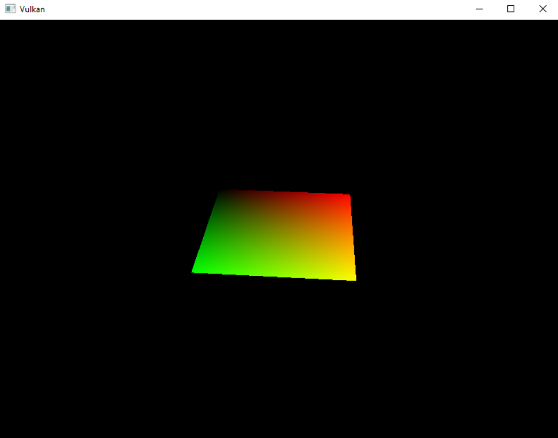
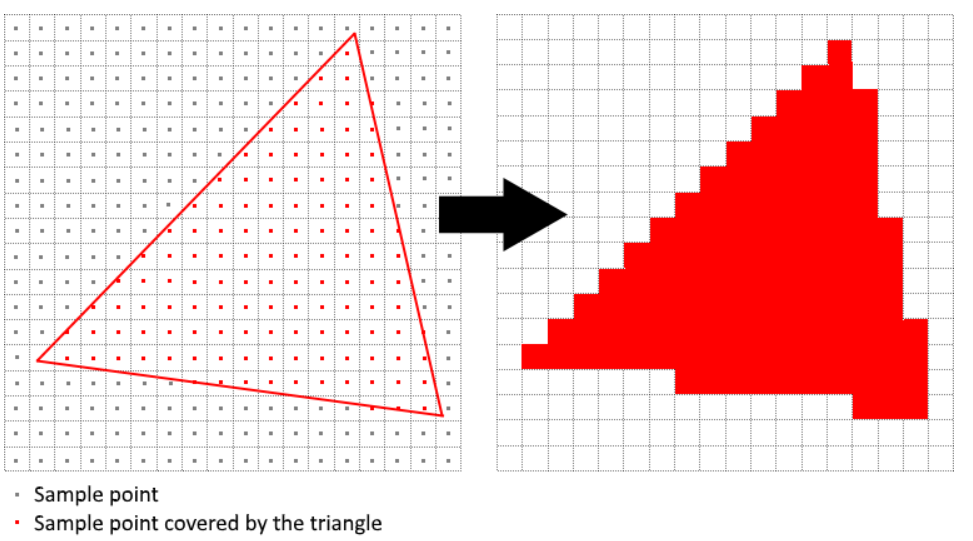
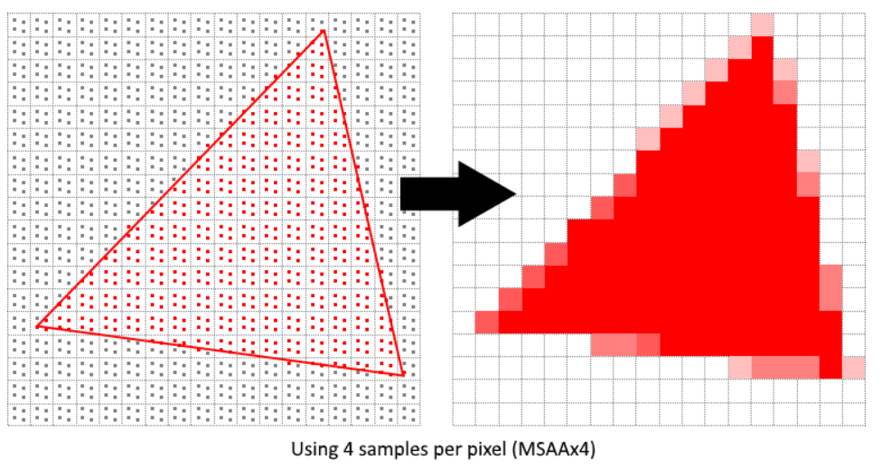
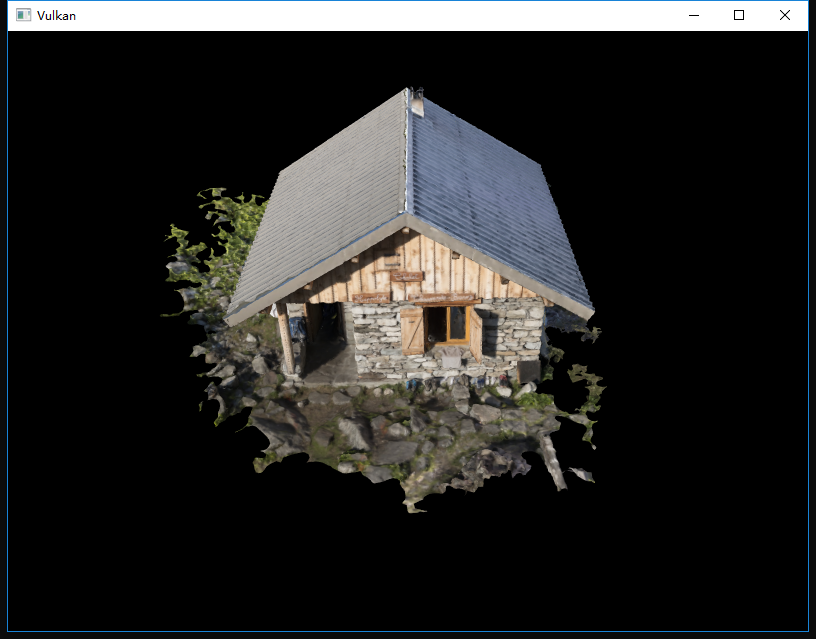
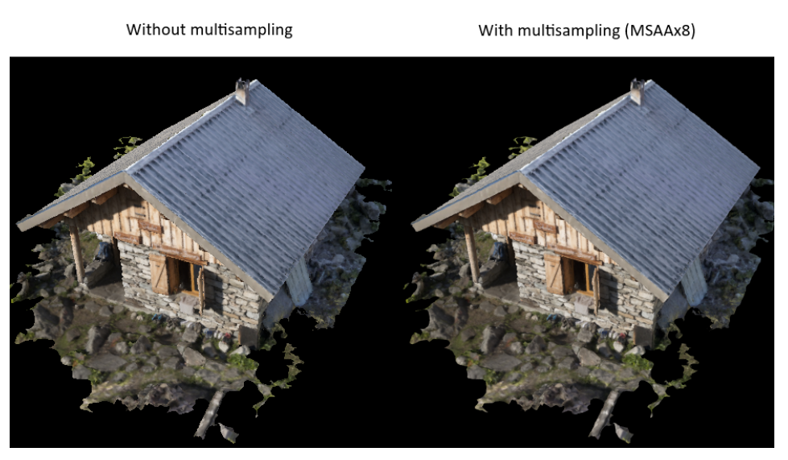
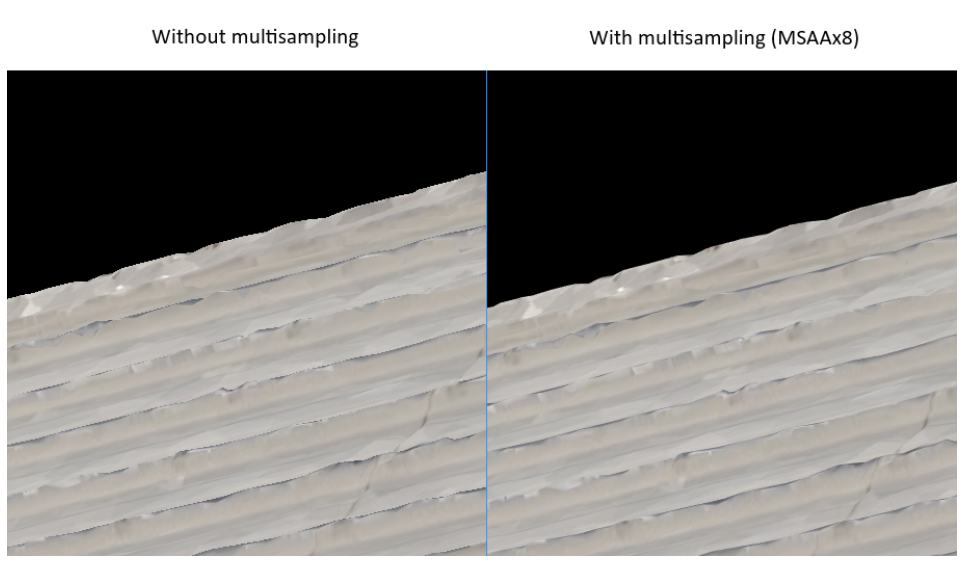
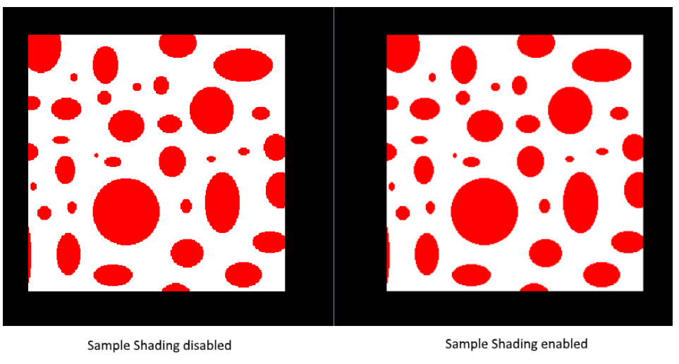

继续上一次的
<!-- more -->
<b>介绍</b>
我们的程序现在可以加载纹理的多个细节级别了，在渲染图像远离相机的时候进行相应的修复。现在图像更平滑，但仔细观察后，您会发现沿着绘制几何形状边缘的会有锯齿。当我们渲染四边形时，这在我们的一个早期程序中尤为明显：


这种糟糕的效果称为混叠（aliasing），这是有限的像素用于渲染的导致结果。由于没有无限分辨率的显示器，因此从某种程度上来说它总会发生。有很多方法可以解决这个问题，在本章中我们将重点讨论一个比较流行的方法：[多重采样抗锯齿（MSAA）](https://en.wikipedia.org/wiki/Multisample_anti-aliasing)。

在普通渲染中，是基于单个采样点确定像素颜色的，在大多数情况下，该采样点都是屏幕上的目标像素的中心。如果绘制线的一部分通过某个像素但未覆盖采样点，则该像素将留空，从而导致锯齿状的“阶梯”效果。


MSAA所做的是它使用每个像素的多个采样点（因此得名）来确定其最终颜色。正如所预料的那样，更多的样本会带来更好的结果，但是它的计算成本也更高。


<b>获取采样数量</b>
让我们从确定硬件可以使用的采样数量开始。大多数现代GPU支持至少8个采样点，但能不保证这个数字在任何地方都是相同的。我们将通过添加新的类成员来查询：
```cpp
...
VkSampleCountFlagBits msaaSamples = VK_SAMPLE_COUNT_1_BIT;
...
```
默认情况下，我们每个像素只使用一个样本，这相当于没有多重采样，在这种情况下，最终图像将保持不变。可以从与我们选择的物理设备关联的VkPhysicalDeviceProperties中提取确切的最大样本数。我们正在使用深度缓冲区，因此我们必须同时考虑颜色和深度的样本计数，其中较低的一个将是我们可以支持的最大值。

添加一个为我们获取此信息的函数：
```cpp
VkSampleCountFlagBits getMaxUsableSampleCount() {
    VkPhysicalDeviceProperties physicalDeviceProperties;
    vkGetPhysicalDeviceProperties(physicalDevice, &physicalDeviceProperties);

    VkSampleCountFlags counts = std::min(physicalDeviceProperties.limits.framebufferColorSampleCounts, physicalDeviceProperties.limits.framebufferDepthSampleCounts);
    if (counts & VK_SAMPLE_COUNT_64_BIT) { return VK_SAMPLE_COUNT_64_BIT; }
    if (counts & VK_SAMPLE_COUNT_32_BIT) { return VK_SAMPLE_COUNT_32_BIT; }
    if (counts & VK_SAMPLE_COUNT_16_BIT) { return VK_SAMPLE_COUNT_16_BIT; }
    if (counts & VK_SAMPLE_COUNT_8_BIT) { return VK_SAMPLE_COUNT_8_BIT; }
    if (counts & VK_SAMPLE_COUNT_4_BIT) { return VK_SAMPLE_COUNT_4_BIT; }
    if (counts & VK_SAMPLE_COUNT_2_BIT) { return VK_SAMPLE_COUNT_2_BIT; }

    return VK_SAMPLE_COUNT_1_BIT;
}
```
我们会使用此函数在物理设备选择过程中设置msaaSamples变量，为此，我们还必须稍微修改pickPhysicalDevice函数：
```cpp
void pickPhysicalDevice() {
    ...
    for (const auto& device : devices) {
        if (isDeviceSuitable(device)) {
            physicalDevice = device;
            msaaSamples = getMaxUsableSampleCount();
            break;
        }
    }
    ...
}
```

<b>设置渲染目标</b>
在MSAA中，每个像素在屏幕外缓冲区中进行采样，然后将其渲染到屏幕上。这个新缓冲区与我们渲染的常规图像略有不同-它们必须能够为每个像素存储多个采样点。一旦创建了多重采样缓冲区，就必须将其解析为默认的帧缓冲区（每个像素只存储一个采样点）。这就是为什么我们必须创建一个额外的渲染目标并修改我们当前的绘制过程。我们只需要一个渲染目标，因为一次只有一个绘制操作是活动的，就像深度缓冲一样。添加以下类成员：
```cpp
...
VkImage colorImage;
VkDeviceMemory colorImageMemory;
VkImageView colorImageView;
...
```
这个新图像必须存储每个像素所需的采样数，因此我们需要在图像创建过程中将此数字传递给VkImageCreateInfo。在createImage函数添加一个numSamples参数：
```cpp
void createImage(uint32_t width, uint32_t height, uint32_t mipLevels, VkSampleCountFlagBits numSamples, VkFormat format, VkImageTiling tiling, VkImageUsageFlags usage, VkMemoryPropertyFlags properties, VkImage& image, VkDeviceMemory& imageMemory) {
    ...
    imageInfo.samples = numSamples;
    ...
```
现在，使用VK_SAMPLE_COUNT_1_BIT更新对此函数的所有调用-随着程序实现的进展，我们将使用适当的值替换它：
```cpp
createImage(swapChainExtent.width, swapChainExtent.height, 1, VK_SAMPLE_COUNT_1_BIT, depthFormat, VK_IMAGE_TILING_OPTIMAL, VK_IMAGE_USAGE_DEPTH_STENCIL_ATTACHMENT_BIT, VK_MEMORY_PROPERTY_DEVICE_LOCAL_BIT, depthImage, depthImageMemory);
...
createImage(texWidth, texHeight, mipLevels, VK_SAMPLE_COUNT_1_BIT, VK_FORMAT_R8G8B8A8_UNORM, VK_IMAGE_TILING_OPTIMAL, VK_IMAGE_USAGE_TRANSFER_SRC_BIT | VK_IMAGE_USAGE_TRANSFER_DST_BIT | VK_IMAGE_USAGE_SAMPLED_BIT, VK_MEMORY_PROPERTY_DEVICE_LOCAL_BIT, textureImage, textureImageMemory);
```
我们现在将创建一个多重采样颜色缓冲区。添加一个createColorResources函数，注意我们在这里使用msaaSamples作为createImage的函数参数。我们这里只使用一个mip级别，因为在每个像素具有多个样本的图像的情况下，Vulkan规范强制执行此操作，另外，此颜色缓冲区也不需要mipmap，因为它不会用作纹理：
```cpp
void createColorResources() {
    VkFormat colorFormat = swapChainImageFormat;

    createImage(swapChainExtent.width, swapChainExtent.height, 1, msaaSamples, colorFormat, VK_IMAGE_TILING_OPTIMAL, VK_IMAGE_USAGE_TRANSIENT_ATTACHMENT_BIT | VK_IMAGE_USAGE_COLOR_ATTACHMENT_BIT, VK_MEMORY_PROPERTY_DEVICE_LOCAL_BIT, colorImage, colorImageMemory);
    colorImageView = createImageView(colorImage, colorFormat, VK_IMAGE_ASPECT_COLOR_BIT, 1);

    transitionImageLayout(colorImage, colorFormat, VK_IMAGE_LAYOUT_UNDEFINED, VK_IMAGE_LAYOUT_COLOR_ATTACHMENT_OPTIMAL, 1);
}
```
为了保持一致性，在createDepthResources之前调用该函数：
```cpp
void initVulkan() {
    ...
    createColorResources();
    createDepthResources();
    ...
}
```
您可能会注意到新创建的彩色图像使用从VK_IMAGE_LAYOUT_UNDEFINED到VK_IMAGE_LAYOUT_COLOR_ATTACHMENT_OPTIMAL的转换方式，这是我们处理的新变化。考虑这一点，需要更改transitionImageLayout函数：
```cpp
void transitionImageLayout(VkImage image, VkFormat format, VkImageLayout oldLayout, VkImageLayout newLayout, uint32_t mipLevels) {
    ...
    else if (oldLayout == VK_IMAGE_LAYOUT_UNDEFINED && newLayout == VK_IMAGE_LAYOUT_COLOR_ATTACHMENT_OPTIMAL) {
        barrier.srcAccessMask = 0;
        barrier.dstAccessMask = VK_ACCESS_COLOR_ATTACHMENT_READ_BIT | VK_ACCESS_COLOR_ATTACHMENT_WRITE_BIT;
        sourceStage = VK_PIPELINE_STAGE_TOP_OF_PIPE_BIT;
        destinationStage = VK_PIPELINE_STAGE_COLOR_ATTACHMENT_OUTPUT_BIT;
    }
    else {
        throw std::invalid_argument("unsupported layout transition!");
    }
    ...
}
```
现在我们已经有了一个多重采样颜色缓冲区，现在是时候处理深度了。修改createDepthResources并更新深度缓冲区使用的采样数：
```cpp
void createDepthResources() {
    ...
    createImage(swapChainExtent.width, swapChainExtent.height, 1, msaaSamples, depthFormat, VK_IMAGE_TILING_OPTIMAL, VK_IMAGE_USAGE_DEPTH_STENCIL_ATTACHMENT_BIT, VK_MEMORY_PROPERTY_DEVICE_LOCAL_BIT, depthImage, depthImageMemory);
    ...
}
```
我们现在已经创建了几个新的Vulkan资源，所以我们不要忘记在清理它们：
```cpp
void cleanupSwapChain() {
    vkDestroyImageView(device, colorImageView, nullptr);
    vkDestroyImage(device, colorImage, nullptr);
    vkFreeMemory(device, colorImageMemory, nullptr);
    ...
}
```
更新recreateSwapChain，以便在调整窗口大小时以正确的分辨率重新创建新的彩色图像：
```cpp
void recreateSwapChain() {
    ...
    createGraphicsPipeline();
    createColorResources();
    createDepthResources();
    ...
}
```
我们完成了最初的MSAA设置，现在我们需要在我们的图形管道，帧缓冲，渲染通道中开始使用这个新资源并查看结果！

<b>添加新附件</b>
我们先来处理渲染过程。修改createRenderPass并更新颜色和深度附件创建信息的结构：
```cpp
void createRenderPass() {
    ...
    colorAttachment.samples = msaaSamples;
    colorAttachment.finalLayout = VK_IMAGE_LAYOUT_COLOR_ATTACHMENT_OPTIMAL;
    ...
    depthAttachment.samples = msaaSamples;
    ...
```
您会注意到我们已将finalLayout从VK_IMAGE_LAYOUT_PRESENT_SRC_KHR更改为VK_IMAGE_LAYOUT_COLOR_ATTACHMENT_OPTIMAL，那是因为多重采样图像是无法直接呈现的。我们首先需要将它们解析为常规图像。在深度缓冲区并没有这个需求，因为它不会在那里呈现。因此，我们只需添加一个新的颜色附件，即所谓的解析附件：
```cpp
    ...
    VkAttachmentDescription colorAttachmentResolve = {};
    colorAttachmentResolve.format = swapChainImageFormat;
    colorAttachmentResolve.samples = VK_SAMPLE_COUNT_1_BIT;
    colorAttachmentResolve.loadOp = VK_ATTACHMENT_LOAD_OP_DONT_CARE;
    colorAttachmentResolve.storeOp = VK_ATTACHMENT_STORE_OP_STORE;
    colorAttachmentResolve.stencilLoadOp = VK_ATTACHMENT_LOAD_OP_DONT_CARE;
    colorAttachmentResolve.stencilStoreOp = VK_ATTACHMENT_STORE_OP_DONT_CARE;
    colorAttachmentResolve.initialLayout = VK_IMAGE_LAYOUT_UNDEFINED;
    colorAttachmentResolve.finalLayout = VK_IMAGE_LAYOUT_PRESENT_SRC_KHR;
    ...
```
现在必须指示渲染过程将多重采样的彩色图像解析为常规附件。创建一个新的附件引用，该引用将指向将用作解析目标的颜色缓冲区：
```cpp
    ...
    VkAttachmentReference colorAttachmentResolveRef = {};
    colorAttachmentResolveRef.attachment = 2;
    colorAttachmentResolveRef.layout = VK_IMAGE_LAYOUT_COLOR_ATTACHMENT_OPTIMAL;
    ...
```
将pResolveAttachments子通道结构成员设置为指向新创建的附件引用。这可以让渲染过程定义一个多重采样解析操作，让我们能够将图像渲染到屏幕：
```cpp
    ...
    subpass.pResolveAttachments = &colorAttachmentResolveRef;
    ...
```
现在使用新的颜色附件来更新渲染通道信息结构：
```cpp
    ...
    std::array<VkAttachmentDescription, 3> attachments = {colorAttachment, depthAttachment, colorAttachmentResolve};
    ...
```
在渲染过程完成后，修改createFrameBuffers并将新图像视图添加到列表中：
```cpp
void createFrameBuffers() {
        ...
        std::array<VkImageView, 3> attachments = {
            colorImageView,
            depthImageView,
            swapChainImageViews[i]
        };
        ...
}
```
最后，通过修改createGraphicsPipeline告知新创建的管道需要使用多个采样：
```cpp
void createGraphicsPipeline() {
    ...
    multisampling.rasterizationSamples = msaaSamples;
    ...
}
```
现在运行您的程序，您可以看到以下内容：


就像使用mipmapping一样，差异可能不会立即表现出来。仔细看看你会注意到屋顶上的边缘不再是锯齿状的，整个图像看起来比原版更平滑。


当靠近其中一个边缘时，差异会更明显：


<b>质量改进</b>
我们当前的MSAA实现存在某些缺陷，这可能会在更复杂的场景中影响输出图像的质量。例如，我们目前还没有解决由着色器混叠引起的潜在问题，即MSAA只会使几何体的边缘变得平滑，而不是进行内部填充。当要呈现平滑多边形时这可能是一个比较好的解决方法，但如果应用的纹理包含高对比度颜色，则仍会有锯齿产生。解决此问题的一种方法是启用样本着色，这将进一步提高图像质量，但需要额外的性能开销：
```cpp
void createLogicalDevice() {
    ...
    deviceFeatures.sampleRateShading = VK_TRUE; // enable sample shading feature for the device
    ...
}

void createGraphicsPipeline() {
    ...
    multisampling.sampleShadingEnable = VK_TRUE; // enable sample shading in the pipeline
    multisampling.minSampleShading = .2f; // min fraction for sample shading; closer to one is smoother
    ...
}
```
在本示例中，我们将禁用样本着色，但在某些情况下，质量改进可能会很明显：


<b>总结</b>
到达这一步需要做很多工作，但现在你终于有了一个比较好的Vulkan程序基础。您现在拥有的Vulkan基本知识应足以开始探索更多功能，例如：
* 推送常量（Push constants）
* 实例渲染（Instanced rendering）
* 动态一致化（Dynamic uniforms）
* 单独的图像和采样器描述符（Separate images and sampler descriptors）
* 管道缓存（Pipeline cache）
* 多线程命令缓冲区生成（Multi-threaded command buffer generation）
* 多子通道（Multiple subpasses）
* 计算着色器（Compute shaders）

目前的程序可以通过多种方式进行扩展，例如添加Blinn-Phong照明（Blinn-Phong lighting），后期处理效果（post-processing effects）和阴影映射（shadow mapping）。您应该能够从其他API的教程中了解这些效果是如何工作的，尽管Vulkan要求十分明确的指明各个过程，但许多概念都是相似的。


