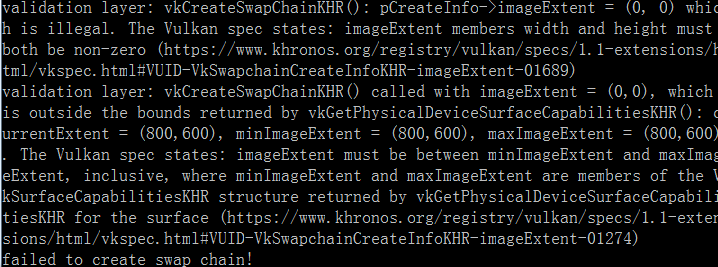

继续上一次的
<!-- more -->
Vulkan中没有“默认帧缓冲区（default framebuffer）”的概念，因此，还需要一个基本结构，在我们将相应的渲染显示到屏幕上此前存储在这个缓冲区中。
这个基本结构称为交换链，是Vulkan程序中必须创建的。交换链本质上是一个等待呈现给屏幕的图像队列，我们的应用程序获取相应的图像进行绘制，然后将其返回到队列中。
虽然队列的工作原理以及从队列中显示图像的条件也取决于交换链的设置方式，但交换链的原本目的是使图像的显示与屏幕的刷新率同步。

<b>检查交换链支持</b>
并非所有的显卡都能够直接将图像呈现给屏幕，如果是为服务器设计的显卡，可能就没有任何显示输出的功能。其次，由于图像的显示严重依赖于窗口系统和与窗口的surface，所以他并不是Vulkan核心功能的一部分。
在查询是否支持这个功能后，就能启用VK_KHR_swapchain这个设备扩展了。

为此，我们首先扩展isDeviceSuitable函数来检查是否支持此扩展。我们之前已经了解了如何列出VkPhysicalDevice支持的扩展，所以这一步也相当简单。
注意，Vulkan头文件提供了一个宏VK_KHR_SWAPCHAIN_EXTENSION_NAME，定义就是VK_KHR_swapchain。使用这个宏可以避免拼写错误。

首先声明所需设备扩展的列表，类似于要启用的验证层列表。
```cpp
const std::vector<const char*> deviceExtensions = {
    VK_KHR_SWAPCHAIN_EXTENSION_NAME
};
```
接下来，创建一个新函数checkDeviceExtensionSupport，在isDeviceSuitable中添加这个函数的调用作为附加检查：
```cpp
bool isDeviceSuitable(VkPhysicalDevice device) {
    QueueFamilyIndices indices = findQueueFamilies(device);

    bool extensionsSupported = checkDeviceExtensionSupport(device);

    return indices.isComplete() && extensionsSupported;
}

bool checkDeviceExtensionSupport(VkPhysicalDevice device) {
    return true;
}
```
枚举所有扩展并检查是否所有需要的扩展都在里面：
```cpp
bool checkDeviceExtensionSupport(VkPhysicalDevice device) {
    uint32_t extensionCount;
    vkEnumerateDeviceExtensionProperties(device, nullptr, &extensionCount, nullptr);

    std::vector<VkExtensionProperties> availableExtensions(extensionCount);
    vkEnumerateDeviceExtensionProperties(device, nullptr, &extensionCount, availableExtensions.data());

    std::set<std::string> requiredExtensions(deviceExtensions.begin(), deviceExtensions.end());

    for (const auto& extension : availableExtensions) {
        requiredExtensions.erase(extension.extensionName);
    }

    return requiredExtensions.empty();
}
```
这里用一组set来存储还没有检查的扩展，这样的话在枚举所有扩展，找到相对应的时候可以简单的剔除已经检验好的。当然，也可以使用checkValidationLayerSupport中嵌套循环的形式来验证，这里的性能差异无关紧要。
现在运行代码并验证的显卡确实能够支持交换链。
值得注意的是，正如我们在前一章中所检查的那样，显示队列的可用意味着他已经支持了交换链的扩展。
但是，明确的表达依然很重要，所以这里也需要明确的启用扩展。

启用扩展只需要对逻辑设备创建结构进行少量更改：
```cpp
createInfo.enabledExtensionCount = static_cast<uint32_t>(deviceExtensions.size());
createInfo.ppEnabledExtensionNames = deviceExtensions.data();
```

<b>查询交换链支持的详细信息</b>
仅仅检查交换链是否可用是不够的，因为实际上它可能与窗口surface不兼容。创建交换链比实例和设备创建需要更多的设置，因此需要在下一步之前查询更多细节。

基本上有三个属性需要检查：
* 基本表面功能（交换链中的最小/最大图像数，图像的最小/最大宽度和高度）
* 表面格式（像素格式，色彩空间）
* 可用的显示模式
与findQueueFamilies类似，我们将使用结构体在查询后传递这些信息。上述三种属性在结构体中的表现形式如下：
```cpp
struct SwapChainSupportDetails {
    VkSurfaceCapabilitiesKHR capabilities;
    std::vector<VkSurfaceFormatKHR> formats;
    std::vector<VkPresentModeKHR> presentModes;
};
```
我们现在将创建一个新函数querySwapChainSupport，它将填充此结构：
```cpp
SwapChainSupportDetails querySwapChainSupport(VkPhysicalDevice device) {
    SwapChainSupportDetails details;

    return details;
}
```
本节只会介绍如何查询包含这些信息的结构，相应的含义以及它们包含的确切数据将在下一节中讨论。

从基本的表面功能开始。
这些属性很容易查询并返回到单个VkSurfaceCapabilitiesKHR结构中：
```cpp
vkGetPhysicalDeviceSurfaceCapabilitiesKHR(device, surface, &details.capabilities);
```
这个函数需要接受VkPhysicalDevice和VkSurfaceKHR的窗口surface参数来确定支持的功能。所有的支持查询功能都会将这两个参数作为首要的参数，因为它们是交换链的核心组件。

下一步是查询支持的表面格式。
因为这是同一个结构体的列表，所以同样和之前很多相似的函数一样调用（先查询个数，在查询每个的值）：
```cpp
uint32_t formatCount;
vkGetPhysicalDeviceSurfaceFormatsKHR(device, surface, &formatCount, nullptr);

if (formatCount != 0) {
    details.formats.resize(formatCount);
    vkGetPhysicalDeviceSurfaceFormatsKHR(device, surface, &formatCount, details.formats.data());
}
```
确保调整矢量的大小来容纳所有可用格式。最后，使用vkGetPhysicalDeviceSurfacePresentModesKHR来查询支持的现实模式与，与之前的方式完全相同：
```cpp
uint32_t presentModeCount;
vkGetPhysicalDeviceSurfacePresentModesKHR(device, surface, &presentModeCount, nullptr);

if (presentModeCount != 0) {
    details.presentModes.resize(presentModeCount);
    vkGetPhysicalDeviceSurfacePresentModesKHR(device, surface, &presentModeCount, details.presentModes.data());
}
```
现在所有的细节都填充到结构体中了，让我们再次扩展isDeviceSuitable，利用这个函数来验证交换链的支持是否可用。
如果在我们现在拥有的窗口surface下至少有一种支持的图像格式和一种支持的显示模式，则交换链的支持对于本教程就足够用了。
```cpp
bool swapChainAdequate = false;
if (extensionsSupported) {
    SwapChainSupportDetails swapChainSupport = querySwapChainSupport(device);
    swapChainAdequate = !swapChainSupport.formats.empty() && !swapChainSupport.presentModes.empty();
}
```
重要的一点，在验证层扩展可用后，我们只尝试查询交换链支持就行了。函数的最后一行更改为：
```cpp
return indices.isComplete() && extensionsSupported && swapChainAdequate;
```

<b>为交换链选择正确的设置</b>
如果满足swapChainAnequate条件，那么交换链的支持肯定就足够了，但可能仍有许多不同的设置不是最优的。我们现在将编写一些函数来找到正确的设置来使交换链变成最优的形式。
有三种类型可供选择的设置：
* 表面格式（颜色深度）
* 显示模式（将图像“交换”到屏幕的条件）
* 交换范围（交换链中图像的分辨率）
对于这些设置中的每一个，我们都会有一个理想的值，如果它可用，我们将继续使用，否则我们将创建一些逻辑来找到下一个最好的设置。

<b>表面格式</b>
这个设置将从下面这个函数开始，我们稍后会将SwapChainSupportDetails结构的formats成员作为参数传递：
```cpp
VkSurfaceFormatKHR chooseSwapSurfaceFormat(const std::vector<VkSurfaceFormatKHR>& availableFormats) {

}
```
每个VkSurfaceFormatKHR都包含一个format和一个colorSpace成员。format成员指定了颜色通道和类型，例如，VK_FORMAT_B8G8R8A8_UNORM意味着我们以8位无符号整数的顺序存储B，G，R和alpha通道，每个像素占用32位。
colorSpace成员使用VK_COLOR_SPACE_SRGB_NONLINEAR_KHR标志说明是否支持SRGB色彩空间，请注意，在旧版本中，此标志是VK_COLORSPACE_SRGB_NONLINEAR_KHR。

对于色彩空间，我们将使用SRGB（如果可用的话），因为它可以产生[更准确的感知颜色](https://stackoverflow.com/questions/12524623/what-are-the-practical-differences-when-working-with-colors-in-a-linear-vs-a-no)。
直接使用SRGB颜色有点困难，因此我们将使用标准的RGB作为颜色格式，其中最常见的一种是VK_FORMAT_B8G8R8A8_UNORM

最好的情况是Vulkan只返回一个VkSurfaceFormatKHR条目，其格式成员设置为VK_FORMAT_UNDEFINED的时候，这样surface是没有首选格式的，我们可以自由选择：
```cpp
if (availableFormats.size() == 1 && availableFormats[0].format == VK_FORMAT_UNDEFINED) {
    return {VK_FORMAT_B8G8R8A8_UNORM, VK_COLOR_SPACE_SRGB_NONLINEAR_KHR};
}
```
如果我们无法自由选择任何格式，那么我们将遍历列表的所有项并检测首选组合是否可用：
```cpp
for (const auto& availableFormat : availableFormats) {
    if (availableFormat.format == VK_FORMAT_B8G8R8A8_UNORM && availableFormat.colorSpace == VK_COLOR_SPACE_SRGB_NONLINEAR_KHR) {
        return availableFormat;
    }
}
```
如果这也失败了，那么我们可以根据它们的好坏程度对可用格式进行排名，但在大多数情况下，只需使用指定的第一种格式即可：
```cpp
VkSurfaceFormatKHR chooseSwapSurfaceFormat(const std::vector<VkSurfaceFormatKHR>& availableFormats) {
    if (availableFormats.size() == 1 && availableFormats[0].format == VK_FORMAT_UNDEFINED) {
        return {VK_FORMAT_B8G8R8A8_UNORM, VK_COLOR_SPACE_SRGB_NONLINEAR_KHR};
    }

    for (const auto& availableFormat : availableFormats) {
        if (availableFormat.format == VK_FORMAT_B8G8R8A8_UNORM && availableFormat.colorSpace == VK_COLOR_SPACE_SRGB_NONLINEAR_KHR) {
            return availableFormat;
        }
    }

    return availableFormats[0];
}
```

<b>显示模式</b>
显示模式可以说是交换链中最重要的设置，因为它代表了向屏幕显示图像的实质条件。Vulkan有四种可用的模式：
* VK_PRESENT_MODE_IMMEDIATE_KHR：应用程序提交的图像会立即传输到屏幕上，这可能会导致撕裂。
* VK_PRESENT_MODE_FIFO_KHR: 交换链是一个队列，当屏幕显示刷新并且程序在队列的后面插入渲染图像时，从队列的前面获取图像。如果队列已满，则程序必须等待。这与现代游戏中的垂直同步很相似，刷新显示的时刻称为“垂直空白”。
* VK_PRESENT_MODE_FIFO_RELAXED_KHR: 该模式与上一个模式略有不同的地方为，如果应用程序存在延迟，即接受最后一个垂直同步信号时队列空了，将不会等待下一个垂直同步信号，而是将图像直接传送。这样做可能导致可见的撕裂效果。
* VK_PRESENT_MODE_MAILBOX_KHR: 这是第二种模式的另一种变化，当队列已满时，队列中的图像将被替换为较新的图像，而不是阻塞。此模式可用于实现三重缓冲，与使用双缓冲的标准垂直同步相比，可以通过减少延时来避免因此导致的图像撕裂。
只需要保证VK_PRESENT_MODE_FIFO_KHR时可用的就行了，同样，再次编写一个函数来查找可用的最佳模式：
```cpp
VkPresentModeKHR chooseSwapPresentMode(const std::vector<VkPresentModeKHR> availablePresentModes) {
    return VK_PRESENT_MODE_FIFO_KHR;
}
```
我个人认为三重缓冲是一个非常好的模式。它允许我们通过渲染尽可能新的图像直到垂直空白来避免撕裂，同时仍然可以保持相当低的延迟。所以这里可以检测一下它是否可用：
```cpp
VkPresentModeKHR chooseSwapPresentMode(const std::vector<VkPresentModeKHR> availablePresentModes) {
    for (const auto& availablePresentMode : availablePresentModes) {
        if (availablePresentMode == VK_PRESENT_MODE_MAILBOX_KHR) {
            return availablePresentMode;
        }
    }

    return VK_PRESENT_MODE_FIFO_KHR;
}
```
遗憾的是，某些驱动程序目前不能正确支持VK_PRESENT_MODE_FIFO_KHR，因此如果VK_PRESENT_MODE_MAILBOX_KHR不可用，可以使用VK_PRESENT_MODE_IMMEDIATE_KHR:
```cpp
VkPresentModeKHR chooseSwapPresentMode(const std::vector<VkPresentModeKHR> availablePresentModes) {
    VkPresentModeKHR bestMode = VK_PRESENT_MODE_FIFO_KHR;

    for (const auto& availablePresentMode : availablePresentModes) {
        if (availablePresentMode == VK_PRESENT_MODE_MAILBOX_KHR) {
            return availablePresentMode;
        } else if (availablePresentMode == VK_PRESENT_MODE_IMMEDIATE_KHR) {
            bestMode = availablePresentMode;
        }
    }

    return bestMode;
}
```

<b>交换范围</b>
现在为最后的一个设置添加函数：
```cpp
VkExtent2D chooseSwapExtent(const VkSurfaceCapabilitiesKHR& capabilities) {

}
```
交换范围是交换链图像的分辨率，它几乎总是等于绘制的窗口的分辨率。可能的分辨率范围在VkSurfaceCapabilitiesKHR结构中定义。Vulkan告诉我们可以在currentExtent成员中设置宽度和高度来匹配窗口的分辨率。
但是，一些窗口管理器也允许我们在这里有不同的设置，可以通过将currentExtent中的宽度和高度设置为特殊值来进行指定：设置为uint32_t的最大值。
在这种情况下，我们将选择在minImageExtent和maxImageExtent范围内与窗口最匹配的方案：
```cpp
VkExtent2D chooseSwapExtent(const VkSurfaceCapabilitiesKHR& capabilities) {
    if (capabilities.currentExtent.width != std::numeric_limits<uint32_t>::max()) {
        return capabilities.currentExtent;
    } else {
        VkExtent2D actualExtent = {WIDTH, HEIGHT};

        actualExtent.width = std::max(capabilities.minImageExtent.width, std::min(capabilities.maxImageExtent.width, actualExtent.width));
        actualExtent.height = std::max(capabilities.minImageExtent.height, std::min(capabilities.maxImageExtent.height, actualExtent.height));

        return actualExtent;
    }
}
```
这里使用max和min函数来将WIDTH和HEIGHT的值设定在支持的最小和最大范围之间。需要#include <algorithm>来使用它们。

<b>创建交换链</b>
现在我们已经拥有了所有这些辅助函数来帮助我们在运行时做出选择，现在有了创建交换链所需的所有信息。

创建一个createSwapChain函数，确保在initVulkan中的创建逻辑设备的函数之后调用他。在这个函数中首先获取之前辅助函数得到的所有值：
```cpp
void initVulkan() {
    createInstance();
    setupDebugCallback();
    createSurface();
    pickPhysicalDevice();
    createLogicalDevice();
    createSwapChain();
}

void createSwapChain() {
    SwapChainSupportDetails swapChainSupport = querySwapChainSupport(physicalDevice);

    VkSurfaceFormatKHR surfaceFormat = chooseSwapSurfaceFormat(swapChainSupport.formats);
    VkPresentModeKHR presentMode = chooseSwapPresentMode(swapChainSupport.presentModes);
    VkExtent2D extent = chooseSwapExtent(swapChainSupport.capabilities);
}
```
实际上还有一些小东西需要设定，但它们很简单，不值得创建单独的函数。
第一个是交换链中的图像数量，基本上就是队列长度。
这个实现指定了正常运行时的最小图像数量，我们将尝试使用其中一个以正确实现三重缓冲：
```cpp
uint32_t imageCount = swapChainSupport.capabilities.minImageCount + 1;
if (swapChainSupport.capabilities.maxImageCount > 0 && imageCount > swapChainSupport.capabilities.maxImageCount) {
    imageCount = swapChainSupport.capabilities.maxImageCount;
}
```
maxImageCount的值为0表示除了内存要求之外没有任何限制，所以这里需要进行额外的检查。

与Vulkan对象一样，创建交换链对象也需要填充大型结构。我们现在已经非常熟悉这种形式了：
```cpp
VkSwapchainCreateInfoKHR createInfo = {};
createInfo.sType = VK_STRUCTURE_TYPE_SWAPCHAIN_CREATE_INFO_KHR;
createInfo.surface = surface;
```
指定交换链应该绑定的surface后，还需要指定交换链中有关图像的详细信息：
```cpp
createInfo.minImageCount = imageCount;
createInfo.imageFormat = surfaceFormat.format;
createInfo.imageColorSpace = surfaceFormat.colorSpace;
createInfo.imageExtent = extent;
createInfo.imageArrayLayers = 1;
createInfo.imageUsage = VK_IMAGE_USAGE_COLOR_ATTACHMENT_BIT;
```
imageArrayLayers指定每个图像所包含的图层数量，除非是正在开发3D应用程序，否则始终为1。
imageUsage指定将使用交换链中的图像进行哪种操作，在本教程中，我们将直接渲染它们，这意味着它们被用作[颜色附件（color attachment）](https://stackoverflow.com/questions/43854990/what-is-a-color-attachment-in-metal)。
当然也可以先单独渲染图像，之后在进行后续的操作。在这种情况下，可以使用VK_IMAGE_USAGE_TRANSFER_DST_BIT，并使用内存操作将渲染图像传输到交换链图像。
```cpp
QueueFamilyIndices indices = findQueueFamilies(physicalDevice);
uint32_t queueFamilyIndices[] = {indices.graphicsFamily.value(), indices.presentFamily.value()};

if (indices.graphicsFamily != indices.presentFamily) {
    createInfo.imageSharingMode = VK_SHARING_MODE_CONCURRENT;
    createInfo.queueFamilyIndexCount = 2;
    createInfo.pQueueFamilyIndices = queueFamilyIndices;
} else {
    createInfo.imageSharingMode = VK_SHARING_MODE_EXCLUSIVE;
    createInfo.queueFamilyIndexCount = 0; // Optional
    createInfo.pQueueFamilyIndices = nullptr; // Optional
}
```
接下来，如上，我们需要指定如何处理将在多个队列簇中使用的交换链图像。如果图形队列簇与显示队列簇，就是多个队列簇的情况了。
我们将从图形队列中绘制交换链中的图像，然后在显示队列中提交它们。有两种方法可以处理从多个队列访问的图像：
* VK_SHARING_MODE_EXCLUSIVE：图像一次只能由一个队列簇拥有，并且必须在将其用于另一个队列簇之前显式的转移所有权。此选项提供最佳性能。
* VK_SHARING_MODE_CONCURRENT：图像可以在多个队列簇中使用，而无需显式所有权转移。
如果队列簇不同，那么我们将在本教程中使用并发模式，以避免必须执行所有权的转移，因为这些涉及了一些在以后更好解释的概念。
并发模式要求使用queueFamilyIndexCount和pQueueFamilyIndi​​ces参数预先指定将共享哪些队列簇的所有权。
如果图形队列簇和显示队列簇是相同的（大多数硬件都是这种情况），那么我们应该坚持独占模式，因为并发模式要求指定至少两个不同的队列簇：
```cpp
createInfo.preTransform = swapChainSupport.capabilities.currentTransform;
```
如果某个转换被支持的话（capabilities中的supportedTransforms），我们可以指定这个转换来应用于交换链中的图像，例如顺时针旋转90度或水平翻转。
如果不需要任何转换，如上所示，只需指定为当前转换即可。
```cpp
createInfo.compositeAlpha = VK_COMPOSITE_ALPHA_OPAQUE_BIT_KHR;
```
compositeAlpha指定是否使用alpha通道与窗口系统中的其他窗口进行混合，基本上都会忽略alpha通道，使用VK_COMPOSITE_ALPHA_OPAQUE_BIT_KHR就行了。
```cpp
createInfo.presentMode = presentMode;
createInfo.clipped = VK_TRUE;
```
presentMode这个参数的名字一看就知道要设置为presentMode了。
如果clipped设置为VK_TRUE，那么这意味着我们不关心被遮挡的像素的颜色，例如因为另一个窗口位于它们前面。
除非真的需要能够读回这些像素并获得可预测的结果，否则这样设置能够获得最佳的性能。
```cpp
createInfo.oldSwapchain = VK_NULL_HANDLE;
```
现在只剩下最后一个参数oldSwapchain了。使用Vulkan时，您的交换链可能会在您的应用程序运行时变成无效的或未优化的状态，比如窗口调整大小时就会这样。
在这种情况下，需要从头开始重新创建交换链，并且必须在此字段中指定对旧交换链的引用。这是一个复杂的问题，我们将在以后的章节中详细介绍。这里我们只会创建一个交换链。

现在添加一个类成员来存储VkSwapchainKHR对象：
```cpp
VkSwapchainKHR swapChain;
```
现在创建交换链就像调用vkCreateSwapchainKHR一样简单了：
```cpp
if (vkCreateSwapchainKHR(device, &createInfo, nullptr, &swapChain) != VK_SUCCESS) {
    throw std::runtime_error("failed to create swap chain!");
}
```
参数分别是逻辑设备，交换链信息，可选的自定义分配器和指向存储句柄的变量的指针。
同时还需要在清理设备之前使用vkDestroySwapchainKHR进行清理：
```cpp
void cleanup() {
    vkDestroySwapchainKHR(device, swapChain, nullptr);
    ...
}
```
现在运行应用程序以确保成功创建了交换链。
如果此时在vkCreateSwapchainKHR中遇到访问冲突错误，或者得到了Failed to find 'vkGetInstanceProcAddress' in layer SteamOverlayVulkanLayer.dll的错误消息，可以查看有关Steam覆盖层的[FAQ entry](https://vulkan-tutorial.com/FAQ)。

如果在启用验证层的时候删除createInfo.imageExtent = extent;这一行，您将看到其中一个验证层立即捕获到错误并打印了一条有用的消息：

（这里或许需要system("pause")，不然抛出异常后就直接退出了，看不到这个信息）

<b>检索交换链图像</b>
交换链现在已经创建，所以剩下的就是检索其中的VkImages的句柄了。我们将在后面章节中的渲染操作中用到。
添加一个类成员来存储句柄：
```cpp
std::vector<VkImage> swapChainImages;
```
图像是由交换链的实现创建的，一旦交换链被销毁，它们将自动清理，因此我们不需要添加任何清理代码。

现在在createSwapChain的vkCreateSwapchainKHR后面添加代码用于检索句柄，检索它们与在Vulkan中查找一组对象的过程非常相似。
首先通过调用vkGetSwapchainImagesKHR查询交换链中的图像数量，然后调整容器大小，最后再次调用它以检索句柄。
```cpp
vkGetSwapchainImagesKHR(device, swapChain, &imageCount, nullptr);
swapChainImages.resize(imageCount);
vkGetSwapchainImagesKHR(device, swapChain, &imageCount, swapChainImages.data());
```
请注意，当我们创建交换链时，我们将所需图像的数量传递了名为minImageCount的字段。这样的实现方式允许可以创建更多的图像，这也是我们需要再次查询数目的原因。

最后一件事，存储我们为成员变量中的交换链图像选择的格式和范围。我们将在之后的章节中用到它们：
```cpp
VkSwapchainKHR swapChain;
std::vector<VkImage> swapChainImages;
VkFormat swapChainImageFormat;
VkExtent2D swapChainExtent;

...

swapChainImageFormat = surfaceFormat.format;
swapChainExtent = extent;
```
现在我们有了一组可以绘制并呈现给窗口的图像。下一章将开始介绍如何将图像设置为渲染目标，然后我们会开始研究实际的图形管道和绘图命令。


