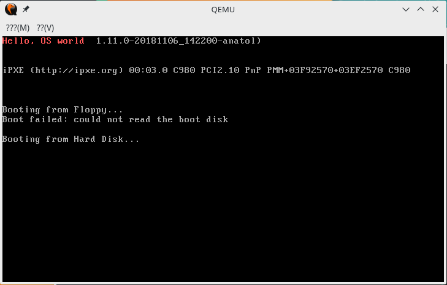

学习一个操作系统，参考《Orange'S：一个操作系统的实现》
<!-- more -->
按照书中的顺序，先写个小小的引导扇区：
我所在的环境是manjaro虚拟机
manjaro下默认好像是没有qemu和nasm的，所以安装一下：
```bash
pacman -S qemu
pacman -S nasm
```
然后就可以编写了：
```asm
org 7c00h
mov ax, cs
mov ds, ax
mov es, ax
call DispStr
jmp $
DispStr:
    mov ax, BootMessage
    mov bp, ax
    mov cx, 16
    mov ax, 1300h
    mov bx, 000ch
    mov dl, 0
    int 10h
    ret
BootMessage:    db  "Hello, OS world"
times 510-($-$$)    db 0
dw  0xaa55
```
下面一点点解释：
在计算机开机时会进行加电自检（POST），然后寻找启动盘，如果从软盘启动，会检查软盘的0面0磁道1扇区，如果是0xaa55结束，则认为他是一个引导扇区。
所以最后设置了0xaa55的结束标志，定义他为一个引导扇区，并且其中的执行代码要少于512字节。
ps:有关dd dw db 都是定义变量用的
不同之处在于dd表示一个双字，就是四个字节36位，每次读取数据时，读完一个偏移量加4
dw在汇编中表示一个字，就是两个字节16位，每次读取数据时，读完一个偏移量加2
db在汇编中表示一个byte，就是一个字节8位，每次读取数据时，读完一个偏移量加1 
在表示字符串的时候通常使用db，如果使用dw或dd可能字符串会颠倒，这是是由于他们存储方式的原因，具体原因可以参考[这个](https://blog.csdn.net/weixin_42553435/article/details/80919722)。


启动时，主引导记录会存入内存地址[0x7C00](http://www.ruanyifeng.com/blog/2015/09/0x7c00.html)，就是说bios发现了引导扇区后，会将这512字节的内容装载到内存为7c00的位置，org的意思就是开始执行的时候，将某段机器语言装载到内存中的哪个地址，这样就可以在7c00进行执行了。

二三四行是为了将ds（数据段寄存器）和es（附加段寄存器）两个段指向与cs（代码段寄存器，对应于内存中的存放代码的内存区域，用来存放内存代码段区域的入口地址（段基址））相同的段，以便以后操作时能定位到正确位置，由于段寄存器不能直接mov，所以这里需要通用寄存器ax进行中转，mov DST,SRC就是把SRC送到DST中。

call DispStr就是调用DispStr子程序，相关功能就是显示字符串“Hello, OS world”，之后jmp $进入无限循环。

DispStr：
第一行显而易见会将BootMessage的地址传给ax，而BootMessage就只定义了一个“Hello, OS world”字符串，所以这里ax的地址就是“Hello, OS world”的首地址了。

之后就是打印显示的工作了，这里需要用到int 10h中断，他是BIOS对显示器和屏幕所提供的服务程序。可以参考[int 10的相关说明](http://stanislavs.org/helppc/int_10.html)，这里我们的需求是打印显示字符串，所以用到的是[这个](http://stanislavs.org/helppc/int_10-13.html)，这里简单说明一下：
```markdowm
	AH = 13h
	AL = write mode (see bit settings below)
	   = 0 string is chars only, attribute in BL, cursor not moved
	   = 1 string is chard only, attribute in BL, cursor moved
	   = 2 string contains chars and attributes, cursor not moved
	   = 3 string contains chars and attributes, cursor moved
	BH = video page number
	BL = attribute if mode 0 or 1 (AL bit 1=0)
	CX = length of string (ignoring attributes)
	DH = row coordinate
	DL = column coordinate
	ES:BP = pointer to string


	Bit settings for write mode (register AL):

	|7|6|5|4|3|2|1|0|  AL
	 | | | | | | | `---- 0=don't move cursor, 1=move cursor
	 | | | | | | `----- 0=BL has attributes, 1=string has attributes
	 `---------------- unused


	returns nothing


	- BEL, BS, CR, LF are treated as ASCII control codes
	- wraps data and scrolls if unable to fit data on one line
```
ES:BP需要指向要显示的字符串指针，之前我们将字符串指针指向了ax，所以这里把bp指向ax就行：mov bp, ax
CX为字符串的长度，这里为16：mov cx, 16

AH，AL分别为AX寄存器的高8位和低8位。
这个中断需要AH为13，AL为相关模式，这里用1，所以mov ax, 01301h就是设置AH为13，AL为01 

BH，BL同理，即为BX寄存器的高8位和低8位，分别设置视频页号和属性（这里就是颜色）
我们还没有对视频分页，这里视频页号取0就行，BL取0c（黑底红字）：mov bx, 000ch

DH和DL分别为行列坐标，这里设置列坐标为0：mov dl, 0

最后调用int 10中断：int 10h
最后使用ret转移，结束了这一部分子程序。

之后的times 510-($-$$) db 0
$代表当前行行首的标号 $$代表当前段的起始汇编地址，times语义为重复
这句代码就表示将0这个字节重读510-($-$$)遍，就是一直填充0直到程序有510个字节，这样加上最后的结束标志0xaa55占用的2个字节，一共刚好512字节了。

现在分别执行：
```bash
nasm boot.asm -o boot.bin
dd if=boot.bin of=boot.img bs=512 count=1
qemu-system-x86_64 -fda boot.img -boot a -m 64 -localtime
```
第一行是nasm src -o des命令，进行src汇编代码编译为des目标文件
第二行是dd指令，在指定大小内对一个文件进行拷贝，并在拷贝的同时进行指定的转换。参数很好理解，具体可以参考这个的[说明](http://www.cnblogs.com/dkblog/archive/2009/09/18/1980715.html)。
第三行是qemu仿真器，可以简单理解为虚拟机，这里用到的参数-fda/-fdb “文件名” 使用“文件名”作为磁盘0/1镜像；-boot [a|d|c] 使用磁盘a，光盘d，或者硬盘c启动；-m容量指定内存的大小，单位是MB；-localtime使用qemu默认的UTC。

运行成功的话可以看到这个：



