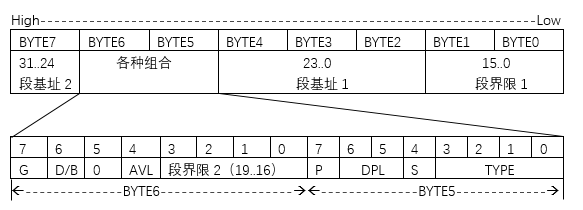
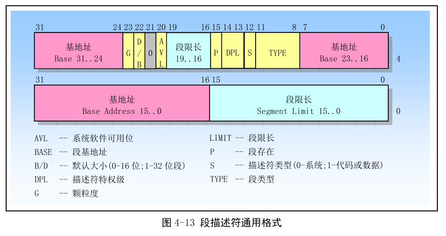
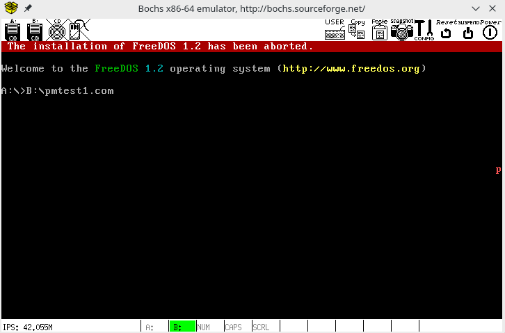

继续上次的
<!-- more -->
这次实现一个保护模式，全部代码如下：
```asm
%include "pm.inc"

org 07c00h
    jmp     LABEL_BEGIN

[SECTION .gdt]
; GDT
;                             段基址             段界限  属性                
LABEL_GDT:        Descriptor       0,                0, 0           ;空描述符
LABEL_DESC_CODE32:Descriptor       0, SegCode32Len - 1, DA_C + DA_32;非一致代码段
LABEL_DESC_VIDEO: Descriptor 0B8000h,           0ffffh, DA_DRW      ;显存首地址
; GDT结束

GdtLen      equ     $ - LABEL_GDT   ;GDT长度
GdtPtr      dw      GdtLen - 1      ;GDT界限
            dd      0               ;GDT基地址

; GDT选择子
SelectorCode32      equ     LABEL_DESC_CODE32       - LABEL_GDT
SelectorVideo       equ     LABEL_DESC_VIDEO        - LABEL_GDT
; END of [SECTION .gdt]

[SECTION .a16]
[BITS 16]
LABEL_BEGIN:
    mov     ax, cs
    mov     ds, ax
    mov     es, ax
    mov     ss, ax
    mov     sp, 0100h

    ; 初始化32位代码段描述符
    xor     eax, eax
    mov     ax, cs
    shl     eax, 4
    add     eax, LABEL_SEG_CODE32
    mov     word [LABEL_DESC_CODE32 + 2], ax
    shr     eax, 16
    mov     byte [LABEL_DESC_CODE32 + 4], al
    mov     byte [LABEL_DESC_CODE32 + 7], ah

    ; 为加载GDTR做准备
    xor     eax, eax
    mov     ax, ds
    shl     eax, 4
    add     eax, LABEL_GDT          ; eax <- gdt 基地址
    mov     dword [GdtPtr + 2], eax ; [GdtPtr + 2] <- gdt 基地址

    ; 加载 GDTR
    lgdt    [GdtPtr]

    ; 关中断
    cli

    ; 打开地址线A20
    in      al, 92h
    or      al, 00000010b
    out     92h,al

    ; 准备切换到保护模式
    mov     eax, cr0
    or      eax, 1
    mov     cr0, eax

    ; 真正进入保护模式
    jmp dword SelectorCode32:0      ; 执行这一句会把SelectorCode32装入cs
                                    ; 并跳转到Code32Selector:0处
; END of [SECTION .s16]

[SECTION .s32] ; 32位代码段， 由实模式跳入。
[BITS 32]

LABEL_SEG_CODE32:
    mov     ax, SelectorVideo
    mov     gs, ax                  ; 视频段选择子（目的）

    mov     edi, (80 *11 + 79) * 2  ; 屏幕第11行，第79列。
    mov     ah, 0Ch                 ; 0000: 黑底 1100:红字
    mov     al, 'p'
    mov     [gs:edi], ax

    ; 到此停止
    jmp $

SegCode32Len    equ     $ - LABEL_SEG_CODE32
; END of [SECTION .s32]
```

下面简单解释一下：
首先<code>include "pm.inc"</code>和注释一样，这里面包含一些常量，宏和相关说明，没有的可以在[这里](https://github.com/yyu/osfs03/blob/master/f/pm.inc)获取。

然后和之前一样<code>org 07c00h</code>，之后jmp到需要执行的代码。

现在看<code>[SECTION .gdt]</code>这个段，这里SECTION定义了一个gdt段，SECTION并没有什么特别的语义，仅仅是一种组织代码和存储的方式，这里这样做是为了之后很好的扩展，要了解更多可以查看[这个](https://blog.csdn.net/ruyanhai/article/details/7179878)。开始就用Descriptor定义了3个结构，Descriptor在"pm.inc"中定义，定义如下：
```asm
; 宏 ------------------------------------------------------------------------------------------------------
;
; 描述符
; usage: Descriptor Base, Limit, Attr
;        Base:  dd
;        Limit: dd (low 20 bits available)
;        Attr:  dw (lower 4 bits of higher byte are always 0)
%macro Descriptor 3
	dw	%2 & 0FFFFh				                ; 段界限 1				    (2 字节)
	dw	%1 & 0FFFFh				                ; 段基址 1				    (2 字节)
	db	(%1 >> 16) & 0FFh			            ; 段基址 2				    (1 字节)
	dw	((%2 >> 8) & 0F00h) | (%3 & 0F0FFh)	    ; 属性 1 + 段界限 2 + 属性 2 (2 字节)
	db	(%1 >> 24) & 0FFh			            ; 段基址 3				    (1 字节)
%endmacro ; 共 8 字节
;
```
可以看到就是定义了一个8字节的结构，宏的语法格式为<code>%macro 宏名称 参数个数</code>，所以这里很明显了，就是定义了一个Descriptor，3参数的结构，之后的%1，%2，%3分别为第一个，第二个，第三个参数，之前也提到db，dw，dd分别为1字节，2字节，4字节，现在就可以分别解释了。
第一行表示取第二个参数的0-15位（2个字节的大小）作为宏的第一、二个字节
第二行表示取第一个参数的0-15位（2个字节的大小）作为宏的第三、四个字节
第三行先把第一个参数右移16位（2字节）最低位就变成了之前的第16位，在和0FF求与，就是取第一个参数的16-23位，作为宏的第五个字节。
第四行“|”号前半部分，参数2右移8位（1字节）最低为变为之前的第8位，和0F00求与，0F00为1的位置为第8-11位，在原始的第二个参数中就变成了16-19位（（8-11）+8）。后半部分第三个参数和0F0FF求与，就是第三个参数的0-7位及12-15位，之后前后部分求或得到宏的第六七字节，可以看到，这里的0-7位都是第三个参数的，所以认为宏的第六字节就是第三个参数的第0-7位，而第七字节就是这里的第8-15位就是两个参数的组合。
第五行第一个参数先右移24位，低位变成原来的第24位，然后与0FF求与，就是第一个参数的24-31位作为第宏的第八个字节。

ps：汇编语言中，一般所说的第一个字节是指按照存贮地址偏移量最小的字节，对应数据的最低位字节；而通信协议中，串行传输时，是从一个帧的首部开始依次传送，一般从高位数起；16位寄存器传输32位数值，根据32为数值的存储顺序，低位字在前，高位字在后，所以应该是先传低16位，后传高16位数据。

我们的代码中，这里的3个参数分别为段基址，段界限，属性，所以得到的宏的结构应该是这样的：


在IA32下，cpu有两种工作模式，实模式和保护模式，直观地看，当pc上电，开始时cpu是工作在实模式下的，经过某种机制后，才进入保护模式，在保护模式下，cpu有着巨大的寻址能力。Intel8086是16位的cpu，有16位的寄存器，16位的数据总线以及20位的地址总线和1MB的寻址能力。从80386开始，Intel的cpu进入32位时代。有32位地址总线，所以寻址空间可达4GB，这时需要新的方法来解决
8086是16位的cpu，只能访问地址在1M以下的内存称为常规内存，我们把地址在1M以上的内存称为扩展内存。实模式下有着16位的寄存器/16位数据总线/20位地址总线。一个地址有段和偏移两部分组成，物理地址的计算公式为：
<b>物理地址physicaladdress=段值segment * 16 + 偏移offset</b>

其中段值和偏移都是16位的
从80386开始，进入32位cpu时代，有32位地址总线。但是，地址并没有用寄存器直接指定，仍然采用了“段+偏移”的模式。虽然段值仍然由原来的16位cs/ds等寄存器指定，但此时这些寄存器中存放的不再是段基址，而是一个索引：从这个索引，可以找到一个表项，里面存放了段基址等很多属性，这个表项称为段描述符，这个表就称为GDT。这就是保护模式寻址了。
也就是说GDT的作用是用来提供段式存储机制，这种机制是通过段寄存器和GDT中的描述符（也就是我们这里的Descriptor）共同提供的。

所以，这里的3个参数，所谓的段基址就是存放该段的起始地址，而段界限指段内的最大偏移，所以一定要在段长度的基础上再减1，这就是这里SegCode32Len - 1的由来了，关于SegCode32Len，可以在代码最后看到<code>SegCode32Len equ $ - LABEL_SEG_CODE32</code>，所以SegCode32Len就是$ - LABEL_SEG_CODE32，而$表示的就是当前的偏移地址，而这一句是紧接着LABEL_SEG_CODE32之后的，<code>$ - LABEL_SEG_CODE32</code>就是表示他的长度了。关于他的属性很复杂，会在后面一点解释。

之后就是LABEL_DESC_VIDEO的描述子，关于这里的参数问题，可以看[这里](https://blog.csdn.net/venlv2046/article/details/80260232)。

之后又定义了两个结构，GdtLen作为Gdt长度，语义和之前说的SegCode32Len类似，GdtPtr结构，包含一个GDT界限和GDT基址。

然后是两个选择子SelectorCode32和SelectorVideo，具体的定义就是相应的描述符相对于GDT的偏移，再看代码就很直观了。

现在跳过16位的代码段，先看32位的代码段，这里的<code>[BITS 32]</code>指定了这一段的代码是32位代码段，即保护模式段：
```asm
mov     ax, SelectorVideo
mov     gs, ax 
```
这两句将段寄存器gs的值变成了SelectorVideo，由上面的解释可以看到SelectorVideo就是LABEL_DESC_VIDEO相对于GDT的偏移，这里GDT的基址为0，基本就可以认为gs现在就是对应显存的描述符LABEL_DESC_VIDEO。
```asm
mov     edi, (80 *11 + 79) * 2  ; 屏幕第11行，第79列。
mov     ah, 0Ch                 ; 0000: 黑底 1100:红字
mov     al, 'p'
mov     [gs:edi], ax
```
二三行分别指定了写入的字体和颜色分别写入ax的高低位，第一行就是就是位置了，这里通过计算在gs段偏移多少来设置地址，在屏幕上，一行一般是80个字符；每个字符的显示需要两个字节，一个字节是显示字符的ascii，一个字节的显示用的颜色（字符颜色+背景色）。这些数据在显示缓存里是按行排列的，先是第0行，然后是第1行，所以第11行的起始地址就是<code>80\*2\*11</code>了，这一行的第79列字符就是再加上<code>79\*2</code>了，整个就是<code>80\*2\*11+79\* 2=(80\*11+79)\*2</code>了。之后将ax的值写入这个位置就能达到显示的目的了。

现在来看16位的代码：
```asm
mov     ax, cs
mov     ds, ax
mov     es, ax
mov     ss, ax
mov     sp, 0100h
```
首先是初始化相关段寄存器和对堆栈初始化，就是对ss和sp赋值了。
```asm
; 初始化32位代码段描述符
xor     eax, eax
mov     ax, cs
shl     eax, 4
add     eax, LABEL_SEG_CODE32
mov     word [LABEL_DESC_CODE32 + 2], ax
shr     eax, 16
mov     byte [LABEL_DESC_CODE32 + 4], al
mov     byte [LABEL_DESC_CODE32 + 7], ah
```
eax就是ax的32位版本了。这段代码首先将LABEL_SEG_CODE32的物理地址（即[SECTION .s32]段的物理地址）赋给eax，然后把他分成三部分分别赋给描述符LABEL_DESC_CODE32的三个位置，不太理解的话可以与描述符的代码比较，这里的[LABEL_DESC_CODE32 + 2]相当于在LABEL_DESC_CODE32描述符之后的两个字节的位置，就是LABEL_DESC_CODE的三四字节，就是上图中段基址的位置，也是描述符代码中<code>dw %1 & 0FFFFh</code>这一行，shr eax, 16表示eax右移16位，之后同理，总之就是赋值了LABEL_DESC_CODE32描述符中段基址的部分。由于LABEL_DESC_CODE32段界限和属性已经指定，所以现在LABEL_DESC_CODE32的初始化已全部完成。
```asm
lgdt [GdtPtr]
```
这一句的作用是将GdtPtr指示的6个字节加载到寄存器gdtr中，这里我们设计的GdtPtr和gdtr的结构完全一样。

下面一句话是关中断，之所以关中断，是因为保护模式下中断处理的机制是不同的，不关中断会出现错误。
```asm
; 打开地址线A20
in      al, 92h
or      al, 00000010b
out     92h,al
```
这一句是打开A20地址线。A20地址线并不是打开保护模式的关键，只是在保护模式下，不打开A20地址线，你将无法访问到所有的内存（具体参考下面的第5点）
1、用于80286与8086兼容
2、用于80286处于实模式下时，防止用户程序访问到100000h~10FFEFh之间的内存（高端内存）
3、8086模式，A20关闭的情况下，访问超过1MB内存时，会自动回卷
4、8086模式下，A20打开的情况下，访问超过1MB内存，就真实的访问
5、保护模式下，A20关闭（始终为0），则用户的地址只能是：0 - (1MB-1), 2 - (3MB-1), 4 - (5MB-1)，我们可以这样设想，A20为个位数（以1MB为单位），如果它始终为0，你永远不可能让这个数变成奇数
6、保护模式下，A20开启，则可以访问全地址，没有奇偶MB的问题。

这里的in和out语义分别是：
* in DES, SRC： 从src端口读取1字节数据到DES
* OUT DES, SRC： 将SRC的值写入DES端口 
打开A20地址线的方法有很多，这里我们使用操作端口92h的方法：
1、端口0x92控制A20信号线，即操作0x92端口就能开启和禁止寻址超过1M时的环绕。
2、or al,00000010b　就是将从端口0x92读入数据的二进制码的第二位置1，从而实现开启A20地址。因为A20信号的第二位就是用于控制开启/禁止A20地址的。 

之后是切换到保护模式的准备工作：
```asm
; 准备切换到保护模式
mov     eax, cr0
or      eax, 1
mov     cr0, eax
```
寄存器cr0的第0位是PE位，此位为0时，CPU运行于实模式，为1时，CPU运行于保护模式。这里将更改为1，就运行在保护模式下了。但是此时cs寄存器（代码段寄存器）的值仍然是实模式下的值，现在需要把代码段选择子装入cs中：
```asm
; 真正进入保护模式
jmp dword SelectorCode32:0      ; 执行这一句会把SelectorCode32装入cs
                                ; 并跳转到Code32Selector:0处
```
之前说到SelectorCode32就是代码段选择子的地址，所以直接跳转就行，不过这里是16位的段，但是目标地址是32位的，所以加个dword变成32位的。

现在代码部分解释完毕，解释一下之前跳过的属性的部分吧：
关于描述符的简单格式这里只给一个图，详细一点的可以参考[这个](http://www.cnblogs.com/longintchar/p/5224405.html)。


我们这里的代码段的属性是<code>DA_C + DA_32</code>，这两个也是在pm.inc中定义的：
```asm
;----------------------------------------------------------------------------
; 描述符类型值说明
; 其中:
;       DA_  : Descriptor Attribute
;       D    : 数据段
;       C    : 代码段
;       S    : 系统段
;       R    : 只读
;       RW   : 读写
;       A    : 已访问
;       其它 : 可按照字面意思理解
;----------------------------------------------------------------------------
DA_32		EQU	4000h	; 32 位段
DA_LIMIT_4K	EQU	8000h	; 段界限粒度为 4K 字节

DA_DPL0		EQU	  00h	; DPL = 0
DA_DPL1		EQU	  20h	; DPL = 1
DA_DPL2		EQU	  40h	; DPL = 2
DA_DPL3		EQU	  60h	; DPL = 3
;----------------------------------------------------------------------------
; 存储段描述符类型值说明
;----------------------------------------------------------------------------
DA_DR		EQU	90h	; 存在的只读数据段类型值
DA_DRW		EQU	92h	; 存在的可读写数据段属性值
DA_DRWA		EQU	93h	; 存在的已访问可读写数据段类型值
DA_C		EQU	98h	; 存在的只执行代码段属性值
DA_CR		EQU	9Ah	; 存在的可执行可读代码段属性值
DA_CCO		EQU	9Ch	; 存在的只执行一致代码段属性值
DA_CCOR		EQU	9Eh	; 存在的可执行可读一致代码段属性值
;----------------------------------------------------------------------------
; 系统段描述符类型值说明
;----------------------------------------------------------------------------
DA_LDT		EQU	  82h	; 局部描述符表段类型值
DA_TaskGate	EQU	  85h	; 任务门类型值
DA_386TSS	EQU	  89h	; 可用 386 任务状态段类型值
DA_386CGate	EQU	  8Ch	; 386 调用门类型值
DA_386IGate	EQU	  8Eh	; 386 中断门类型值
DA_386TGate	EQU	  8Fh	; 386 陷阱门类型值
;----------------------------------------------------------------------------
```
可以看到DA_C是98h，对应的二进制是10011000b。也就是说，P位是1表明这个段在内存中，S位是1表明这个段是代码段或者数据段，TYPE=8表明这个段是个代码段，而且是只执行的代码段。DA_32是4000h，由于这个段是代码段，D位是1表明这个段是32位的代码段。所以这个段是存在的只执行的32位代码段，DPL为0。

现在代码部分解释完毕，是时候运行了。
和之前一样用nasm将代码编译为pmtest.bin，这里有点不同，之前我们是把bin文件直接写入到引导扇区，但是引导扇区空间有限，要是我们的程序之后大于512字节就不好了，所以现在有了另一个办法。步骤如下：
1、首先去[freedos官网](http://www.freedos.org/)下一个freedos的软盘img镜像，命名为freedos.img。
2、和之前一样用bximage生成一个软盘镜像，命名为pm.img
3、修改我们的bochsrc，将之前的floppya那一行更改为：
```bochsrc
floppya: 1_44=freedos.img, status=inserted
floppyb: 1_44=pm.img, status=inserted
boot: a
```
4、启动bochs，在freedos启动后格式化B:盘（<code>format b:</code>）。
5、因为现在要编译为.com文件，将代码<code>org 07c00h</code>更改为<code>org 0100h</code>进行编译：<code>nasm pmtest1.asm -o pmtest1.com</code>
6、将pmtest1.com复制到虚拟软盘pm.img上：
```bash
sudo mount -o loop pm.img /mnt/floppy
sudo cp pmtest1.com /mnt/floppy/
sudo umount /mnt/floppy
```
7、到freedos中执行如下命令：
```dos
B:\pmtest1.com
```
如果成功可以看到如下所示的样子，一个红色的字母p出现在中间右侧：



