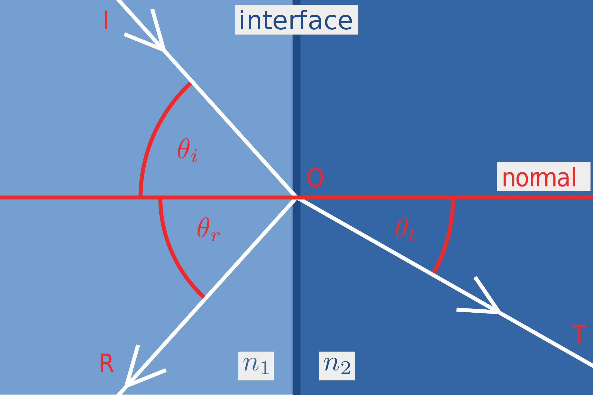
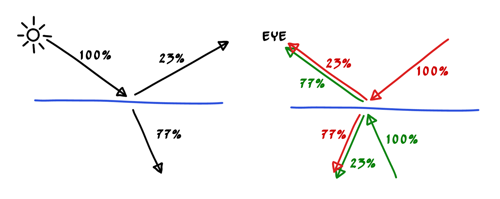
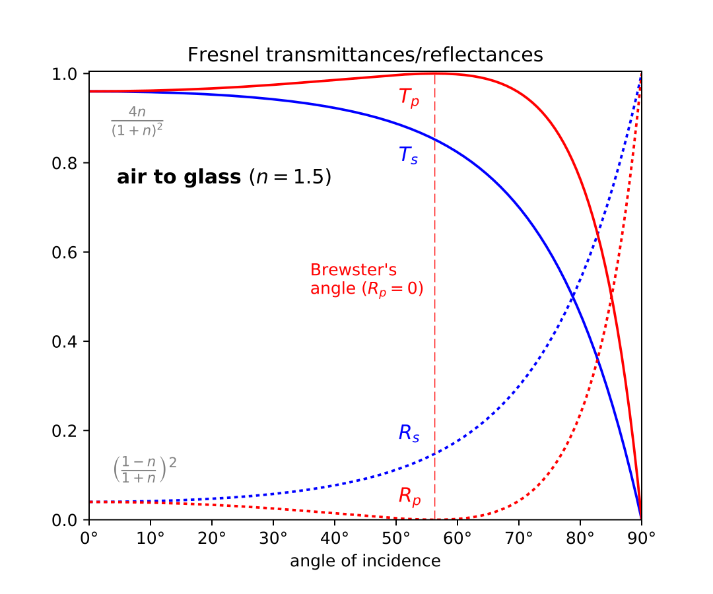

首先是一个简单的标准模型：
<!-- more -->

*I为入射光，T为折射光，R为反射光，$n_{1}$和$n_{1}$分别为两种介质的折射率*
显然我们有：
$\theta_{i} = \theta_{r}\tag 1$
根据[Snell's law](https://en.wikipedia.org/wiki/Snell%27s_law)也有：
$n_{1}sin\theta_{i} = n_{2}sin\theta_{t}\tag 2$

**菲涅耳方程给出了反射波电场与入射波电场的比值。**
简单来说，就是反射光所占入射光的比例。

一个简单的反射折射模型如下所示：

可以看到23%的反射光和77%的折射光最终汇聚之后最终被人眼看到。计算方式如下
$color = 0.77 * color_{refracted_ray} + 0.23 * color_{reflected_ray}$

这里0.77和0.23两个常量的计算就需要使用菲涅尔方程来计算。根据菲涅尔公式有：
$R_{s} = |\frac{n_{1}cos\theta_{i} - n_{2}\sqrt{1-(\frac{n_{1}}{n_{2}}sin\theta_{i})^2}}{n_{1}cos\theta_{i} + n_{2}\sqrt{1-(\frac{n_{1}}{n_{2}}sin\theta_{i})^2}}|^2\tag 3$
$R_{p} = |\frac{n_{1}\sqrt{1-(\frac{n_{1}}{n_{2}}sin\theta_{i})^2} - n_{2}cos\theta_{i}}{n_{1}\sqrt{1-(\frac{n_{1}}{n_{2}}sin\theta_{i})^2} + n_{2}cos\theta_{i}}|^2\tag 4$

根据式(2)有：
$\sqrt{1-(\frac{n_{1}}{n_{2}}sin\theta_{i})^2} = \sqrt{1-sin^2\theta_{t}} = \sqrt{1-(\frac{n_{1}}{n_{2}}sin\theta_{i})^2}$

将上式带入式(3)和式(4)有：
$R_{s} = |\frac{n_{1}cos\theta_{i} - n_{2}\sqrt{1-(\frac{n_{1}}{n_{2}}sin\theta_{i})^2}}{n_{1}cos\theta_{i} + n_{2}\sqrt{1-(\frac{n_{1}}{n_{2}}sin\theta_{i})^2}}|^2 = |\frac{n_{1}cos\theta_{i} - n_{2}\sqrt{1-(\frac{n_{1}}{n_{2}}sin\theta_{i})^2}}{n_{1}cos\theta_{i} + n_{2}\sqrt{1-(\frac{n_{1}}{n_{2}}sin\theta_{i})^2}}|^2\tag 5$
$R_{p} = |\frac{n_{1}\sqrt{1-(\frac{n_{1}}{n_{2}}sin\theta_{i})^2} - n_{2}cos\theta_{i}}{n_{1}\sqrt{1-(\frac{n_{1}}{n_{2}}sin\theta_{i})^2} + n_{2}cos\theta_{i}}|^2 = |\frac{n_{1}\sqrt{1-(\frac{n_{1}}{n_{2}}sin\theta_{i})^2} - n_{2}cos\theta_{i}}{n_{1}\sqrt{1-(\frac{n_{1}}{n_{2}}sin\theta_{i})^2} + n_{2}cos\theta_{i}}|^2\tag 6$

现在只考虑无偏振的自然光，即$R_{s}$和$R_{p}$偏振中的功率相等，有：
$R_{eff} = \frac{1}{2}(R_{s}+R_{p})$

显然可以看出，菲涅尔方程的值是和入射角$\theta_{i}$唯一相关的（折射率为相关材质的常量）。

下图是一个由空气射入玻璃的菲涅尔方程和入射角之间的关系：

可以看出来，当入射角为0度，即入射光垂直于表面时，基本不反射，而当入射角为90度时，反射比例接近百分之百，这解释了为什么离透明物体（玻璃，湖水等）很近时，基本看不到反射效果，只能看到玻璃后的东西，或者水里的鱼啥的。

但是使用上面的方程过于繁琐和复杂，Schlick提出了一种近似的方法，即
$R(\theta) = R_{0} + (1 - R_{0})(1 - cos\theta)^5$
其中$R_{0}$为入射角为0时的值。即：
$R_{0} = (\frac{n_{1} - n_{2}}{n_{1} + n_{2}})^2$

同时有：
$cos\theta = \vec{v} \cdot \vec{n}$
其中$\vec{v}$和$\vec{n}$为视线方向和平面法向量。

最后即变成我们熟悉的公式：
$R(\theta) = R_{0} + (1 - R_{0})(1 - \vec{v} \cdot \vec{n})^5$
